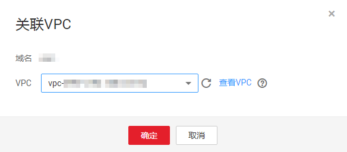

# 为内网域名关联VPC

## 操作场景

当用户创建的内网域名需要关联新的VPC时，可以在管理控制台云解析服务页面进行关联VPC操作。

> **说明：** 
>关联的VPC需要与服务器（例如ECS）所在VPC保持一致，否则会导致内网域名解析不成功。

## 操作步骤

1.  登录管理控制台。
2.  选择“网络 \> 云解析服务”。

    进入“云解析”页面。

3.  在左侧树状导航栏，选择“域名解析 \> 内网解析”。

    进入“内网域名”页面。

4.  单击管理控制台左上角的，选择区域和项目。

1.  选择待关联VPC的内网域名，单击“操作”列下的“关联VPC”。

    **图 1**  关联VPC  
    

2.  在“VPC”中，设置需要关联的VPC。

    如果没有可关联的VPC，可以单击“查看VPC”到“虚拟私有云”页面创建VPC。

    **图 2**  设置关联VPC  
    

3.  单击“确定”。

    在域名列表的“已关联的VPC”列，可查看关联的VPC。

    **图 3**  已关联的VPC  
    

