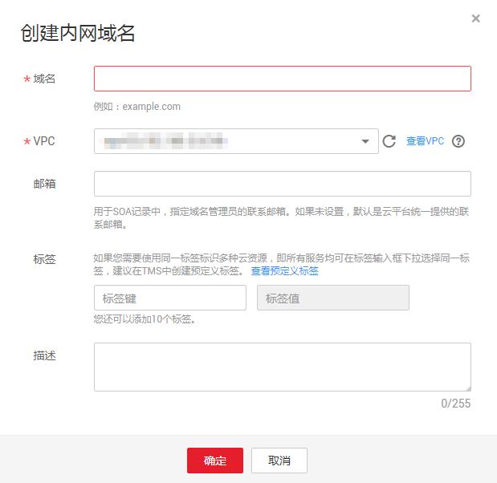

# 创建内网域名

## 操作场景

如果想要使用华为云的云解析服务的内网域名解析功能，您需要先在云解析服务中创建内网域名。

## 前提条件

-   已经创建VPC，详细内容请参见[创建虚拟私有云和子网](https://support.huaweicloud.com/usermanual-vpc/zh-cn_topic_0013935842.html)。
-   已经在VPC内创建弹性云服务器，并为其规划内网域名“example.com”。

## 操作步骤

1.  登录管理控制台。
2.  将鼠标悬浮于页面左侧的“”，在服务列表中，选择“网络  \> 云解析服务”。

    进入“云解析”页面。

3.  在左侧树状导航栏，选择“内网域名”。

    进入“内网域名”页面。

4.  单击管理控制台左上角的，选择区域和项目。
5.  在页面右上角，单击“创建内网域名”。
6.  在“创建内网域名”页面中，输入域名及相关参数。

    **图 1**  创建内网域名  
    

    参数说明如[表1](#zh-cn_topic_0138290710_zh-cn_topic_0035467699_table2052132816642)所示。

    **表 1**  创建内网域名参数说明

    
    <table><thead align="left"><tr id="zh-cn_topic_0138290710_zh-cn_topic_0035467699_row5957484916642"><th class="cellrowborder" valign="top" width="18.11%" id="mcps1.2.4.1.1">
参数

    </th>
    <th class="cellrowborder" valign="top" width="50.629999999999995%" id="mcps1.2.4.1.2">
参数说明

    </th>
    <th class="cellrowborder" valign="top" width="31.259999999999998%" id="mcps1.2.4.1.3">
取值样例

    </th>
    </tr>
    </thead>
    <tbody><tr id="zh-cn_topic_0138290710_zh-cn_topic_0035467699_row2871871016642"><td class="cellrowborder" valign="top" width="18.11%" headers="mcps1.2.4.1.1 ">
域名

    </td>
    <td class="cellrowborder" valign="top" width="50.629999999999995%" headers="mcps1.2.4.1.2 ">
创建的内网域名名称。

    
支持创建顶级域，但需符合域名命名规范。

    
域名的格式请参见<a href="https://support.huaweicloud.com/productdesc-dns/dns_pd_0009.html" target="_blank" rel="noopener noreferrer">域名格式与级别</a>。

    </td>
    <td class="cellrowborder" valign="top" width="31.259999999999998%" headers="mcps1.2.4.1.3 ">
example.com

    </td>
    </tr>
    <tr id="zh-cn_topic_0138290710_row16069279235858"><td class="cellrowborder" valign="top" width="18.11%" headers="mcps1.2.4.1.1 ">
VPC

    </td>
    <td class="cellrowborder" valign="top" width="50.629999999999995%" headers="mcps1.2.4.1.2 ">
内网域名要关联的VPC。

    
 说明： 

关联的VPC需要与服务器（例如ECS）所在VPC保持一致，否则会导致内网域名解析不成功。

    

    </td>
    <td class="cellrowborder" valign="top" width="31.259999999999998%" headers="mcps1.2.4.1.3 ">
-

    </td>
    </tr>
    <tr id="zh-cn_topic_0138290710_zh-cn_topic_0035467699_row3925088716642"><td class="cellrowborder" valign="top" width="18.11%" headers="mcps1.2.4.1.1 ">
邮箱

    </td>
    <td class="cellrowborder" valign="top" width="50.629999999999995%" headers="mcps1.2.4.1.2 ">
可选参数。

    
管理该内网域名的管理员邮箱。建议用户使用保留邮箱“HOSTMASTER@<em id="zh-cn_topic_0138290710_i31584450204027">域名</em>”作为此管理员邮箱。

    
更多关于Email的信息，请参见<a href="https://support.huaweicloud.com/dns_faq/dns_faq_009.html" target="_blank" rel="noopener noreferrer">SOA记录中的Email格式为什么变化了？</a>。

    </td>
    <td class="cellrowborder" valign="top" width="31.259999999999998%" headers="mcps1.2.4.1.3 ">
HOSTMASTER@example.com

    </td>
    </tr>
    <tr id="row75930206212"><td class="cellrowborder" valign="top" width="18.11%" headers="mcps1.2.4.1.1 ">
企业项目

    </td>
    <td class="cellrowborder" valign="top" width="50.629999999999995%" headers="mcps1.2.4.1.2 ">
内网域名关联的企业项目，用于将内网域名按照企业项目进行管理。

    
 说明： 

仅当用户使用的“帐号类型”为“企业帐号”时，显示该参数，且参数必选。

    

    
配置原则：

    <ul id="ul1658222152111"><li>如果不通过企业项目管理域名资源，则采用默认值“default”。</li><li>如果通过企业项目管理域名资源，则在下拉列表中选择已经创建的企业项目。
在设置该参数前，您需要完成<a href="https://support.huaweicloud.com/usermanual-em/zh-cn_topic_0108763964.html" target="_blank" rel="noopener noreferrer">创建企业项目</a>。

    
更多关于企业项目的信息，请参考<a href="https://support.huaweicloud.com/usermanual-em/em_am_0006.html" target="_blank" rel="noopener noreferrer">《企业项目管理用户指南》</a>。

    </li></ul>
    </td>
    <td class="cellrowborder" valign="top" width="31.259999999999998%" headers="mcps1.2.4.1.3 ">
default

    </td>
    </tr>
    <tr id="zh-cn_topic_0138290710_row648142632420"><td class="cellrowborder" valign="top" width="18.11%" headers="mcps1.2.4.1.1 ">
标签

    </td>
    <td class="cellrowborder" valign="top" width="50.629999999999995%" headers="mcps1.2.4.1.2 ">
可选参数。

    
域名的标识，包括键和值，每个域名可以创建10个标签。

    
键和值的命名规则请参见<a href="#zh-cn_topic_0138290710_table1393932617253">表2</a>。

    </td>
    <td class="cellrowborder" valign="top" width="31.259999999999998%" headers="mcps1.2.4.1.3 ">
example_key1

    
example_value1

    </td>
    </tr>
    <tr id="zh-cn_topic_0138290710_row197267115553"><td class="cellrowborder" valign="top" width="18.11%" headers="mcps1.2.4.1.1 ">
描述

    </td>
    <td class="cellrowborder" valign="top" width="50.629999999999995%" headers="mcps1.2.4.1.2 ">
可选参数。

    
域名的描述信息。

    
长度不超过255个字符。

    </td>
    <td class="cellrowborder" valign="top" width="31.259999999999998%" headers="mcps1.2.4.1.3 ">
This is a zone example.

    </td>
    </tr>
    </tbody>
    </table>

    **表 2**  标签命名规则

    
    <table><thead align="left"><tr id="zh-cn_topic_0138290710_zh-cn_topic_0138290753_row72901535141713"><th class="cellrowborder" valign="top" width="18.181818181818183%" id="mcps1.2.4.1.1">
参数

    </th>
    <th class="cellrowborder" valign="top" width="50.505050505050505%" id="mcps1.2.4.1.2">
规则

    </th>
    <th class="cellrowborder" valign="top" width="31.313131313131315%" id="mcps1.2.4.1.3">
举例

    </th>
    </tr>
    </thead>
    <tbody><tr id="zh-cn_topic_0138290710_zh-cn_topic_0138290753_row52906354176"><td class="cellrowborder" valign="top" width="18.181818181818183%" headers="mcps1.2.4.1.1 ">
键

    </td>
    <td class="cellrowborder" valign="top" width="50.505050505050505%" headers="mcps1.2.4.1.2 "><ul id="zh-cn_topic_0138290710_zh-cn_topic_0138290753_ul46253231183"><li>不能为空。</li><li>对于同一资源键值唯一。</li><li>长度不超过36个字符。</li><li>取值为不包含“=”、“*”、“&lt;”、“&gt;”、“\”、“,”、“|”和“/”的所有Unicode字符，且首尾字符不能为空格。</li></ul>
    </td>
    <td class="cellrowborder" valign="top" width="31.313131313131315%" headers="mcps1.2.4.1.3 ">
example_key1

    </td>
    </tr>
    <tr id="zh-cn_topic_0138290710_zh-cn_topic_0138290753_row132900355172"><td class="cellrowborder" valign="top" width="18.181818181818183%" headers="mcps1.2.4.1.1 ">
值

    </td>
    <td class="cellrowborder" valign="top" width="50.505050505050505%" headers="mcps1.2.4.1.2 "><ul id="zh-cn_topic_0138290710_zh-cn_topic_0138290753_ul19648123161815"><li>不能为空。</li><li>长度不超过43个字符。</li><li>取值为不包含“=”、“*”、“&lt;”、“&gt;”、“\”、“,”、“|”和“/”的所有Unicode字符，且首尾字符不能为空格。</li></ul>
    </td>
    <td class="cellrowborder" valign="top" width="31.313131313131315%" headers="mcps1.2.4.1.3 ">
example_value1

    </td>
    </tr>
    </tbody>
    </table>

7.  单击“确定”。
8.  返回“内网域名”页面。

    创建完成后，您可以在“内网域名”页面查看新创建的域名信息。

9.  在“内网域名”页面的域名列表中，单击域名的名称，进入“解析记录”页面。

    在“解析记录”页面，可以通过“添加记录集”为域名配置解析记录，详细内容请参见[解析记录简介](解析记录简介.md)。

    > **说明：** 
    >单击“名称”列的域名名称，可以看到系统已经为您创建了SOA类型和NS类型的记录集。其中，
    >-   SOA类型的记录集标识了对此域名具有最终解释权的主权威服务器。
    >-   NS类型的记录集标识了此域名的权威服务器。

## 后续操作

创建内网域名完成后，

-   可以为域名配置解析记录，请参见[解析记录简介](解析记录简介.md)。
-   可以对域名进行修改、删除、查看详细信息等操作，请参见[管理内网域名](管理内网域名.md)。

