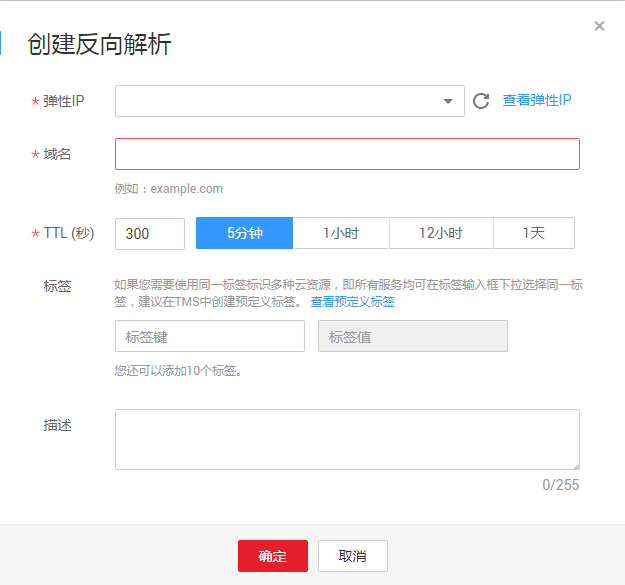

# 创建反向解析

## 操作场景

反向解析主要应用于自建邮箱服务器，可以提高邮箱服务器IP地址和域名的信誉度。多数垃圾邮件发送者使用动态分配或者没有注册域名的IP地址来发送垃圾邮件，以逃避追踪。设置了邮箱服务器IP地址到域名的反向解析后，收件方可以通过邮件的IP地址反向解析出域名，就可以降低邮箱服务器发送的邮件被当做垃圾邮件的几率。

假设您使用华为云的弹性云服务器作为邮箱服务器，那么您需要为弹性云服务器配置反向解析，以便将弹性IP映射到某一域名。

本节介绍为云服务（例如弹性云服务器）配置反向解析的过程。

## 约束与限制

当前仅支持针对32位子网掩码的网段\(即单IP地址\)设置反向解析记录。

## 前提条件

-   已经在华为云或第三方域名注册商处注册了域名。
-   已经完成云服务的部署，并为其绑定弹性IP。

## 操作步骤

1.  登录管理控制台。
2.  将鼠标悬浮于页面左侧的“”，在服务列表中，选择“网络 \> 云解析服务”。

    进入“云解析”页面。

3.  在左侧树状导航栏，选择“域名解析 \> 反向解析”。

    进入“反向解析”页面。

4.  单击管理控制台左上角的，选择区域和项目。
5.  单击“创建反向解析”，开始创建反向解析。

    **图 1**  创建反向解析  
    

6.  根据界面提示配置参数，参数说明如[表1](#zh-cn_topic_0138290741_zh-cn_topic_0035467699_table2052132816642)所示。

    **表 1**  创建反向解析参数说明

    
    <table><thead align="left"><tr id="zh-cn_topic_0138290741_zh-cn_topic_0035467699_row5957484916642"><th class="cellrowborder" valign="top" width="19.99%" id="mcps1.2.4.1.1">
参数

    </th>
    <th class="cellrowborder" valign="top" width="48.75%" id="mcps1.2.4.1.2">
参数说明

    </th>
    <th class="cellrowborder" valign="top" width="31.259999999999998%" id="mcps1.2.4.1.3">
取值样例

    </th>
    </tr>
    </thead>
    <tbody><tr id="zh-cn_topic_0138290741_zh-cn_topic_0035467699_row2871871016642"><td class="cellrowborder" valign="top" width="19.99%" headers="mcps1.2.4.1.1 ">
弹性IP

    </td>
    <td class="cellrowborder" valign="top" width="48.75%" headers="mcps1.2.4.1.2 ">
您通过其他云服务（例如弹性云服务器）获得的弹性IP。

    
该参数支持通过输入框快速定位到所需要的弹性IP。

    </td>
    <td class="cellrowborder" valign="top" width="31.259999999999998%" headers="mcps1.2.4.1.3 ">
XX.XX.XX.XX

    </td>
    </tr>
    <tr id="zh-cn_topic_0138290741_zh-cn_topic_0035467699_row6656618516642"><td class="cellrowborder" valign="top" width="19.99%" headers="mcps1.2.4.1.1 ">
域名

    </td>
    <td class="cellrowborder" valign="top" width="48.75%" headers="mcps1.2.4.1.2 ">
弹性IP所指向的域名。

    </td>
    <td class="cellrowborder" valign="top" width="31.259999999999998%" headers="mcps1.2.4.1.3 ">
www.example.com

    </td>
    </tr>
    <tr id="zh-cn_topic_0138290741_zh-cn_topic_0035467699_row2168553016642"><td class="cellrowborder" valign="top" width="19.99%" headers="mcps1.2.4.1.1 ">
TTL(秒)

    </td>
    <td class="cellrowborder" valign="top" width="48.75%" headers="mcps1.2.4.1.2 ">
反向解析的有效缓存时间，以秒为单位。

    
默认为“5min”，即300s。

    </td>
    <td class="cellrowborder" valign="top" width="31.259999999999998%" headers="mcps1.2.4.1.3 ">
300

    </td>
    </tr>
    <tr id="row086339104914"><td class="cellrowborder" valign="top" width="19.99%" headers="mcps1.2.4.1.1 ">
企业项目

    </td>
    <td class="cellrowborder" valign="top" width="48.75%" headers="mcps1.2.4.1.2 ">
反向解析关联的企业项目，用于将反向解析按照企业项目进行管理。

    
 说明： 

仅当用户使用的“账号类型”为“企业账号”时，显示该参数，且参数必选。

    

    
配置原则：

    <ul id="ul1658222152111"><li>如果不通过企业项目管理反向解析资源，则采用默认值“default”。</li><li>如果通过企业项目管理反向解析资源，则在下拉列表中选择已经创建的企业项目。
在设置该参数前，您需要完成<a href="https://support.huaweicloud.com/usermanual-em/zh-cn_topic_0108763964.html" target="_blank" rel="noopener noreferrer">创建企业项目</a>。

    
更多关于企业项目的信息，请参考<a href="https://support.huaweicloud.com/usermanual-em/em_am_0006.html" target="_blank" rel="noopener noreferrer">《企业项目管理用户指南》</a>。

    </li></ul>
    </td>
    <td class="cellrowborder" valign="top" width="31.259999999999998%" headers="mcps1.2.4.1.3 ">
default

    </td>
    </tr>
    <tr id="zh-cn_topic_0138290741_row273617193297"><td class="cellrowborder" valign="top" width="19.99%" headers="mcps1.2.4.1.1 ">
标签

    </td>
    <td class="cellrowborder" valign="top" width="48.75%" headers="mcps1.2.4.1.2 ">
可选参数。

    
反向解析的标识，包括键和值，每个反向解析可以创建10个标签。

    
键和值的命名规则请参见<a href="#zh-cn_topic_0138290741_table1393932617253">表2</a>。

    </td>
    <td class="cellrowborder" valign="top" width="31.259999999999998%" headers="mcps1.2.4.1.3 ">
example_key1

    
example_value1

    </td>
    </tr>
    <tr id="zh-cn_topic_0138290741_zh-cn_topic_0035467699_row3925088716642"><td class="cellrowborder" valign="top" width="19.99%" headers="mcps1.2.4.1.1 ">
描述

    </td>
    <td class="cellrowborder" valign="top" width="48.75%" headers="mcps1.2.4.1.2 ">
可选配置，对反向解析的描述。

    </td>
    <td class="cellrowborder" valign="top" width="31.259999999999998%" headers="mcps1.2.4.1.3 ">
The description of the PTR Record.

    </td>
    </tr>
    </tbody>
    </table>

    **表 2**  标签命名规则

    
    <table><thead align="left"><tr id="zh-cn_topic_0138290741_zh-cn_topic_0198961893_row72901535141713"><th class="cellrowborder" valign="top" width="18.181818181818183%" id="mcps1.2.4.1.1">
参数

    </th>
    <th class="cellrowborder" valign="top" width="50.505050505050505%" id="mcps1.2.4.1.2">
规则

    </th>
    <th class="cellrowborder" valign="top" width="31.313131313131315%" id="mcps1.2.4.1.3">
举例

    </th>
    </tr>
    </thead>
    <tbody><tr id="zh-cn_topic_0138290741_zh-cn_topic_0198961893_row52906354176"><td class="cellrowborder" valign="top" width="18.181818181818183%" headers="mcps1.2.4.1.1 ">
键

    </td>
    <td class="cellrowborder" valign="top" width="50.505050505050505%" headers="mcps1.2.4.1.2 "><ul id="zh-cn_topic_0138290741_zh-cn_topic_0198961893_ul46253231183"><li>不能为空。</li><li>对于同一资源键值唯一。</li><li>长度不超过36个字符。</li><li>取值为不包含“=”、“*”、“&lt;”、“&gt;”、“\”、“,”、“|”和“/”的所有Unicode字符，且首尾字符不能为空格。</li></ul>
    </td>
    <td class="cellrowborder" valign="top" width="31.313131313131315%" headers="mcps1.2.4.1.3 ">
example_key1

    </td>
    </tr>
    <tr id="zh-cn_topic_0138290741_zh-cn_topic_0198961893_row132900355172"><td class="cellrowborder" valign="top" width="18.181818181818183%" headers="mcps1.2.4.1.1 ">
值

    </td>
    <td class="cellrowborder" valign="top" width="50.505050505050505%" headers="mcps1.2.4.1.2 "><ul id="zh-cn_topic_0138290741_zh-cn_topic_0198961893_ul19648123161815"><li>不能为空。</li><li>长度不超过43个字符。</li><li>取值为不包含“=”、“*”、“&lt;”、“&gt;”、“\”、“,”、“|”和“/”的所有Unicode字符，且首尾字符不能为空格。</li></ul>
    </td>
    <td class="cellrowborder" valign="top" width="31.313131313131315%" headers="mcps1.2.4.1.3 ">
example_value1

    </td>
    </tr>
    </tbody>
    </table>

7.  单击“确定”，完成反向解析的创建。

    创建完成后，您可以在“反向解析”页面查看新创建的反向解析信息。

    > **说明：** 
    >如果您的域名（如example.com）拥有多个弹性IP，则需要为每一个弹性IP创建一个反向解析。

8.  您可以通过在已经连接Internet的PC终端的DOS窗口，执行以下命令测试反向解析是否生效。

    命令格式如下：

    nslookup -qt=ptr  _IP地址_

