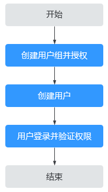

# 创建用户并授权使用DNS

如果您需要对您所拥有的DNS进行精细的权限管理，您可以使用[统一身份认证服务](https://support.huaweicloud.com/productdesc-iam/iam_01_0026.html)（Identity and Access Management，简称IAM），通过IAM，您可以：

-   根据企业的业务组织，在您的华为云账号中，给企业中不同职能部门的员工创建IAM用户，让员工拥有唯一安全凭证，并使用DNS资源。
-   根据企业用户的职能，设置不同的访问权限，以达到用户之间的权限隔离。
-   将DNS资源委托给更专业、高效的其他华为云账号或者云服务，这些账号或者云服务可以根据权限进行代运维。

如果华为云账号已经能满足您的要求，不需要创建独立的IAM用户，您可以跳过本章节，不影响您使用DNS服务的其它功能。

本章节为您介绍对用户授权的方法，操作流程如[图1](#zh-cn_topic_0172268189_fig12481104618719)所示。

## 前提条件

给用户组授权之前，请您了解用户组可以添加的DNS权限，并结合实际需求进行选择，DNS支持的系统权限，请参见：[DNS系统权限](https://support.huaweicloud.com/productdesc-dns/dns_pd_0002.html)。若您需要对除DNS之外的其它服务授权，IAM支持服务的所有策略请参见[权限策略](https://support.huaweicloud.com/permissions/policy_list.html?product=dns)。

## 示例流程

**图 1**  给用户授权DNS权限流程  

1.  [创建用户组并授权](https://support.huaweicloud.com/usermanual-iam/iam_03_0001.html)

    在IAM控制台创建用户组，并授予云解析服务只读权限“DNS ReadOnlyAccess”。

2.  [创建用户并加入用户组](https://support.huaweicloud.com/usermanual-iam/iam_02_0001.html)

    在IAM控制台创建用户，并将其加入[1](#zh-cn_topic_0172268189_li10269636890)中创建的用户组。

3.  [用户登录](https://support.huaweicloud.com/usermanual-iam/iam_01_0552.html)并验证权限

    新创建的用户登录控制台，切换至授权区域，验证权限：

    -   在“服务列表”中选择云解析服务，进入DNS的“总览 \> 公网解析”页面，单击右上角“创建公网域名”，尝试创建公网域名，如果无法创建公网域名（假设当前权限仅包含DNS ReadOnlyAccess），表示“DNS ReadOnlyAccess”已生效。
    -   在“服务列表”中选择除云解析服务外（假设当前策略仅包含DNS ReadOnlyAccess）的任一服务，若提示权限不足，表示“DNS ReadOnlyAccess”已生效。

