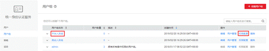
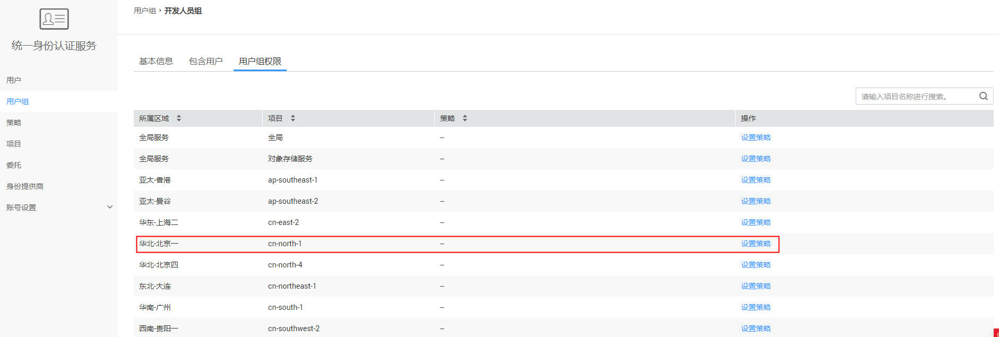

# 创建用户并授权使用DNS

本章节通过简单的用户组授权方法，将DNS的策略授予用户组，并将用户添加至用户组中，从而使用户拥有对应的DNS权限，操作流程如[图1](#zh-cn_topic_0172268189_fig12481104618719)所示。

**图 1**  给用户授权DNS权限流程  

1.  创建用户组并授权

    在IAM控制台创建用户组，并授予云解析服务只读权限“DNS Viwer”。

2.  创建用户

    在IAM控制台创建用户，并将其加入[1](#zh-cn_topic_0172268189_li10269636890)中创建的用户组。

3.  用户登录并验证权限

    新创建的用户登录控制台，验证云解析服务的只读权限。

## 前提条件

-   “DNS Viewer权限”为细粒度策略，请先在IAM控制台中开通细粒度策略，开通方法请参见：[申请细粒度访问控制公测](https://support.huaweicloud.com/usermanual-iam/iam_01_019.html)。
-   给用户组授权之前，请您了解用户组可以添加的DNS系统策略，并结合实际需求进行选择，云解析服务支持的系统策略及策略间的对比，请参见：[DNS系统策略](https://support.huaweicloud.com/productdesc-dns/dns_pd_0002.html)。若您需要对除DNS之外的其它服务授权，IAM支持服务的所有策略请参见[权限策略](https://support.huaweicloud.com/usermanual-permissions/zh-cn_topic_0063498930.html)。

## 步骤1：创建用户组并授权

用户组是用户的集合，IAM通过用户组功能实现用户的授权。您在IAM中创建的用户，需要加入特定用户组后，用户才具备用户组所拥有的权限。关于创建用户组并给用户组授权的方法，可以参考如下操作。

1.  使用注册的华为云账号登录华为云，登录时请选择“账号登录”。

    **图 2**  账号登录  
    

2.  进入华为云控制台， 控制台页面中单击右上角的用户名，选择“统一身份认证”。

    **图 3**  统一身份认证  
    

3.  在统一身份认证服务的左侧导航空格中，单击“用户组”\>“创建用户组”。

    **图 4**  创建用户组  
    

4.  在“创建用户组”界面，输入“用户组名称”，以“开发人员组”为例，单击“确定”。

    用户组创建完成，界面自动返回用户组列表，列表中显示新建的用户组。

5.  单击新建用户组右侧的“权限配置”，在“用户组权限”页签中，基于需要授权的区域，单击“设置策略”。

    -   公网域名资源为全局级服务，该资源的授权需要在资源所属区域中进行。
    -   内网域名和反向解析资源为项目级服务，请确认用户需要使用资源的项目，然后在对应项目中设置权限，则用户仅能访问授权项目中的DNS资源，无法访问其他项目中的DNS资源。

    **图 5**  权限配置  
    

    **图 6**  设置策略  
    

6.  在““设置策略”中搜索“DNS”，选择“DNS Viewer”为例。
7.  单击“确定”，完成用户组授权。

## 步骤2：创建IAM用户

IAM用户与企业中的实际员工或是应用程序相对应，有唯一的安全凭证，可以通过加入一个或多个用户组来获得用户组的权限。关于IAM用户的创建方式请参见如下步骤。

1.  在统一身份认证服务，左侧导航窗格中，单击“用户”\>“创建用户”。
2.  在“创建用户”页面填写“用户信息”。如需一次创建多个用户，可以单击“添加用户”进行批量创建，每次最多可创建10个用户。

    **图 7**  创建用户  
    

    -   用户名：用户登录华为云的用户名，以“James”为例。
    -   邮箱：IAM用户绑定的邮箱，仅“访问方式”选择“首次登录时设置”时必填，选择其他访问方式时选填。
    -   手机号（选填）：IAM用户绑定的手机号。
    -   描述（选填）：对用户的描述信息。

3.  在“创建用户”页面选择“访问方式”，完成后单击“下一步”。

    **图 8**  访问方式  
    

    -   编程访问：创建用户完成后即可下载本次创建的所有用户的[访问密钥](https://support.huaweicloud.com/usermanual-ca/zh-cn_topic_0046606340.html)。
    -   华为云管理控制台访问：用户可以使用账号密码登录到华为云管理控制台。
        1.  控制台登录密码设置方式：当一次创建多个用户时，密码设置方式可选择“首次登录时设置”和“自定义”，不支持“自动生成”密码；当仅创建一个用户时，以上方式均可选择。
        2.  登录保护：为了您的账号安全，建议选择“开启登录保护”。后续如需开启或关闭登录保护，请参见：[登录保护](https://support.huaweicloud.com/usermanual-iam/zh-cn_topic_0079477316.html)。

4.  （可选）将用户加入到用户组，完成后单击“下一步”。
    -   选择新创建的用户组“开发人员组”。将用户加入用户组，用户将具备用户组的权限，这一过程即给该用户授权。其中“admin”为系统缺省提供的用户组，具有管理人员以及所有云服务资源的操作权限。
    -   如需创建新的用户组，可单击“创建用户组”，填写用户组名称和描述（可选），创建成功后即可将用户加入到新创建的用户组中。

5.  IAM用户创建成功，用户列表中显示新创建的IAM用户。如果在访问方式中勾选了“编程访问”，可在此页面下载访问密钥，后续也可以在“我的凭证”中[管理访问密钥](https://support.huaweicloud.com/usermanual-ca/zh-cn_topic_0046606340.html)。

    **图 9**  创建成功  
    

## 步骤3：用户登录并验证权限

用户创建完成后，可以使用新用户的用户名及身份凭证登录华为云验证权限，即“DNS Viewer”权限。更多用户登录方法请参见[用户登录华为云方法](https://support.huaweicloud.com/qs-iam/iam_01_0031.html#section2)。

1.  在华为云登录页面，单击右下角的“IAM用户登录”。

    **图 10**  IAM用户登录  
    

2.  在“IAM用户登录”页面，输入账号名、用户名及用户密码，使用新创建的用户登录。

    -   账号名为该IAM用户所属华为云账号的名称。
    -   用户名和密码为账号在IAM创建用户时输入的用户名和密码。

    如果登录失败，您可以联系您的账号主体，确认用户名及密码是否正确，或是重置用户名及密码，重置方法请参见：[忘记IAM用户密码](https://support.huaweicloud.com/iam_faq/iam_01_0314.html#section1)。

3.  登录成功后，进入华为云控制台，请先切换至授权区域。

    **图 11**  授权区域  
    

4.  在“服务列表”中选择“云解析服务”，进入云解析服务的总览页面。
5.  在总览页面中，单击“内网解析”，进入内网域名页面。
6.  在“内网域名”页面右上角，单击“创建内网域名”，若提示权限不足，表示“DNS Viewer”已生效。
7.  在“服务列表”中选择除云解析服务外的任一服务，若提示权限不足，表示“DNS Viewer”已生效。

