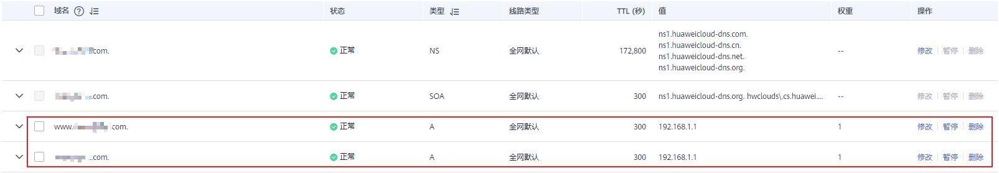

# 快速添加网站解析

## 操作场景

云解析服务支持为域名快速添加网站解析，通过该功能可以简化解析记录的配置，包含如下两种场景：

-   网站解析至IP地址：为域名的主域名和子域名分别添加一条A类型记录集
-   网站解析至另一域名：为域名的主域名和子域名分别添加一条CNAME类型记录集

## 前提条件

-   已经通过域名注册商完成域名“example.com”的注册，并将域名添加至云解析服务，详细内容请参见[创建公网域名](创建公网域名.md)。
-   如果域名“example.com”在中国大陆地区注册，需要完成域名实名认证审核。
-   已经完成网站服务器的搭建，并获取网站的IP地址。
-   如果网站服务器在中国大陆地区部署，需要完成网站域名和IP地址的备案。
    -   若在华为云[搭建网站服务器](https://support.huaweicloud.com/bestpractice-ecs/ecs_web_0001.html)，则通过华为云的备案中心进行备案，详细内容请参见[什么是备案](https://support.huaweicloud.com/icprb-icp/zh-cn_topic_0115815923.html)。
    -   若在其他云服务商处搭建网站服务器，则通过对应的云服务商进行备案。

## 网站解析至IP地址

当您想要将域名“example.com”解析至网站服务器的IP地址时，可以参考本场景操作。

> **说明：** 
>快速添加网站解析仅支持将网站解析至IPv4类型的IP地址。

1.  登录管理控制台。
2.  选择“网络 \> 云解析服务”。

    进入“云解析”页面。

1.  在左侧树状导航栏，选择“域名解析 \> 公网解析”。

    进入“公网域名”页面。

1.  在待添加记录集的域名所在行，单击“名称”列的域名名称。
2.  在解析记录页面右上角，单击“快速添加解析”。

    进入“快速添加解析”页面。

3.  在“快速添加解析”页面，根据界面提示设置网站解析参数。

    1.  选择“网站解析”页签。
    2.  “网站地址”选择“IP地址”，并在输入框中填写网站服务器的IP地址。

    **图 1**  快速添加网站解析至IP地址  
    

4.  单击“确定”，完成网站解析至IP地址的配置。

    您可以在域名的记录集列表中查看已添加的网站解析的记录集。当记录集的状态显示为“正常”时，表示记录集添加成功。

    域名的记录集包括：

    -   主域名“example.com”的NS和SOA类型记录集：系统自动创建的记录集，用于标识域名具有最终解释权的主权威DNS服务器和权威DNS服务器。
    -   主域名“example.com”的A类型记录集：用于实现通过“example.com”访问网站。
    -   子域名“www.example.com”的A类型记录集：用于实现通过“www.example.com”访问网站。

        **图 2**  记录集列表  
        

## 网站解析至另一域名

当您想要将域名“example.com”解析至另一域名“website.com”时，可以参考本场景操作。

1.  登录管理控制台。
2.  选择“网络 \> 云解析服务”。

    进入“云解析”页面。

1.  在左侧树状导航栏，选择“域名解析 \> 公网解析”。

    进入“公网域名”页面。

1.  在待添加记录集的域名所在行，单击“名称”列的域名名称。
2.  在解析记录页面右上角，单击“快速添加解析”。

    进入“快速添加解析”页面。

3.  在“快速添加解析”页面，根据界面提示设置网站解析参数。

    1.  选择“网站解析”页签。
    2.  “网站地址”选择“域名”，并在输入框中对应的域名。

    **图 3**  快速添加网站解析至另一域名  
    

4.  单击“确定”，完成网站解析至另一域名的配置。

    您可以在域名的记录集列表中查看已添加的网站解析的记录集。当记录集的状态显示为“正常”时，表示记录集添加成功。

    域名的记录集包括：

    -   主域名“example.com”的NS和SOA类型记录集：系统自动创建的记录集，用于标识域名具有最终解释权的主权威DNS服务器和权威DNS服务器。
    -   主域名“example.com”的CNAME类型记录集：用于实现通过“example.com”访问域名“website.com”。
    -   子域名“www.example.com”的CNAME类型记录集：用于实现通过“www.example.com”访问域名“website.com”。

        **图 4**  记录集列表  
        

