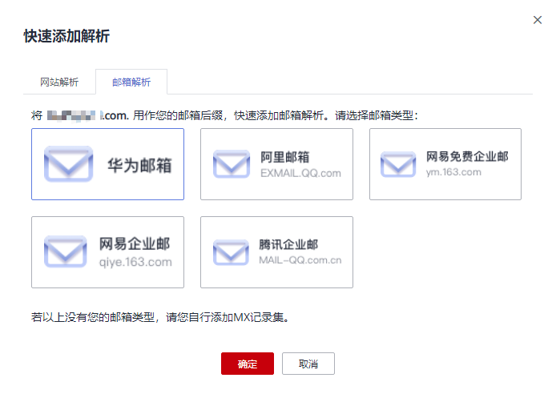

# 快速添加邮箱解析

## 操作场景

云解析服务支持为域名快速添加邮箱解析，通过该功能可以简化解析记录的配置，实现一步为不同类型邮箱配置MX、CNAME以及TXT类型的解析记录。

仅支持为如下邮箱快速添加邮箱解析：

-   华为云云速邮箱
-   阿里云企业邮箱
-   网易免费邮箱
-   网易企业邮箱
-   腾讯企业邮箱

若您的邮箱未包含在上述邮箱类型中，请参考[配置邮箱解析](https://support.huaweicloud.com/qs-dns/dns_qs_0004.html)自行添加邮箱解析记录。

常用邮箱解析记录示例请参见[常用邮箱的解析记录示例](https://support.huaweicloud.com/dns_faq/dns_faq_044.html)。本文以华为云云速邮箱为例介绍快速添加邮箱解析的操作指导。

## 前提条件

-   已经通过域名注册商完成域名“example.com”的注册，并将域名添加至云解析服务，详细内容请参见[创建公网域名](创建公网域名.md)。
-   如果域名“example.com”在中国大陆地区注册，需要完成域名实名认证审核。
-   已经购买邮箱服务器，并获取邮箱服务器的域名地址。
-   如果邮箱服务器在中国大陆地区部署，需要完成邮箱服务器域名和IP地址的备案。
    -   若在华为云购买邮箱服务器，则通过华为云的备案中心进行备案，详细内容请参见[什么是备案](https://support.huaweicloud.com/icprb-icp/zh-cn_topic_0115815923.html)。
    -   若在其他云服务商处购买邮箱服务器，则通过对应的云服务商进行备案。

## 操作步骤

1.  登录管理控制台。
2.  将鼠标悬浮于页面左侧的“”，在服务列表中，选择“网络  \> 云解析服务”。

    进入“云解析”页面。

1.  在左侧树状导航栏，选择“域名解析 \> 公网解析”。

    进入“公网域名”页面。

1.  在待添加记录集的域名所在行，单击“名称”列的域名名称。
2.  在解析记录页面右上角，单击“快速添加解析”。

    进入“快速添加解析”页面。

3.  在“快速添加解析”页面，选择“邮箱解析”页签。

    **图 1**  快速添加邮箱解析  
    

4.  选择“华为邮箱”。
5.  单击“确定”，完成邮箱解析的配置。

    您可以在域名的记录集列表中查看已添加的邮箱解析的记录集。当记录集的状态显示为“正常”时，表示记录集添加成功。

    域名的记录集包括：

    -   主域名“example.com”的NS和SOA类型记录集：系统自动创建的记录集，用于标识域名具有最终解释权的主权威DNS服务器和权威DNS服务器。
    -   邮箱解析相关的MX、CNAME以及TXT类型的记录集，详细含义如[表1](#table10372249149)所示。

        **表 1**  华为云云速邮箱解析设置样例

        
        <table><thead align="left"><tr id="zh-cn_topic_0189043234_row1450642162112"><th class="cellrowborder" valign="top" width="11.08%" id="mcps1.2.5.1.1">
记录集类型

        </th>
        <th class="cellrowborder" valign="top" width="11.23%" id="mcps1.2.5.1.2">
主机记录

        </th>
        <th class="cellrowborder" valign="top" width="34.98%" id="mcps1.2.5.1.3">
值

        </th>
        <th class="cellrowborder" valign="top" width="42.71%" id="mcps1.2.5.1.4">
说明

        </th>
        </tr>
        </thead>
        <tbody><tr id="zh-cn_topic_0189043234_row1250682120214"><td class="cellrowborder" valign="top" width="11.08%" headers="mcps1.2.5.1.1 ">
MX

        </td>
        <td class="cellrowborder" valign="top" width="11.23%" headers="mcps1.2.5.1.2 ">
置为空

        </td>
        <td class="cellrowborder" valign="top" width="34.98%" headers="mcps1.2.5.1.3 ">
10 mx1.saas.huaweicloud.com

        
20 mx2.saas.huaweicloud.com

        </td>
        <td class="cellrowborder" valign="top" width="42.71%" headers="mcps1.2.5.1.4 ">
表示邮箱服务器地址为：

        <ul id="zh-cn_topic_0189043234_ul198176331573"><li>mx1.saas.huaweicloud.com</li><li>mx2.saas.huaweicloud.com</li></ul>
        
该地址由邮箱服务商提供。在接收邮件时，“mx1.saas.huaweicloud.com”的优先级更高。

        </td>
        </tr>
        <tr id="zh-cn_topic_0189043234_row2506152122115"><td class="cellrowborder" valign="top" width="11.08%" headers="mcps1.2.5.1.1 ">
TXT

        </td>
        <td class="cellrowborder" valign="top" width="11.23%" headers="mcps1.2.5.1.2 ">
置为空

        </td>
        <td class="cellrowborder" valign="top" width="34.98%" headers="mcps1.2.5.1.3 ">
"v=spf1 include:spf.saas.huaweicloud.com ~all"

        </td>
        <td class="cellrowborder" valign="top" width="42.71%" headers="mcps1.2.5.1.4 ">
采用SPF记录防范垃圾邮件，该记录值表示：

        <ul id="zh-cn_topic_0189043234_ul838213208113"><li>SPF版本为“spf1”。</li><li>从“spf.saas.huaweicloud.com”声明的地址发出的邮件都是合法邮件，并非冒充的垃圾邮件。</li></ul>
        </td>
        </tr>
        <tr id="zh-cn_topic_0189043234_row1506182152111"><td class="cellrowborder" valign="top" width="11.08%" headers="mcps1.2.5.1.1 ">
CNAME

        </td>
        <td class="cellrowborder" valign="top" width="11.23%" headers="mcps1.2.5.1.2 ">
mail

        </td>
        <td class="cellrowborder" valign="top" width="34.98%" headers="mcps1.2.5.1.3 ">
mail.saas.huaweicloud.com

        </td>
        <td class="cellrowborder" valign="top" width="42.71%" headers="mcps1.2.5.1.4 ">
表示通过域名“mail.example.com”登录Web邮箱“mail.saas.huaweicloud.com”。

        </td>
        </tr>
        <tr id="zh-cn_topic_0189043234_row209534515559"><td class="cellrowborder" valign="top" width="11.08%" headers="mcps1.2.5.1.1 ">
CNAME

        </td>
        <td class="cellrowborder" valign="top" width="11.23%" headers="mcps1.2.5.1.2 ">
smtp

        </td>
        <td class="cellrowborder" valign="top" width="34.98%" headers="mcps1.2.5.1.3 ">
smtp.saas.huaweicloud.com

        </td>
        <td class="cellrowborder" valign="top" width="42.71%" headers="mcps1.2.5.1.4 ">
使用域名“smtp.example.com”作为访问邮箱SMTP服务器“smtp.saas.huaweicloud.com”的地址。

        </td>
        </tr>
        <tr id="zh-cn_topic_0189043234_row16739449115515"><td class="cellrowborder" valign="top" width="11.08%" headers="mcps1.2.5.1.1 ">
CNAME

        </td>
        <td class="cellrowborder" valign="top" width="11.23%" headers="mcps1.2.5.1.2 ">
imap

        </td>
        <td class="cellrowborder" valign="top" width="34.98%" headers="mcps1.2.5.1.3 ">
imap.saas.huaweicloud.com

        </td>
        <td class="cellrowborder" valign="top" width="42.71%" headers="mcps1.2.5.1.4 ">
使用域名“imap.example.com”作为访问邮箱IMAP服务器“imap.saas.huaweicloud.com”的地址。

        </td>
        </tr>
        <tr id="zh-cn_topic_0189043234_row28392051105514"><td class="cellrowborder" valign="top" width="11.08%" headers="mcps1.2.5.1.1 ">
CNAME

        </td>
        <td class="cellrowborder" valign="top" width="11.23%" headers="mcps1.2.5.1.2 ">
pop

        </td>
        <td class="cellrowborder" valign="top" width="34.98%" headers="mcps1.2.5.1.3 ">
pop.saas.huaweicloud.com

        </td>
        <td class="cellrowborder" valign="top" width="42.71%" headers="mcps1.2.5.1.4 ">
使用域名“pop.example.com”作为访问邮箱POP服务器“pop.saas.huaweicloud.com”的地址。

        </td>
        </tr>
        <tr id="zh-cn_topic_0189043234_row18295124715519"><td class="cellrowborder" valign="top" width="11.08%" headers="mcps1.2.5.1.1 ">
CNAME

        </td>
        <td class="cellrowborder" valign="top" width="11.23%" headers="mcps1.2.5.1.2 ">
pop3

        </td>
        <td class="cellrowborder" valign="top" width="34.98%" headers="mcps1.2.5.1.3 ">
pop3.saas.huaweicloud.com

        </td>
        <td class="cellrowborder" valign="top" width="42.71%" headers="mcps1.2.5.1.4 ">
使用域名“pop3.example.com”作为访问邮箱POP3服务器“pop3.saas.huaweicloud.com”的地址。

        </td>
        </tr>
        </tbody>
        </table>

        **图 2**  记录集列表  
        

