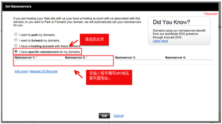

# 怎样修改GoDaddy域名的DNS服务器地址？

1.  登录  [https://www.godaddy.com](https://www.godaddy.com/)网站。
2.  单击“My Account”，进入My Account页面。
3.  在“Products”页签中，单击“DOMAINS”前面的，展开域名列表。
4.  待修改域名的“Action”列，单击“Launch”。
5.  在展开页面的“Nameservers”区域，单击“Set Nameservers”。

    **图 1**  Set Nameservers  
    

6.  选择“I have specific nameservers for my domains.”
7.  设置“Nameservers1”和“Nameservers2”为华为云DNS提供的DNS地址。
    -   ns1.hwclouds-dns.com
    -   ns1.hwclouds-dns.net

