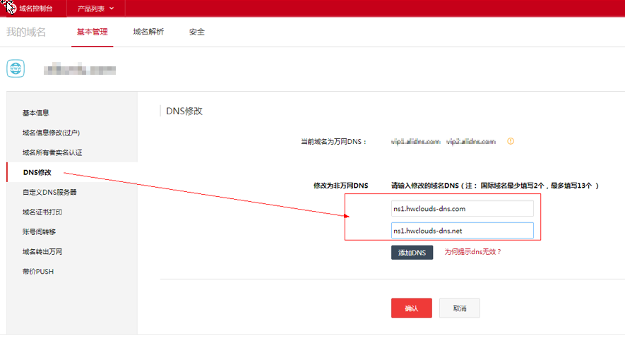

# 怎样修改万网域名的DNS服务器地址？

1.  登录[https://www.aliyun.com](https://www.aliyun.com/)网站。
2.  单击“控制台”，登录进入管理控制台。
3.  选择“产品与服务\>域名与网站（万网）\>域名”。

    进入“域名服务”页面。

4.  在左侧树状导航栏，选择“域名列表”。
5.  在域名列表中，单击待修改的域名。

    进入域名的“基本信息”页面。

6.  在左侧树状导航栏，选择“DNS修改”。

    进入“DNS修改”页面。

    **图 1**  DNS修改  
    

7.  设置“修改为非万网DNS”为华为云DNS提供的DNS地址。
    -   ns1.hwclouds-dns.com
    -   ns1.hwclouds-dns.net

