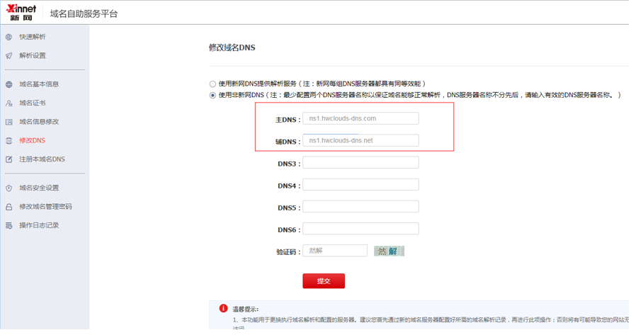

# 怎样修改新网域名的DNS服务器地址？

1.  登录[http://www.xinnet.com](http://www.xinnet.com)网站。
2.  在左侧树状导航栏，单击“域名管理”。
3.  在“我的域名”页签，单击待修改域名“操作”列的“管理”。

    进入“域名基本信息”页面。

4.  在左侧树状导航栏，单击“修改DNS”。

    进入“修改域名DNS”页面。

    **图 1**  修改域名DNS  
    

5.  选择“使用非新网DNS”。
6.  设置“主DNS”和“辅DNS”为华为云DNS提供的DNS地址。
    -   ns1.hwclouds-dns.com
    -   ns1.hwclouds-dns.net

