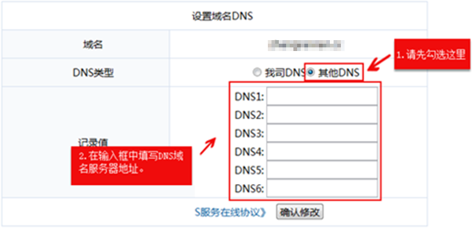

# 怎样修改易名中国域名的DNS服务器地址？

1.  登录  [https://www.ename.net/domain](https://www.ename.net/domain)网站。
2.  在右侧树状导航栏，选择“管理中心\>我的域名”。

    进入“我的域名”页面。

3.  在待修改域名的“操作”列，单击“管理”。

    进入“域名管理”页面。

4.  在“域名管理”页面的“DNS”栏，单击“修改DNS”。

    进入“设置域名DNS”页面。

    **图 1**  设置域名DNS  
    

5.  在“设置域名DNS”页面，设置“DNS类型”为“其他DNS”。
6.  设置“记录值”为华为云DNS提供的DNS地址。
    -   ns1.hwclouds-dns.com
    -   ns1.hwclouds-dns.net

