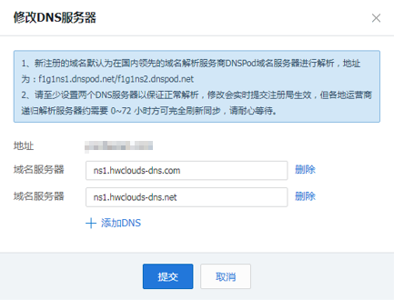

# 怎样修改腾讯域名的DNS服务器地址？

1.  登录[https://cloud.tencent.com](https://cloud.tencent.com)网站。
2.  选择“云产品\>域名与网站\>域名管理”。

    进入“我的域名”页面。

3.  在待修改域名的“操作”列，单击“管理”。

    进入“域名信息”页面。

4.  单击“DNS服务器”参数后面的“修改”。

    进入“修改DNS服务器”页面。

    **图 1**  修改DNS服务器  
    

5.  设置“域名服务器”为华为云DNS提供的DNS地址。
    -   ns1.hwclouds-dns.com
    -   ns1.hwclouds-dns.net

