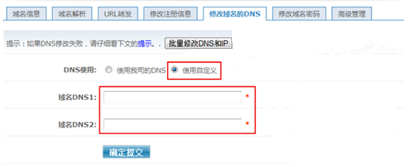

# 怎样修改西部数码域名的DNS服务器地址？

1.  登录[http://www.west263.com](http://www.west263.com)网站。
2.  单击页面顶部的“管理中心”。

    进入“管理中心”页面。

3.  在左侧树状导航栏，选择“业务管理\>域名管理”。

    进入“域名管理”页面。

4.  在待修改域名的“管理”列，单击“管理”。
5.  选择“修改域名的DNS”页签，单击“使用自定义”。

    **图 1**  修改DNS  
    

6.  设置“域名DNS1”和“域名DNS2”分别为：
    -   ns1.hwclouds-dns.com 
    -   ns1.hwclouds-dns.net

