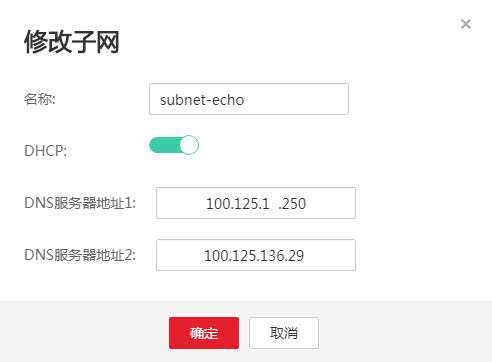

# 怎样切换内网DNS？

ECS服务器默认使用的DNS是公共DNS，DNS地址是114.114.114.114。切换成内网DNS不影响ECS服务器解析公网域名，并且还可以访问其他比如OBS，SMN等服务内部地址。因此，建议修改ECS服务器的DNS为内网DNS。

内网DNS地址请参见[华为云提供的内网DNS地址是多少？](华为云提供的内网DNS地址是多少.md)。

## 修改VPC子网的DNS服务器地址

1.  登录管理控制台。
2.  选择“网络 \> 虚拟私有云”。

    进入虚拟私有云页面。

3.  在左侧树状导航栏，选择“虚拟私有云”。

    进入“虚拟私有云”页面。

4.  在“虚拟私有云”页面的VPC列表中，单击需要修改子网的VPC名称。
5.  在“子网”页签待修改子网所在行，单击“修改”，修改子网的“DNS服务器地址”。

    以中国华南区为例，将VPC子网的DNS服务器地址修改为内网DNS地址：100.125.1.250、100.125.136.29。

    **图 1**  修改VPC子网的DNS服务器地址  
    

## 同步ECS服务器的DNS地址

VPC子网的DNS服务器地址修改后，ECS服务器的DNS不会立即更新。

如果要立即同步ECS服务器的DNS，可以采用以下两种方法。

-   重启操作系统，ECS服务器重新向DHCP服务器获取DNS信息。

    > **注意：**   
    >重启操作系统会造成业务中断，请在业务低峰期谨慎操作。  

    ECS服务器租约期（默认12小时）结束后，ECS服务器会向DHCP服务器刷新IP，DNS地址信息

-   手工修改ECS服务器的DNS服务器配置。

    如果用户的DHCP功能被关闭，需要手工修改ECS服务器的DNS配置。

    例如Linux系统，在/etc/resolv.conf手工修改DNS，不同操作系统修改DNS方法有差别。

