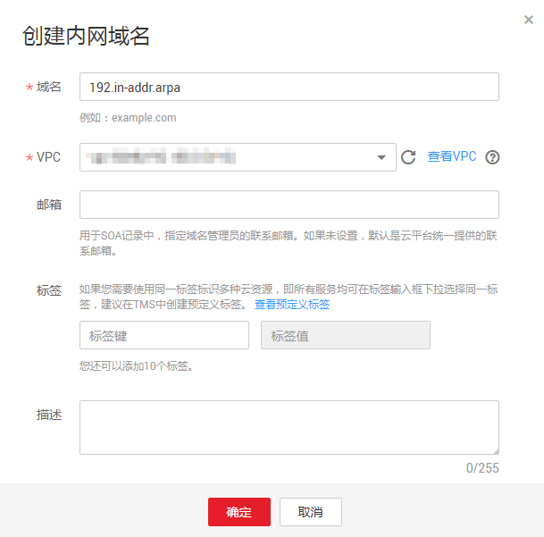
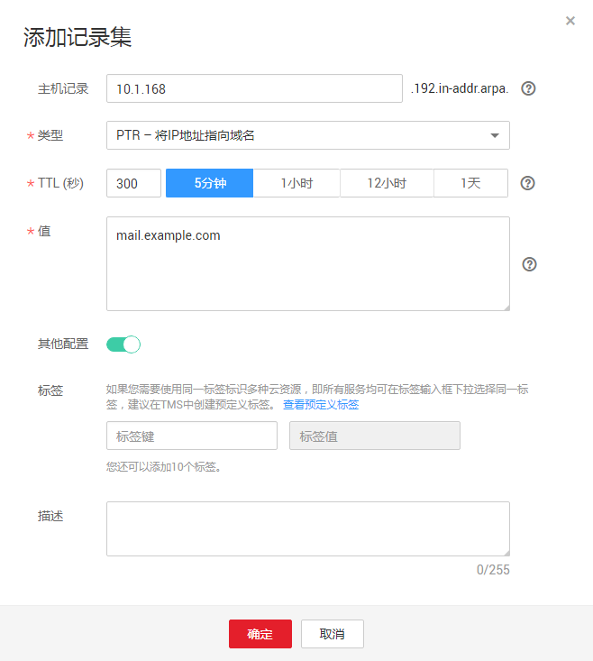

# 怎样设置弹性云服务器的私网IP的反向解析？

反向域名解析提供通过IP地址查找域名的功能。

通过管理控制台的“域名解析 \> 反向解析”“反向解析”页面可以设置EIP的反向解析。如果要设置ECS服务器私网IP的反向解析，可以通过在创建内网域名之后添加PTR记录集实现。

设置私网IP的反向解析，其域名格式是x.x.x.x.in-addr.arpa。

> **说明：**   
>in-addr.arpa是反向解析的顶级域。  
>例如，私网IP是192.168.1.10，其反向域名格式是10.1.168.192.in-addr.arpa。  
>可以创建内网域名192.in-addr.arpa，然后添加10.1.168.192.in-addr.arpa的PTR记录集来实现设置该私网IP的反向解析记录。  

## 创建内网域名

1.  登录管理控制台。
2.  选择“网络 \> 云解析服务”。

    进入云解析服务页面。

3.  在左侧树状导航栏，选择“域名解析 \> 内网域名”。

    进入“内网域名”页面。

4.  单击管理控制台左上角的，选择区域和项目。
5.  单击“创建内网域名”，开始创建内网域名。

    **图 1**  创建内网域名  
    

6.  根据界面提示配置参数，参数说明如[表1](#table12455154165118)所示。

    **表 1**  创建内网域名参数说明

    
    <table><thead align="left"><tr id="row54556485113"><th class="cellrowborder" valign="top" width="33.33333333333333%" id="mcps1.2.4.1.1">
参数

    </th>
    <th class="cellrowborder" valign="top" width="33.33333333333333%" id="mcps1.2.4.1.2">
参数说明

    </th>
    <th class="cellrowborder" valign="top" width="33.33333333333333%" id="mcps1.2.4.1.3">
取值样例

    </th>
    </tr>
    </thead>
    <tbody><tr id="row144553495114"><td class="cellrowborder" valign="top" width="33.33333333333333%" headers="mcps1.2.4.1.1 ">
域名

    </td>
    <td class="cellrowborder" valign="top" width="33.33333333333333%" headers="mcps1.2.4.1.2 ">
域名。

    
反向顶级域in-addr.arpa。

    </td>
    <td class="cellrowborder" valign="top" width="33.33333333333333%" headers="mcps1.2.4.1.3 ">
192.in-addr.arpa

    </td>
    </tr>
    <tr id="row5456845517"><td class="cellrowborder" valign="top" width="33.33333333333333%" headers="mcps1.2.4.1.1 ">
VPC

    </td>
    <td class="cellrowborder" valign="top" width="33.33333333333333%" headers="mcps1.2.4.1.2 ">
内网域名要关联的VPC。

    </td>
    <td class="cellrowborder" valign="top" width="33.33333333333333%" headers="mcps1.2.4.1.3 ">
-

    </td>
    </tr>
    <tr id="row145614175118"><td class="cellrowborder" valign="top" width="33.33333333333333%" headers="mcps1.2.4.1.1 ">
邮箱

    </td>
    <td class="cellrowborder" valign="top" width="33.33333333333333%" headers="mcps1.2.4.1.2 ">
可选参数。

    
管理该内网域名的管理员邮箱。建议用户使用保留邮箱“HOSTMASTER@<em id="i2069584005210">域名</em>”作为此管理员邮箱。

    
更多关于Email的信息，请参见<a href="SOA记录中的Email格式为什么变化了.md">SOA记录中的Email格式为什么变化了？</a>

    </td>
    <td class="cellrowborder" valign="top" width="33.33333333333333%" headers="mcps1.2.4.1.3 ">
HOSTMASTER@example.com

    </td>
    </tr>
    <tr id="row18748159183818"><td class="cellrowborder" valign="top" width="33.33333333333333%" headers="mcps1.2.4.1.1 ">
标签

    </td>
    <td class="cellrowborder" valign="top" width="33.33333333333333%" headers="mcps1.2.4.1.2 ">
可选参数。

    
域名的标示，包括键和值，每个域名可以创建10个标签。

    
键和值的命名规则请参见<a href="#dns_faq_031__table114584301390">表2</a>。

    </td>
    <td class="cellrowborder" valign="top" width="33.33333333333333%" headers="mcps1.2.4.1.3 ">
example_key1

    
example_value1

    </td>
    </tr>
    <tr id="row64563417519"><td class="cellrowborder" valign="top" width="33.33333333333333%" headers="mcps1.2.4.1.1 ">
描述

    </td>
    <td class="cellrowborder" valign="top" width="33.33333333333333%" headers="mcps1.2.4.1.2 ">
可选参数。

    
域名的描述信息。

    
长度不超过255个字符。

    </td>
    <td class="cellrowborder" valign="top" width="33.33333333333333%" headers="mcps1.2.4.1.3 ">
This is a zone example.

    </td>
    </tr>
    </tbody>
    </table>

    **表 2**  标签命名规则

    
    <table><thead align="left"><tr id="zh-cn_topic_0057777026_zh-cn_topic_0035467699_row72901535141713"><th class="cellrowborder" valign="top" width="18.181818181818183%" id="mcps1.2.4.1.1">
参数

    </th>
    <th class="cellrowborder" valign="top" width="50.505050505050505%" id="mcps1.2.4.1.2">
规则

    </th>
    <th class="cellrowborder" valign="top" width="31.313131313131315%" id="mcps1.2.4.1.3">
举例

    </th>
    </tr>
    </thead>
    <tbody><tr id="zh-cn_topic_0057777026_zh-cn_topic_0035467699_row52906354176"><td class="cellrowborder" valign="top" width="18.181818181818183%" headers="mcps1.2.4.1.1 ">
键

    </td>
    <td class="cellrowborder" valign="top" width="50.505050505050505%" headers="mcps1.2.4.1.2 "><ul id="zh-cn_topic_0057777026_zh-cn_topic_0035467699_ul46253231183"><li>不能为空。</li><li>对于同一资源键值唯一。</li><li>长度不超过36个字符。</li><li>取值为不包含“=”,“*”,“&lt;”,“&gt;”,“\”,“,”,“|”,“/”的所有Unicode字符，且首尾字符不能为空格。</li></ul>
    </td>
    <td class="cellrowborder" valign="top" width="31.313131313131315%" headers="mcps1.2.4.1.3 ">
example_key1

    </td>
    </tr>
    <tr id="zh-cn_topic_0057777026_zh-cn_topic_0035467699_row132900355172"><td class="cellrowborder" valign="top" width="18.181818181818183%" headers="mcps1.2.4.1.1 ">
值

    </td>
    <td class="cellrowborder" valign="top" width="50.505050505050505%" headers="mcps1.2.4.1.2 "><ul id="zh-cn_topic_0057777026_zh-cn_topic_0035467699_ul19648123161815"><li>不能为空。</li><li>长度不超过43个字符。</li><li>取值为不包含“=”,“*”,“&lt;”,“&gt;”,“\”,“,”,“|”,“/”的所有Unicode字符，且首尾字符不能为空格。</li></ul>
    </td>
    <td class="cellrowborder" valign="top" width="31.313131313131315%" headers="mcps1.2.4.1.3 ">
example_value1

    </td>
    </tr>
    </tbody>
    </table>

7.  单击“确定”。

    创建完成后，您可以在“内网域名”页面查看新创建的域名信息。

    > **说明：**   
    >单击“名称”列的域名名称，可以看到系统已经为您创建了SOA类型和NS类型的记录集。其中，  
    >-   SOA类型的记录集标识了对此域名具有最终解释权的主权威服务器。  
    >-   NS类型的记录集标识了此域名的权威服务器。  

## 添加PTR记录集

1.  在“内网域名”页面的域名列表中，单击新创建域名的名称。

    系统进入域名解析记录页面。

2.  单击“添加记录集”。

    系统进入“添加记录集”页面。

    **图 2**  添加记录集  
    

3.  根据界面提示填写参数配置，参数说明如[表3](#table2068616914271)所示。

    **表 3**  添加PTR类型记录集参数说明

    
    <table><thead align="left"><tr id="row14687398277"><th class="cellrowborder" valign="top" width="18.18181818181818%" id="mcps1.2.4.1.1">
参数

    </th>
    <th class="cellrowborder" valign="top" width="48.484848484848484%" id="mcps1.2.4.1.2">
参数说明

    </th>
    <th class="cellrowborder" valign="top" width="33.33333333333333%" id="mcps1.2.4.1.3">
取值样例

    </th>
    </tr>
    </thead>
    <tbody><tr id="row46871799274"><td class="cellrowborder" valign="top" width="18.18181818181818%" headers="mcps1.2.4.1.1 ">
主机记录

    </td>
    <td class="cellrowborder" valign="top" width="48.484848484848484%" headers="mcps1.2.4.1.2 ">
填写反向解析具体的IP地址。

    </td>
    <td class="cellrowborder" valign="top" width="33.33333333333333%" headers="mcps1.2.4.1.3 ">
10.1.168

    
例如，用户IP地址为192.168.1.10，则反向解析域名的完整格式为10.1.168.192.in-addr.arpa。

    <ul id="ul772510438411"><li>若创建的域名为192.in-addr.arpa，则主机记录为10.1.168</li><li>若创建的域名为1.168.192.in-addr.arpa，则主机记录为10</li></ul>
    </td>
    </tr>
    <tr id="row186872093277"><td class="cellrowborder" valign="top" width="18.18181818181818%" headers="mcps1.2.4.1.1 ">
类型

    </td>
    <td class="cellrowborder" valign="top" width="48.484848484848484%" headers="mcps1.2.4.1.2 ">
记录集的类型，此处为PTR类型。

    </td>
    <td class="cellrowborder" valign="top" width="33.33333333333333%" headers="mcps1.2.4.1.3 ">
PTR – 将IP地址指向域名

    </td>
    </tr>
    <tr id="row17687395279"><td class="cellrowborder" valign="top" width="18.18181818181818%" headers="mcps1.2.4.1.1 ">
TTL(秒)

    </td>
    <td class="cellrowborder" valign="top" width="48.484848484848484%" headers="mcps1.2.4.1.2 ">
记录集的有效缓存时间，以秒为单位。

    </td>
    <td class="cellrowborder" valign="top" width="33.33333333333333%" headers="mcps1.2.4.1.3 ">
默认为“5min”，即300s。

    </td>
    </tr>
    <tr id="row176881399271"><td class="cellrowborder" valign="top" width="18.18181818181818%" headers="mcps1.2.4.1.1 ">
值

    </td>
    <td class="cellrowborder" valign="top" width="48.484848484848484%" headers="mcps1.2.4.1.2 ">
反向解析指向的域名。

    
仅可输入1个域名。

    </td>
    <td class="cellrowborder" valign="top" width="33.33333333333333%" headers="mcps1.2.4.1.3 ">
mail.example.com

    </td>
    </tr>
    <tr id="row10389125919409"><td class="cellrowborder" valign="top" width="18.18181818181818%" headers="mcps1.2.4.1.1 ">
标签

    </td>
    <td class="cellrowborder" valign="top" width="48.484848484848484%" headers="mcps1.2.4.1.2 ">
可选参数，当“其他配置”开关打开时显示。记录集的标示，包括键和值，每个记录集可以创建10个标签。

    
键和值的命名规则请参见<a href="#dns_faq_031__table114584301390">表2</a>。

    </td>
    <td class="cellrowborder" valign="top" width="33.33333333333333%" headers="mcps1.2.4.1.3 ">
example_key1

    
example_value1

    </td>
    </tr>
    <tr id="row17688109192713"><td class="cellrowborder" valign="top" width="18.18181818181818%" headers="mcps1.2.4.1.1 ">
描述

    </td>
    <td class="cellrowborder" valign="top" width="48.484848484848484%" headers="mcps1.2.4.1.2 ">
可选配置，对PTR记录集的描述，当“其他配置”开关打开时显示。

    </td>
    <td class="cellrowborder" valign="top" width="33.33333333333333%" headers="mcps1.2.4.1.3 ">
The description of the PTR Record.

    </td>
    </tr>
    </tbody>
    </table>

4.  单击“确定”，完成PTR类型记录集的添加。

