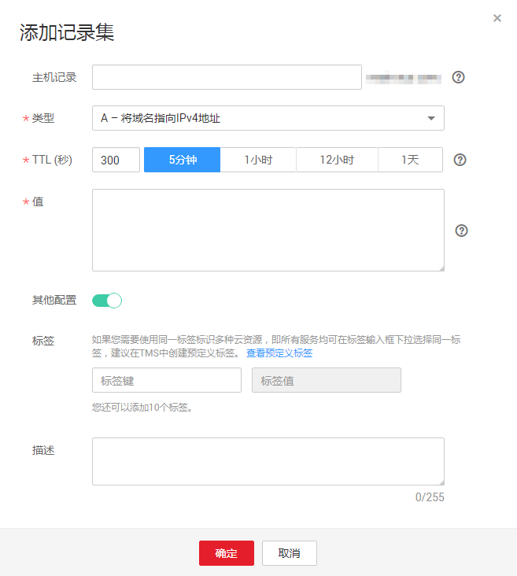

# 怎样通过弹性云服务器的主机名访问弹性云服务器？

云解析服务的内网域名功能支持创建顶级域名（com保留域名除外）。

当用户购买了弹性云服务器并设置了云服务器的主机名，例如hostname。用户可以在云解析服务器中将此名称创建为内网顶级域名，然后添加该域名到私网IP的域名解析记录，这样用户就可以通过弹性云服务器的主机名访问弹性云服务器。

## 操作步骤

1.  登录管理控制台。
2.  选择“网络 \> 云解析服务”。

    进入云解析服务页面。

3.  在左侧树状导航栏，选择“域名解析 \> 内网域名”。

    进入“内网域名”页面。

4.  单击管理控制台左上角的，选择区域和项目。
5.  单击“创建内网域名”，开始创建内网域名。

    “域名”设置为弹性云服务器的主机名“hostname”。

    **图 1**  创建内网域名  
    

6.  单击“确定”。

    创建完成后，您可以在“内网域名”页面查看新创建的域名信息。

7.  在“内网域名”页面的域名列表中，单击新创建域名的名称。

    系统进入域名解析记录页面。

8.  单击“添加记录集”，系统进入“添加记录集”页面。

    根据界面提示为创建的域名hostname添加A记录集：

    -   “类型”设置为“A - 将域名指向IPv4地址”。
    -   “主机记录”设置为空。
    -   “值”设置为私网IP地址，例如“192.168.1.10”。

        **图 2**  添加记录集  
        

9.  单击“确定”。

    创建完成后，在关联VPC的弹性云服务器访问主机名hostname，就可以解析到访问对应服务器的IP地址192.168.1.10。

