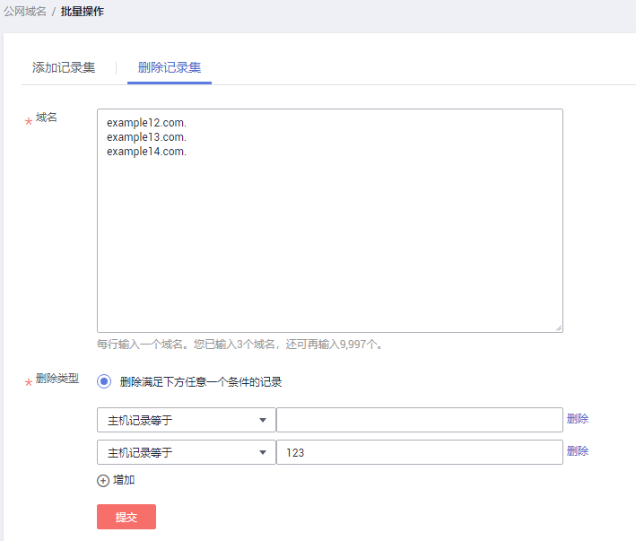
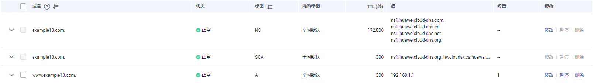

# 批量删除记录集

## 操作场景

云解析服务支持对记录集的批量操作，可以为多个域名批量删除指定“主机记录”的所有记录集。

> **说明：**   
>-   如果批量删除单个域名的记录集，还可以参考[批量删除记录集（单个域名）](管理记录集.md#section1648820445294)操作。  
>-   删除记录集后，不可恢复，请谨慎操作。  

本节以[表1](#table890082472119)所示内容为例，介绍批量删除记录集的操作。

**表 1**  批量删除记录集示例

<table><thead align="left"><tr id="row6901124192115"><th class="cellrowborder" valign="top" width="11.83%" id="mcps1.2.4.1.1">
域名

</th>
<th class="cellrowborder" valign="top" width="12.7%" id="mcps1.2.4.1.2">
主机记录

</th>
<th class="cellrowborder" valign="top" width="75.47%" id="mcps1.2.4.1.3">
说明

</th>
</tr>
</thead>
<tbody><tr id="row3901162413218"><td class="cellrowborder" rowspan="2" valign="top" width="11.83%" headers="mcps1.2.4.1.1 ">
example12.com

</td>
<td class="cellrowborder" valign="top" width="12.7%" headers="mcps1.2.4.1.2 ">
-

</td>
<td class="cellrowborder" valign="top" width="75.47%" headers="mcps1.2.4.1.3 ">
批量删除域名example12.com的所有记录集。

</td>
</tr>
<tr id="row637222112228"><td class="cellrowborder" valign="top" headers="mcps1.2.4.1.1 ">
123

</td>
<td class="cellrowborder" valign="top" headers="mcps1.2.4.1.2 ">
批量删除域名123.example12.com的所有记录集。

</td>
</tr>
<tr id="row5901024102110"><td class="cellrowborder" rowspan="2" valign="top" width="11.83%" headers="mcps1.2.4.1.1 ">
example13.com

</td>
<td class="cellrowborder" valign="top" width="12.7%" headers="mcps1.2.4.1.2 ">
-

</td>
<td class="cellrowborder" valign="top" width="75.47%" headers="mcps1.2.4.1.3 ">
批量删除域名example13.com的所有记录集。

</td>
</tr>
<tr id="row5642132720221"><td class="cellrowborder" valign="top" headers="mcps1.2.4.1.1 ">
123

</td>
<td class="cellrowborder" valign="top" headers="mcps1.2.4.1.2 ">
批量删除域名123.example13.com的所有记录集。

</td>
</tr>
<tr id="row1366995812216"><td class="cellrowborder" rowspan="2" valign="top" width="11.83%" headers="mcps1.2.4.1.1 ">
example14.com

</td>
<td class="cellrowborder" valign="top" width="12.7%" headers="mcps1.2.4.1.2 ">
-

</td>
<td class="cellrowborder" valign="top" width="75.47%" headers="mcps1.2.4.1.3 ">
批量删除域名example14.com的所有记录集。

</td>
</tr>
<tr id="row262123412229"><td class="cellrowborder" valign="top" headers="mcps1.2.4.1.1 ">
123

</td>
<td class="cellrowborder" valign="top" headers="mcps1.2.4.1.2 ">
批量删除域名123.example14.com的所有记录集。

</td>
</tr>
</tbody>
</table>

## 约束与限制

-   仅支持为公网域名批量删除记录集。
-   不支持批量删除系统自动生成的SOA类型和NS类型记录集。
-   如果某个域名不存在指定的“主机记录”，则针对该“主机记录”的批量操作无效。
-   在批量删除记录集时：
    -   支持同时为10000个域名删除记录集。
    -   最多支持设置5个指定“主机记录”。

## 操作步骤

1.  登录管理控制台。
2.  选择“网络 \> 云解析服务”。

    进入“云解析”页面。

3.  在左侧树状导航栏，选择“域名解析 \> 公网解析”。

    进入“公网域名”页面。

4.  在域名列表中，勾选待批量删除记录集的域名，并在域名列表上方的“批量操作”下拉框中，选择“批量删除记录集”。

    **图 1**  批量删除记录集  
    

5.  在“批量操作”页面的“批量删除记录集”页签，如[表1](#table890082472119)所示设置参数。

    -   域名：待批量删除记录集的主域名。

        > **说明：**   
        >-   如果[步骤4](#li5219924163019)中已经勾选待批量删除记录集的域名，则此处无需设置。  
        >-   如果[步骤4](#li5219924163019)中未勾选待批量删除记录集的域名，则填写域名的主域名，多个域名以换行符分隔。  

    -   删除类型：默认勾选“删除满足下方任意一个条件的记录”。

        当前仅支持“主机记录等于”，即批量删除指定“主机记录”的记录集。

    **图 2**  设置批量删除参数  
    

6.  单击“提交”，完成批量删除记录集操作。

    您可以在每个域名对应的记录集列表中查看对应的记录集是否删除成功。若记录集列表中不包含域名为“xxx.com”以及“123.xxx.com”的记录集，则表示操作成功。

    **图 3**  为example12.com添加的记录集  
    

    **图 4**  为example13.com添加的记录集  
    

    **图 5**  为example14.com添加的记录集  
    

