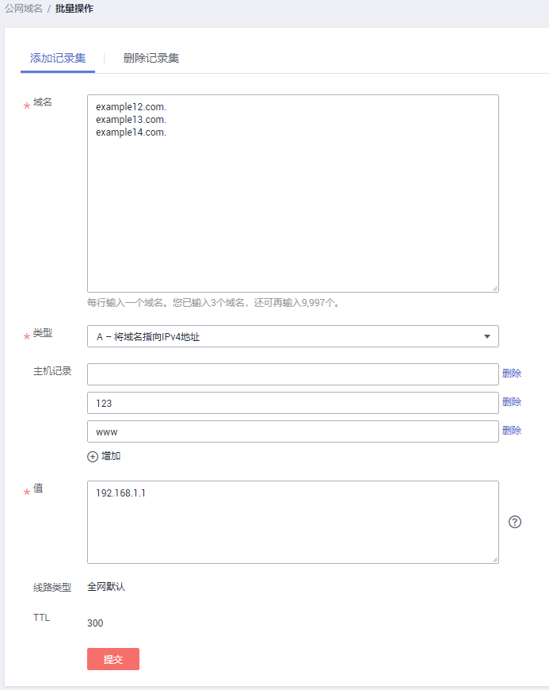
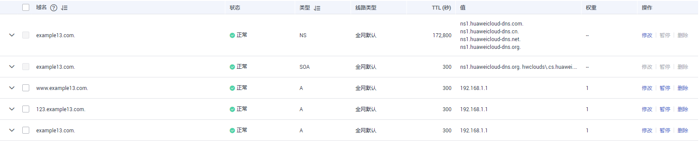
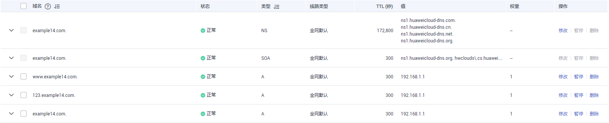

# 批量添加记录集

## 操作场景

云解析服务支持对记录集的批量操作。在相同解析线路中，支持批量为多个域名及其子域名添加相同类型的记录集。

本节以[表1](#table890082472119)所示内容为例，介绍批量添加记录集的操作。

**表 1**  批量添加记录集示例

<table><thead align="left"><tr id="row6901124192115"><th class="cellrowborder" valign="top" width="20.82%" id="mcps1.2.6.1.1">
域名

</th>
<th class="cellrowborder" valign="top" width="13.63%" id="mcps1.2.6.1.2">
主机记录

</th>
<th class="cellrowborder" valign="top" width="12.98%" id="mcps1.2.6.1.3">
记录集类型

</th>
<th class="cellrowborder" valign="top" width="13.8%" id="mcps1.2.6.1.4">
记录集值

</th>
<th class="cellrowborder" valign="top" width="38.769999999999996%" id="mcps1.2.6.1.5">
说明

</th>
</tr>
</thead>
<tbody><tr id="row3901162413218"><td class="cellrowborder" rowspan="3" valign="top" width="20.82%" headers="mcps1.2.6.1.1 ">
example12.com

</td>
<td class="cellrowborder" valign="top" width="13.63%" headers="mcps1.2.6.1.2 ">
-

</td>
<td class="cellrowborder" rowspan="3" valign="top" width="12.98%" headers="mcps1.2.6.1.3 ">
A

</td>
<td class="cellrowborder" rowspan="9" valign="top" width="13.8%" headers="mcps1.2.6.1.4 ">
192.168.1.1

</td>
<td class="cellrowborder" valign="top" width="38.769999999999996%" headers="mcps1.2.6.1.5 ">
为主域名example12.com添加A记录集，其解析值为192.168.1.1。

</td>
</tr>
<tr id="row637222112228"><td class="cellrowborder" valign="top" headers="mcps1.2.6.1.1 ">
123

</td>
<td class="cellrowborder" valign="top" headers="mcps1.2.6.1.2 ">
为子域名123.example12.com添加A记录集，其解析值为192.168.1.1。

</td>
</tr>
<tr id="row993372392213"><td class="cellrowborder" valign="top" headers="mcps1.2.6.1.1 ">
www

</td>
<td class="cellrowborder" valign="top" headers="mcps1.2.6.1.2 ">
为子域名www.example12.com添加A记录集，其解析值为192.168.1.1。

</td>
</tr>
<tr id="row5901024102110"><td class="cellrowborder" rowspan="3" valign="top" headers="mcps1.2.6.1.1 ">
example13.com

</td>
<td class="cellrowborder" valign="top" headers="mcps1.2.6.1.2 ">
-

</td>
<td class="cellrowborder" rowspan="3" valign="top" headers="mcps1.2.6.1.3 ">
A

</td>
<td class="cellrowborder" valign="top" headers="mcps1.2.6.1.4 ">
为主域名example13.com添加A记录集，其解析值为192.168.1.1。

</td>
</tr>
<tr id="row5642132720221"><td class="cellrowborder" valign="top" headers="mcps1.2.6.1.1 ">
123

</td>
<td class="cellrowborder" valign="top" headers="mcps1.2.6.1.2 ">
为子域名123.example13.com添加A记录集，其解析值为192.168.1.1。

</td>
</tr>
<tr id="row1468383002217"><td class="cellrowborder" valign="top" headers="mcps1.2.6.1.1 ">
www

</td>
<td class="cellrowborder" valign="top" headers="mcps1.2.6.1.2 ">
为子域名www.example13.com添加A记录集，其解析值为192.168.1.1。

</td>
</tr>
<tr id="row1366995812216"><td class="cellrowborder" rowspan="3" valign="top" headers="mcps1.2.6.1.1 ">
example14.com

</td>
<td class="cellrowborder" valign="top" headers="mcps1.2.6.1.2 ">
-

</td>
<td class="cellrowborder" rowspan="3" valign="top" headers="mcps1.2.6.1.3 ">
A

</td>
<td class="cellrowborder" valign="top" headers="mcps1.2.6.1.4 ">
为主域名example14.com添加A记录集，其解析值为192.168.1.1。

</td>
</tr>
<tr id="row262123412229"><td class="cellrowborder" valign="top" headers="mcps1.2.6.1.1 ">
123

</td>
<td class="cellrowborder" valign="top" headers="mcps1.2.6.1.2 ">
为子域名123.example14.com添加A记录集，其解析值为192.168.1.1。

</td>
</tr>
<tr id="row75764360223"><td class="cellrowborder" valign="top" headers="mcps1.2.6.1.1 ">
www

</td>
<td class="cellrowborder" valign="top" headers="mcps1.2.6.1.2 ">
为子域名www.example14.com添加A记录集，其解析值为192.168.1.1。

</td>
</tr>
</tbody>
</table>

## 约束与限制

-   仅支持为公网域名批量添加记录集。
-   在进行批量添加记录集之前，需要完成[创建公网域名](创建公网域名.md)，否则批量操作无效。
-   在批量添加记录集时：
    -   支持同时为10000个域名添加记录集。
    -   包括主域名和子域名在内，每个域名最多支持添加10条解析记录。
    -   每个域名的“主机记录”设置相同。
    -   线路类型只支持“全网默认”，不支持智能线路解析。
    -   TTL只支持设置为300秒。

## 操作步骤

1.  登录管理控制台。
2.  将鼠标悬浮于页面左侧的“”，在服务列表中，选择“网络  \> 云解析服务”。

    进入“云解析”页面。

1.  在左侧树状导航栏，选择“域名解析 \> 公网解析”。

    进入“公网域名”页面。

2.  在域名列表中，勾选待批量添加记录集的域名，并在列表上方的“批量操作”下拉框中，选择“批量添加记录集”。

    **图 1**  批量添加记录集  
    

3.  在“批量操作”页面的“批量添加记录集”页签，如[表1](#table890082472119)所示设置参数。
    -   域名：待批量添加记录集的主域名。

        > **说明：** 
        >-   [步骤4](#li540455312367)中已经勾选了待批量添加记录集的域名，此处无需设置。
        >-   如果您直接单击“批量添加记录集”，未勾选待批量添加记录集的域名，则需要填写域名的主域名，多个域名以换行符分隔。

    -   类型：设置待添加的记录集类型。
    -   主机记录：设置域名的解析前缀。
    -   值：设置添加的记录集值。

        **图 2**  设置批量添加参数  
        

4.  单击“提交”，完成批量添加记录集操作。

    您可以在每个域名对应的记录集列表中查看添加的记录集。当记录集的状态显示为“正常”时，表示记录集添加成功。

    **图 3**  为example12.com添加的记录集  
    

    **图 4**  为example13.com添加的记录集  
    

    **图 5**  为example14.com添加的记录集  
    

