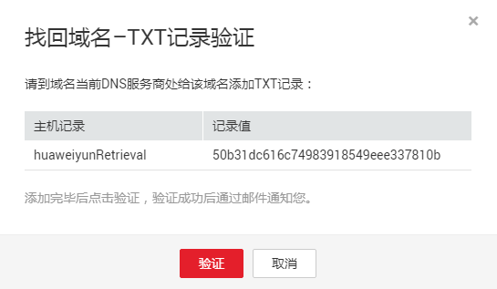
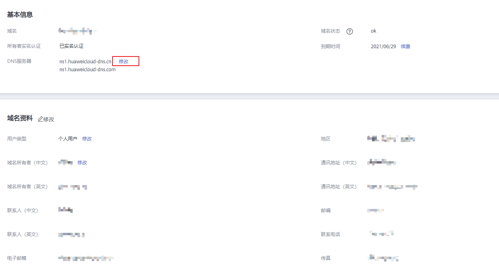

# 找回域名

## 操作场景

云解析服务支持帮助域名真正的所有者找回域名。

云解析服务在“创建公网域名”时不校验域名的所有权，因此，任何用户都可以将域名创建至云解析服务中。如果某一域名在云解析服务中已被创建，当该域名真正的所有者想要创建公网域名时，系统会提示“域名已经被其他租户创建”，此时，无法为域名配置解析，需要先参考本操作找回域名。

域名的注册商不同，找回域名的方式也不同，包含以下场景：

-   [找回域名（第三方注册域名）](#section1170416252123)
    -   域名：通过第三方域名注册商注册
    -   阶段：通过云解析服务“创建公网域名”时报错
    -   提示信息：域名已经被其他租户创建，找回域名

-   [找回域名（华为云注册域名）](#section202151616184720)
    -   域名：通过华为云注册
    -   阶段：通过云解析服务“创建公网域名”时报错
    -   提示信息：域名已经被其他租户创建，找回域名

-   [找回域名（华为云注册域名，且进行了帐号间转移）](#section15272151601913)
    -   域名：通过华为云注册
    -   阶段：完成域名“帐号间转移”操作后，通过转移后帐户“创建公网域名”时报错
    -   提示信息：域名已经被其他租户创建，找回域名

## 前提条件

-   域名已通过域名注册商注册完成，是真实的域名。
-   操作者是域名真正的所有者。

## 找回域名（第三方注册域名）

用户在第三方注册商处注册了域名“example.com”，想要使用华为云DNS进行解析，在创建公网域名时，提示“域名已经被其他租户创建，找回域名”。

这种场景下，可以在第三方DNS处为域名配置对应的TXT记录，待解析生效后完成TXT记录集验证，即可实现找回域名。

**获取TXT记录信息**

1.  登录管理控制台。
2.  将鼠标悬浮于页面左侧的“”，在服务列表中，选择“网络  \> 云解析服务”。

    进入“云解析”页面。

3.  在左侧树状导航栏，选择“域名解析 \> 公网解析”。

    进入“公网域名”页面。

1.  单击“创建公网域名”，进入“创建公网域名”页面。
2.  在“创建公网域名”页面，设置参数并单击“确定”。

    “域名”设置为“example.com”。

3.  若域名已被其他租户创建，请根据页面出现的提示单击“找回域名”。

    **图 1**  域名找回  
    

    进入“找回域名-TXT记录验证”页面，获取用于验证域名所有者所需添加的TXT记录信息。

    **图 2**  找回域名-TXT记录验证  
    

**为域名配置TXT记录**

根据页面提示到域名当前DNS服务商处为域名添加TXT记录。

> **说明：** 
>以下操作仅供参考，详细操作步骤请参考对应DNS服务商的帮助文档。

1.  登录域名当前DNS服务商的管理控制台，在域名列表中，单击“域名”列的域名名称。

    进入“解析设置”页面。

2.  单击“添加记录”。
    -   记录类型：TXT
    -   主机记录：huaweiyunRetrieval
    -   记录值：4924e0ee8e914f0f8e99ac9052565627

3.  单击“确定”，完成TXT记录的添加。

    在记录列表中，当TXT记录“状态”列显示为“正常”时，表示TXT记录添加成功。

**验证TXT记录信息**

1.  待TXT解析生效后，返回[步骤6](#li281664172114)所示页面，单击“验证”按钮。

    后台系统会验证域名TXT解析记录是否生效，请耐心等待，验证通过后，域名将归属到当前帐号下进行管理。

## 找回域名（华为云注册域名）

域名在华为云注册了域名“example.com”，该域名默认选择华为云DNS进行解析，系统会自动在云解析服务中创建公网域名。若在云解析服务的公网域名列表中未查看到创建的域名，且重新创建公网域名时，提示“域名已经被其他租户创建，找回域名”。

这种场景下，可以修改域名的DNS服务器地址到第三方DNS，然后在第三方DNS处为域名配置对应的TXT记录，待解析生效后完成TXT记录集验证，即可实现找回域名。

**修改域名的DNS服务器地址到第三方DNS**

修改DNS服务器并不能立即生效，具体的生效时间请参见[修改DNS服务器后多久生效？](https://support.huaweicloud.com/dns_faq/dns_faq_140305.html)。

1.  登录[管理控制台](https://auth.huaweicloud.com/authui/login.html?locale=zh-cn#/login)。
2.  选择“域名与网站 \> 域名注册”。

    进入“域名列表”页面。

3.  在域名列表中，单击“域名”列的待修改DNS服务器的域名。

    进入域名信息页面。

    **图 3**  域名信息  
    

4.  在域名信息页面，单击“DNS服务器”后的“修改”，进入“修改DNS服务器”页面。

    **图 4**  修改DNS服务器（2）  
    

5.  在“DNS服务器”的文本框内，修改DNS服务器地址到第三方DNS。

    > **说明：** 
    >因后续需要在第三方DNS为域名配置解析记录，因此，请修改为拥有操作权限的第三方服务商的DNS服务器地址。

6.  单击“确定”，完成DNS服务器的修改。

**获取TXT记录信息**

1.  在左侧树状导航栏，选择“域名解析 \> 公网解析”。

    进入“公网域名”页面。

1.  单击“创建公网域名”，进入“创建公网域名”页面。
2.  在“创建公网域名”页面，设置参数并单击“确定”。

    “域名”设置为“example.com”。

3.  若域名已被其他租户创建，请根据页面出现的提示单击“找回域名”。

    **图 5**  域名找回  
    

    进入“找回域名-TXT记录验证”页面，获取用于验证域名所有者所需添加的TXT记录信息。

    **图 6**  找回域名-TXT记录验证  
    

**为域名配置TXT记录**

根据页面提示到第三方DNS服务商处为该域名添加TXT记录。

> **说明：** 
>以下操作仅供参考，详细操作步骤请参考对应DNS服务商的帮助文档。

1.  登录域名当前DNS服务商的管理控制台，在域名列表中，单击“域名”列的域名名称。

    进入“解析设置”页面。

2.  单击“添加记录”。
    -   记录类型：TXT
    -   主机记录：huaweiyunRetrieval
    -   记录值：4924e0ee8e914f0f8e99ac9052565627

3.  单击“确定”，完成TXT记录的添加。

    在记录列表中，当TXT记录“状态”列显示为“正常”时，表示TXT记录添加成功。

**验证TXT记录信息**

1.  待TXT解析生效后，返回[步骤6](#li1621661618478)所示页面，单击“验证”按钮。

    后台系统会验证域名TXT解析记录是否生效，请耐心等待，验证通过后，域名将归属到当前帐号下进行管理。

## 找回域名（华为云注册域名，且进行了帐号间转移）

域名“example.com”由帐户A通过华为云注册，通过帐号间转移操作，将域名转移至帐户B进行管理。用户通过帐号B为该域名创建公网域名时，提示“域名已经被其他租户创建，找回域名”。

这种场景下，可以通过登录源帐号A，删除已配置的域名及解析记录，然后再通过目的帐号B为域名配置解析。

**删除源帐号A中的域名及解析记录**

> **说明：** 
>删除公网域名，即可删除域名的解析记录。

1.  通过帐号A登录管理控制台。
2.  将鼠标悬浮于页面左侧的“”，在服务列表中，选择“网络  \> 云解析服务”。

    进入“云解析”页面。

3.  在左侧树状导航栏，选择“域名解析 \> 公网解析”。

    进入“公网域名”页面。

1.  选择待删除的公网域名，单击“操作”列下的“更多 \> 删除”。

    进入“删除公网域名”页面。

    **图 7**  删除公网域名  
    

2.  单击“是”，确认删除该公网域名。

**通过目的帐号B为域名配置解析记录**

1.  通过帐号B登录管理控制台。
2.  根据需要，重新为域名配置解析记录，详细操作请参考[创建公网域名](创建公网域名.md)和[解析管理简介](解析管理简介.md)。

