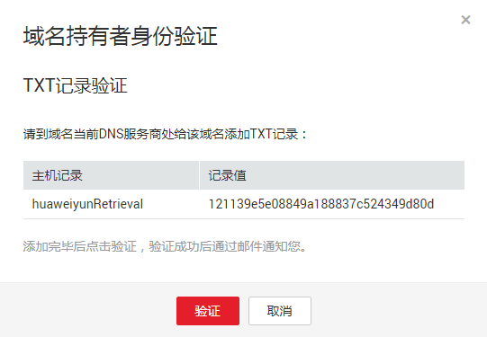

# 找回域名

## 操作场景

云解析服务为域名的真正所有者提供找回域名的操作。

云解析服务在创建公网域名时不校验域名的所有权，用户可以将任何域名托管至云解析服务中。当有用户再次创建相同域名在云解析服务时，系统会提示该域名已被其他用户创建。若用户是域名的真正所有者，则可以执行找回域名操作。

## 操作步骤

1.  登录管理控制台。
2.  选择“网络 \> 云解析服务”。

    进入云解析服务页面。

3.  在左侧树状导航栏，选择“域名解析 \> 公网域名”。

    进入“公网域名”页面。

4.  单击“创建公网域名”，系统进入“创建公网域名”页面。
5.  若域名已被创建，请根据页面出现的提示单击“域名找回”。

    **图 1**  域名找回  
    

6.  系统进入域名持有者身份验证页面，并展示用于验证域名所有者所需添加的TXT记录信息。

    请根据页面提示到域名当前DNS服务商处完成添加TXT记录操作。

    **图 2**  域名持有者身份验证  
    

7.  待TXT解析生效后，单击“验证”按钮。

    后台系统会验证域名TXT解析记录是否生效，请耐心等待，验证通过后，域名将归属到当前账号下进行管理。

