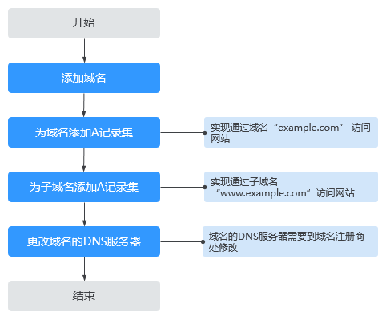
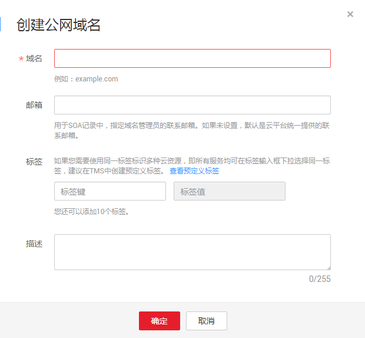
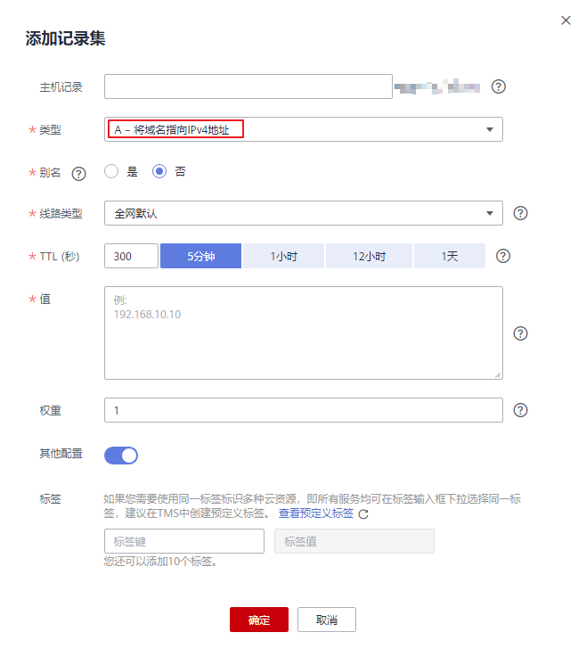
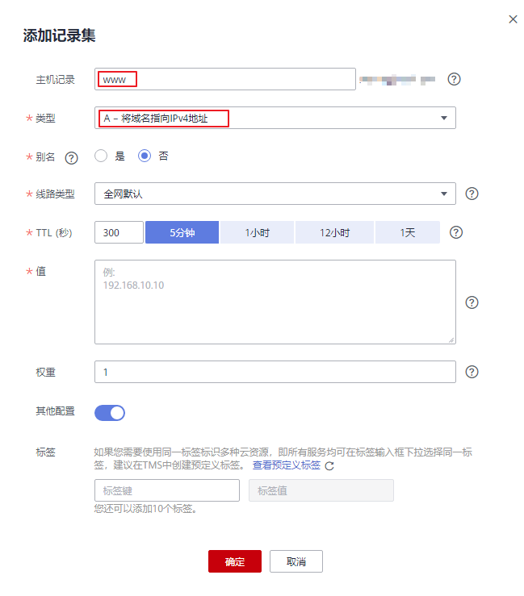

# 添加网站解析

## 操作场景

当您想在Internet上通过域名访问您的网站时，可以通过华为云的云解析服务为域名添加解析记录。

例如，搭建一个网站服务器，采用IPv4格式的弹性IP地址。如果想要实现通过域名“example.com”及其子域名“www.example.com”访问该网站，需要配置如下解析记录：

-   A：添加域名“example.com”到弹性IP地址的解析记录。
-   A：添加子域名“www.example.com”到弹性IP地址的解析记录。

您还可以通过[快速添加网站解析](https://support.huaweicloud.com/usermanual-dns/dns_usermanual_06012.html)功能为域名配置网站解析。

> **说明：** 
>为域名配置网站解析与域名的注册商（国内域名或海外域名均可）、网站服务器所在的帐号和位置无关，仅需要获取域名以及网站服务器的弹性公网IP。
>本操作不适用于云速建站，若要为云速建站配置解析，请参考[配置域名](https://support.huaweicloud.com/qs-cloudsite/cloudsite_01_4096.html)。

## 前提条件

-   已完成域名注册和域名实名认证审核。
-   已经完成网站服务器的搭建，并获取网站的IP地址。
-   如果网站服务器在中国大陆地区部署，需要完成网站域名和IP地址的备案。
    -   若在华为云[搭建网站服务器](https://support.huaweicloud.com/bestpractice-ecs/ecs_web_0001.html)，则通过华为云的备案中心进行备案，详细内容请参见[什么是备案](https://support.huaweicloud.com/icprb-icp/zh-cn_topic_0115815923.html)。
    -   若在其他云服务商处搭建网站服务器，则通过对应的云服务商进行备案。

## 操作流程

配置网站解析的流程如[图1](#fe4910c96160749349abf31cb88cfe52b)所示。

**图 1**  操作流程  

## 步骤一：添加域名

华为云注册的域名，系统会自动在云解析服务完成添加域名的操作，您可以在公网域名列表中查看添加的域名。

通过第三方域名注册商注册的域名，需要通过“创建公网域名”操作添加至云解析服务。

1.  登录管理控制台。
2.  将鼠标悬浮于页面左侧的“”，在服务列表中，选择“网络  \> 云解析服务”。

    进入“云解析”页面。

3.  在左侧树状导航栏，选择“公网域名”。

    进入“公网域名”页面。

4.  在页面右上角，单击“创建公网域名”。
5.  在“创建公网域名”页面中，输入注册的域名“example.com”，将域名添加至云解析服务。

    更多参数说明，请参见[创建公网域名](https://support.huaweicloud.com/usermanual-dns/zh-cn_topic_0035467702.html)。

    **图 2**  创建公网域名  
    

6.  单击“确定”，完成公网域名“example.com”的创建。

    创建完成后，您可以在“公网域名”页面查看新创建的域名信息。

    **图 3**  公网域名列表  
    

    若提示“域名已经被其他租户创建。”，请参考[找回域名](https://support.huaweicloud.com/usermanual-dns/zh-cn_topic_0122498010.html)。

    > **说明：** 
    >单击“名称”列的域名名称，可以看到系统已经为您创建了SOA类型和NS类型的记录集。其中，
    >-   SOA类型的记录集标识了对此域名具有最终解释权的主权威服务器。
    >-   NS类型的记录集标识了此域名的权威服务器。
    >    您可以根据域名所在区域修改NS记录集的值，详细内容请参考[华为云DNS对用户提供域名服务的DNS是什么？](https://support.huaweicloud.com/dns_faq/dns_faq_012.html)。

## 步骤二：为域名添加A记录集

若要实现通过域名“example.com”访问网站，则为域名“example.com”添加A类型记录集。

1.  在“公网域名”页面的域名列表的“域名”列，单击域名的名称“example.com”。

    进入“解析记录”页面。

2.  在页面右上角，单击“添加记录集”。
3.  在“添加记录集”页面，根据界面提示为域名“example.com”设置A记录集参数。

    -   主机记录：设置为空，表示解析的域名为主域名“example.com”。
    -   类型：设置为A类型记录集。
    -   值：设置为网站服务器的弹性公网IP。

    其余参数取默认值，更多参数说明，请参见[添加A类型记录集](https://support.huaweicloud.com/usermanual-dns/dns_usermanual_0007.html)。

    **图 4**  设置记录集参数  
    

4.  单击“确定”，完成记录集的添加。

    您可以在域名对应的记录集列表中查看添加的记录集。当记录集的状态显示为“正常”时，表示记录集添加成功。

## 步骤三：为子域名添加A记录集

若要实现通过域名“www.example.com”访问网站，则为域名“example.com”的子域名添加A类型记录集。

1.  在“公网域名”页面的域名列表的“域名”列，单击域名的名称“example.com”。

    进入“解析记录”页面。

2.  在页面右上角，单击“添加记录集”。
3.  在“添加记录集”页面，根据界面提示为域名“example.com”设置A记录集参数。

    -   主机记录：设置为“www”，表示解析的域名为子域名“www.example.com”。
    -   类型：设置为A类型记录集。
    -   值：设置为网站服务器的弹性公网IP。

    其余参数取默认值，更多参数说明，请参见[添加A类型记录集](https://support.huaweicloud.com/usermanual-dns/dns_usermanual_0007.html)。

    **图 5**  设置记录集参数  
    

4.  单击“确定”，完成记录集的添加。

    您可以在域名对应的记录集列表中查看添加的记录集。当记录集的状态显示为“正常”时，表示记录集添加成功。

## （可选）步骤四：更改域名的DNS服务器

默认华为云注册域名使用华为云DNS服务器地址，无需执行此步骤。

在其他服务商处注册的域名请执行以下步骤修改DNS服务器地址为华为云的DNS服务器地址。

> **说明：** 
>域名的DNS服务器定义了域名用于解析的权威DNS服务器。
>当通过云解析服务创建公网域名后，系统默认生成的NS类型记录集的值即为云解析服务的DNS服务器地址。
>若域名的DNS服务器设置与NS记录集的值不符，则域名无法正常解析，您需要到域名注册商处将域名的DNS服务器修改为华为云云解析服务的DNS服务器地址。
>更改后的DNS服务器地址将于48小时内生效，具体生效时间请以域名注册商处的说明为准。

**查询云解析服务DNS服务器地址**

1.  登录管理控制台。
2.  将鼠标悬浮于页面左侧的“”，在服务列表中，选择“网络  \> 云解析服务”。

    进入“云解析”页面。

3.  在左侧树状导航栏，选择“公网域名”。

    进入“公网域名”页面。

4.  在“公网域名”页面新创建的域名所在行，单击“名称”列的域名名称。

    “类型”为“NS”的记录集，其对应的“值”即为DNS服务器的域名。

    **图 6**  系统返回的NS类型记录集  
    

**更改域名的DNS服务器**

登录域名注册商网站，修改域名的DNS服务器为云解析服务的DNS服务器地址，详细操作指导请参考域名注册商网站操作指导。

## 验证解析是否生效

域名解析记录添加完成后，您可以参考[怎样测试域名解析是否生效？](https://support.huaweicloud.com/dns_faq/dns_faq_015.html)验证域名解析的结果。

## 后续操作

如果想要进一步实现网站的可信身份认证与安全数据传输，即通过“https”访问网站，可以通过华为云为网站购买和部署SSL证书，详细内容请参考[SSL证书管理](https://support.huaweicloud.com/ccm/index.html)。

