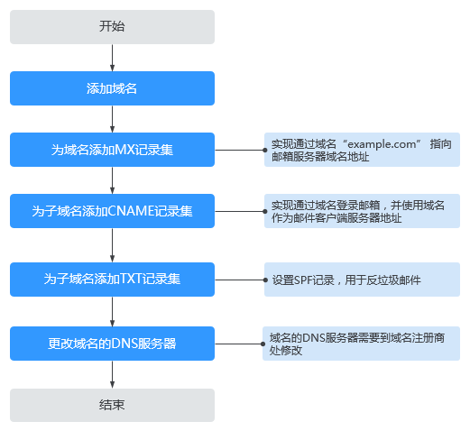
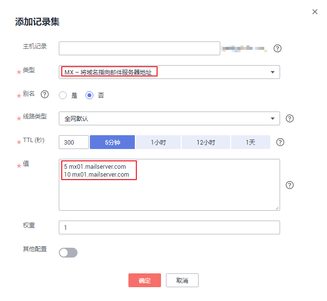
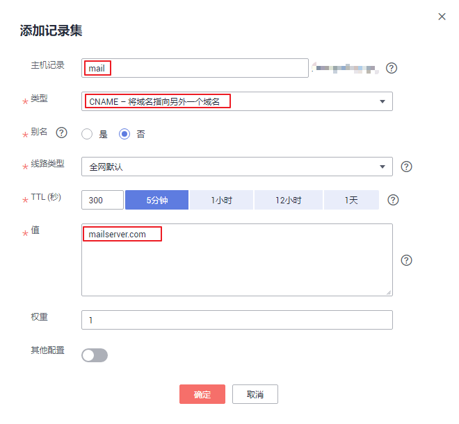
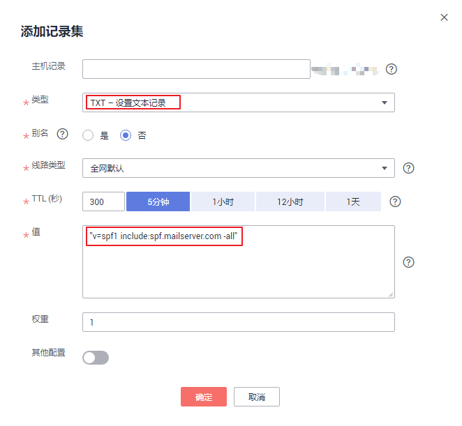

# 添加邮箱解析

## 操作场景

当您想要通过华为云的云解析服务为您的邮箱服务器提供解析服务，可以参考本操作为域名配置邮箱解析。

例如，搭建一个邮箱服务器，如果要实现通过mail.example.com登录邮箱，并使用域名作为SMTP、IMAP以及POP等类型邮件客户端的服务器地址，需要配置如下解析记录：

-   MX：添加域名“example.com”到购买的邮箱服务器地址。
-   CNAME：为域名“example.com”添加4条CNAME记录集，用于实现通过域名“mail.example.com”登录邮箱，以及在邮件客户端（如Outlook，Foxmail等）中使用域名“mail.example.com”作为SMTP、IMAP以及POP服务器的地址。
-   TXT：为域名“example.com”添加TXT记录集，设置SPF记录，用于反垃圾邮件。

常见邮箱解析记录示例请参见[常用邮箱的解析记录示例](https://support.huaweicloud.com/dns_faq/dns_faq_044.html)。您还可以通过[快速添加邮箱解析](https://support.huaweicloud.com/usermanual-dns/dns_usermanual_06013.html)功能配置如下常用邮箱的邮箱解析：

-   华为云云速邮箱
-   阿里云企业邮箱
-   网易免费邮箱
-   网易企业邮箱
-   腾讯企业邮箱

> **说明：** 
>-   为域名配置邮箱解析与邮箱服务器所在的帐号和位置无关，仅需要获取邮箱服务器的域名地址。
>-   未备案的域名可以正常解析邮箱，不受影响。
>-   本操作适用于如下场景：
>    -   通过华为云注册域名，邮箱服务器部署在华为云，与域名属于同一帐号。
>    -   通过第三方注册域名，邮箱服务器部署在华为云，与域名属于不同帐号。
>    -   通过第三方注册域名，邮箱服务器部署在与域名相同的其他云。
>    -   通过第三方注册域名，邮箱服务器部署在与域名不同的其他云。

## 前提条件

-   已经通过华为云的[域名注册服务](https://support.huaweicloud.com/domain/index.html)或第三方域名注册商完成域名“example.com”的注册。
-   如果域名“example.com”在中国大陆地区注册，需要完成域名实名认证审核。
-   已经购买邮箱服务器，并获取邮箱服务器的域名地址。
-   如果邮箱服务器在中国大陆地区部署，需要完成邮箱服务器域名和IP地址的备案。
    -   若在华为云购买邮箱服务器，则通过华为云的备案中心进行备案，详细内容请参见[什么是备案](https://support.huaweicloud.com/icprb-icp/zh-cn_topic_0115815923.html)。
    -   若在其他云服务商处购买邮箱服务器，则通过对应的云服务商进行备案。

-   规划邮箱解析记录配置数据，如[表1](#table35051221162110)所示。

    **表 1**  邮箱解析记录

    
    <table><thead align="left"><tr id="row1450642162112"><th class="cellrowborder" valign="top" width="11.08%" id="mcps1.2.5.1.1">
记录集类型

    </th>
    <th class="cellrowborder" valign="top" width="11.23%" id="mcps1.2.5.1.2">
主机记录

    </th>
    <th class="cellrowborder" valign="top" width="34.98%" id="mcps1.2.5.1.3">
值

    </th>
    <th class="cellrowborder" valign="top" width="42.71%" id="mcps1.2.5.1.4">
说明

    </th>
    </tr>
    </thead>
    <tbody><tr id="row1250682120214"><td class="cellrowborder" valign="top" width="11.08%" headers="mcps1.2.5.1.1 ">
MX

    </td>
    <td class="cellrowborder" valign="top" width="11.23%" headers="mcps1.2.5.1.2 ">
-

    </td>
    <td class="cellrowborder" valign="top" width="34.98%" headers="mcps1.2.5.1.3 ">
5 mx01.mailserver.com

    
10 mx02.mailserver.com

    </td>
    <td class="cellrowborder" valign="top" width="42.71%" headers="mcps1.2.5.1.4 ">
邮箱服务器地址，通过邮箱服务商获取。

    </td>
    </tr>
    <tr id="row2506152122115"><td class="cellrowborder" valign="top" width="11.08%" headers="mcps1.2.5.1.1 ">
TXT

    </td>
    <td class="cellrowborder" valign="top" width="11.23%" headers="mcps1.2.5.1.2 ">
-

    </td>
    <td class="cellrowborder" valign="top" width="34.98%" headers="mcps1.2.5.1.3 ">
"v=spf1 include:spf.mailserver.com -all"

    </td>
    <td class="cellrowborder" valign="top" width="42.71%" headers="mcps1.2.5.1.4 ">
采用SPF记录防范垃圾邮件。

    </td>
    </tr>
    <tr id="row1506182152111"><td class="cellrowborder" valign="top" width="11.08%" headers="mcps1.2.5.1.1 ">
CNAME

    </td>
    <td class="cellrowborder" valign="top" width="11.23%" headers="mcps1.2.5.1.2 ">
mail

    </td>
    <td class="cellrowborder" valign="top" width="34.98%" headers="mcps1.2.5.1.3 ">
mailserver.com

    </td>
    <td class="cellrowborder" valign="top" width="42.71%" headers="mcps1.2.5.1.4 ">
通过域名“mail.example.com”登录邮箱。

    </td>
    </tr>
    <tr id="row209534515559"><td class="cellrowborder" valign="top" width="11.08%" headers="mcps1.2.5.1.1 ">
CNAME

    </td>
    <td class="cellrowborder" valign="top" width="11.23%" headers="mcps1.2.5.1.2 ">
smtp

    </td>
    <td class="cellrowborder" valign="top" width="34.98%" headers="mcps1.2.5.1.3 ">
smtp.mailserver.com

    </td>
    <td class="cellrowborder" valign="top" width="42.71%" headers="mcps1.2.5.1.4 ">
使用域名“smtp.example.com”作为“smtp.mailserver.com”的地址。

    </td>
    </tr>
    <tr id="row16739449115515"><td class="cellrowborder" valign="top" width="11.08%" headers="mcps1.2.5.1.1 ">
CNAME

    </td>
    <td class="cellrowborder" valign="top" width="11.23%" headers="mcps1.2.5.1.2 ">
imap

    </td>
    <td class="cellrowborder" valign="top" width="34.98%" headers="mcps1.2.5.1.3 ">
imap.mailserver.com

    </td>
    <td class="cellrowborder" valign="top" width="42.71%" headers="mcps1.2.5.1.4 ">
使用域名“imap.example.com”作为“imap.mailserver.com”的地址。

    </td>
    </tr>
    <tr id="row28392051105514"><td class="cellrowborder" valign="top" width="11.08%" headers="mcps1.2.5.1.1 ">
CNAME

    </td>
    <td class="cellrowborder" valign="top" width="11.23%" headers="mcps1.2.5.1.2 ">
pop

    </td>
    <td class="cellrowborder" valign="top" width="34.98%" headers="mcps1.2.5.1.3 ">
pop.mailserver.com

    </td>
    <td class="cellrowborder" valign="top" width="42.71%" headers="mcps1.2.5.1.4 ">
使用域名“pop.example.com”作为“pop.mailserver.com”的地址。

    </td>
    </tr>
    </tbody>
    </table>

    > **说明：** 
    >在配置邮箱解析过程中如果遇到“与已有解析记录冲突”提示信息，请参考[添加记录集时，为什么会提示“与已有解析记录冲突”？](https://support.huaweicloud.com/dns_faq/dns_faq_016.html)进行处理。

## 操作流程

配置邮箱解析的流程如[图1](#fe4910c96160749349abf31cb88cfe52b)所示。

**图 1**  操作流程  

## 步骤一：添加域名

配置邮箱解析，需要先将注册的域名“example.com”添加至云解析服务中。如果您的域名是通过华为云注册的，系统将自动添加域名至云解析服务，请跳过本步骤。

1.  登录管理控制台。
2.  将鼠标悬浮于页面左侧的“”，在服务列表中，选择“网络  \> 云解析服务”。

    进入“云解析”页面。

3.  在左侧树状导航栏，选择“公网域名”。

    进入“公网域名”页面。

4.  在页面右上角，单击“创建公网域名”。
5.  在“创建公网域名”页面中，输入注册的域名“example.com”，将域名添加至云解析服务。

    更多参数说明，请参见[创建公网域名](https://support.huaweicloud.com/usermanual-dns/zh-cn_topic_0035467702.html)。

    **图 2**  创建公网域名  
    

6.  单击“确定”，完成公网域名“example.com”的创建。

    创建完成后，您可以在“公网域名”页面查看新创建的域名信息。

    **图 3**  公网域名列表  
    

    若提示“域名已经被其他租户创建。”，请参考[找回域名](https://support.huaweicloud.com/usermanual-dns/zh-cn_topic_0122498010.html)。

    > **说明：** 
    >单击“名称”列的域名名称，可以看到系统已经为您创建了SOA类型和NS类型的记录集。其中，
    >-   SOA类型的记录集标识了对此域名具有最终解释权的主权威服务器。
    >-   NS类型的记录集标识了此域名的权威服务器。
    >    您可以根据域名所在区域修改NS记录集的值，详细内容请参考[华为云DNS对用户提供域名服务的DNS是什么？](https://support.huaweicloud.com/dns_faq/dns_faq_012.html)。

## 步骤二：添加MX记录集

MX记录集用于指定域名对应的邮箱服务器地址，其值设置为购买的邮箱服务器的域名地址，由邮箱服务商提供。

1.  在“公网域名”页面的域名列表的“域名”列，单击域名的名称“example.com”。

    进入“解析记录”页面。

2.  在页面右上角，单击“添加记录集”。
3.  在“添加记录集”页面，根据界面提示为域名“example.com”设置记录集参数。

    -   主机记录：设置为空，表示解析的域名为主域名“example.com”。

        > **说明：** 
        >若待添加解析记录的域名为“@”，表示为空头域名，此时，将“主机记录”置为空即可。

    -   类型：设置为MX类型记录集。
    -   值：设置为邮箱服务器地址，格式为“\[优先级\]\[邮箱服务器地址\]”。

        -   优先级：设置邮箱服务器接收邮件优先顺序，数值越小优先级越高。
        -   邮箱服务器地址：邮箱服务商提供的域名地址。

        例如，设置为：

        5 mx01.mailserver.com

        10 mx01.mailserver.com

    其余参数取默认值，更多参数说明，请参见[添加MX类型记录集](https://support.huaweicloud.com/usermanual-dns/dns_usermanual_0011.html)。

    **图 4**  设置记录集参数  
    

4.  单击“确定”，完成记录集的添加。

    您可以在域名对应的记录集列表中查看添加的记录集。当记录集的状态显示为“正常”时，表示记录集添加成功。

## 步骤三：添加CNAME记录集

如果要实现通过域名“mail.example.com”登录Web邮箱，或者在邮件客户端（如Outlook，Foxmail等）中使用域名“mail.example.com”作为SMTP、IMAP以及POP服务器的地址，则需要为域名“example.com”分别添加对应的CNAME类型记录集。

> **说明：** 
>-   是否支持通过Web邮箱方式登录邮箱由邮箱服务商决定。
>-   SMTP、IMAP以及POP是指邮箱服务器支持的邮件传输协议。邮箱服务器支持的邮件传输协议由邮箱服务器的设置决定。

需要添加4条CNAME类型的记录集，记录集的关键参数如[表1](#table35051221162110)所示。

1.  在“公网域名”页面的域名列表的“域名”列，单击域名的名称“example.com”。

    进入“解析记录”页面。

2.  在页面右上角，单击“添加记录集”。
3.  在“添加记录集”页面，根据界面提示为域名“example.com”设置CNAME记录集参数。

    -   主机记录：设置为“mail”，表示解析的域名为“mail.example.com”。
    -   类型：设置为CNAME类型记录集。
    -   值：设置为指向的邮箱地址“mailserver.com”。

    其余参数取默认值，更多参数说明，请参见[添加CNAME类型记录集](https://support.huaweicloud.com/usermanual-dns/dns_usermanual_0010.html)。

    **图 5**  设置记录集参数  
    

    > **说明：** 
    >[图5](#fig323614175300)以第一条记录集为例进行说明，其余三条记录集仅在“主机记录”和“值”存在差异，详细取值以[表1](#table35051221162110)为准。

4.  单击“确定”，完成记录集的添加。

    您可以在域名对应的记录集列表中查看添加的记录集。当记录集的状态显示为“正常”时，表示记录集添加成功。

5.  依次执行[步骤1](#li3518132115308)\~[步骤4](#li16518182113306)完成其余三条记录集的添加。

    关键参数“主机记录”和“值”以[表1](#table35051221162110)为准。

## 步骤四：添加TXT记录集

添加TXT记录集为域名设置SPF记录，用于反垃圾邮件。

SPF是为了防范垃圾邮件的一种DNS记录类型，是TXT记录集的一种应用，用于登记某个域名拥有的用来外发邮件的所有IP地址。

按照SPF的格式在添加一条TXT类型的记录集，可以提高域名的信誉度，还可以防止垃圾邮件伪造该域名的发件人发送垃圾邮件。

1.  在“公网域名”页面的域名列表的“域名”列，单击域名的名称“example.com”。

    进入“解析记录”页面。

2.  在页面右上角，单击“添加记录集”。
3.  在“添加记录集”页面，根据界面提示为域名“example.com”设置记录集参数。

    -   主机记录：设置为空，表示解析的域名为主域名“example.com”。

        > **说明：** 
        >若待添加解析记录的域名为“@”，表示为空头域名，此时，将“主机记录”置为空即可。

    -   类型：设置为TXT类型记录集。
    -   值：设置为SPF记录，SPF记录的详细说明请参考相关介绍文档，本文不详细介绍。

        在本操作中，SPF记录为“"v=spf1 include:spf.mailserver.com -all"”，表示采用的SPF版本为“spf1”，支持域名为“example.com”的邮箱服务器的邮件从“spf.mailserver.com”声明的地址发出的都是合法邮件，并非冒充的垃圾邮件。

    其余参数取默认值，更多参数说明，请参见[添加TXT类型记录集](https://support.huaweicloud.com/usermanual-dns/dns_usermanual_0012.html)。

    **图 6**  设置TXT记录集参数  
    

4.  单击“确定”，完成记录集的添加。

    您可以在域名对应的记录集列表中查看添加的记录集。当记录集的状态显示为“正常”时，表示记录集添加成功。

## 步骤五：更改域名的DNS服务器

当通过云解析服务创建公网域名后，系统默认生成的NS类型记录集的值即为云解析服务的DNS服务器地址。

若域名的DNS服务器设置与NS记录集的值不符，则域名无法正常解析，您需要到域名注册商处将域名的DNS服务器修改为华为云云解析服务的DNS服务器地址。

> **说明：** 
>更改后的DNS服务器地址将于48小时内生效，具体生效时间请以域名注册商处的说明为准。

**查询云解析服务DNS服务器地址**

1.  登录管理控制台。
2.  将鼠标悬浮于页面左侧的“”，在服务列表中，选择“网络  \> 云解析服务”。

    进入“云解析”页面。

3.  在左侧树状导航栏，选择“公网域名”。

    进入“公网域名”页面。

4.  在“公网域名”页面新创建的域名所在行，单击“名称”列的域名名称。

    “类型”为“NS”的记录集，其对应的“值”即为DNS服务器的域名。

    **图 7**  系统返回的NS类型记录集  
    

**更改域名的DNS服务器**

登录域名注册商网站，修改域名的DNS服务器为云解析服务的DNS服务器地址，详细操作指导请参考域名注册商网站操作指导。

