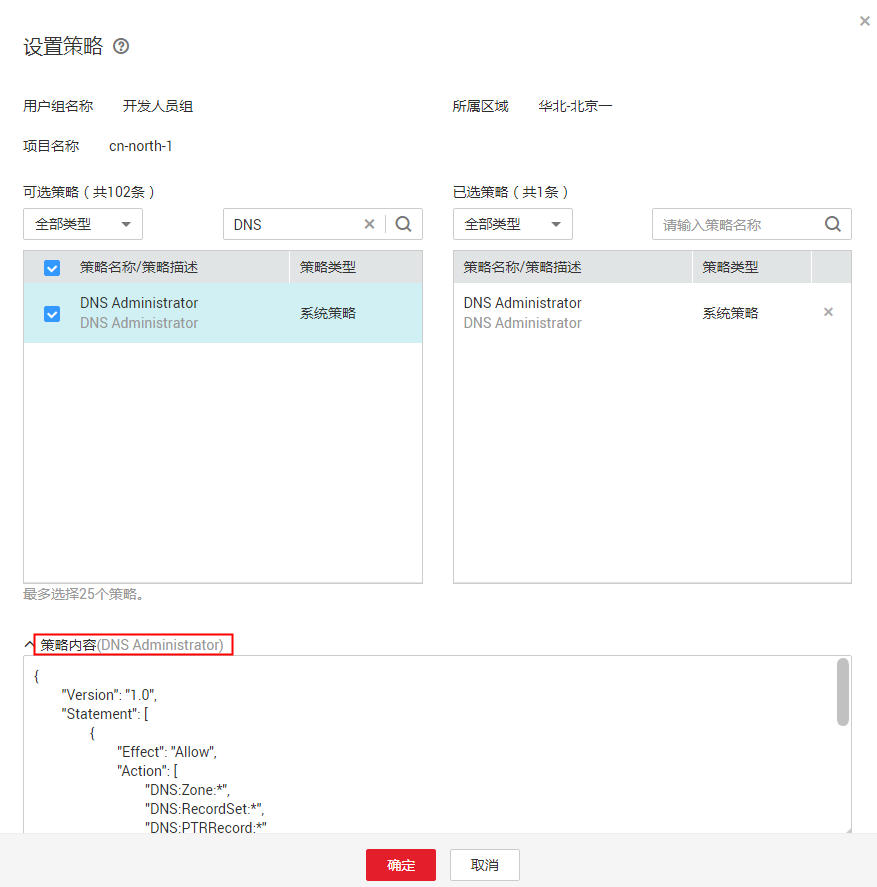

# 策略语法：RBAC<a name="dns_usermanual_0028"></a>

## 策略结构<a name="zh-cn_topic_0172268190_section1661242202715"></a>

策略结构包括：策略版本号（Version）、策略授权语句（Statement）和策略依赖（Depends）。

**图 1**  策略结构<a name="zh-cn_topic_0172268190_fig2641112616326"></a>  


## 策略语法<a name="zh-cn_topic_0172268190_section1030510262812"></a>

给用户组选择策略时，单击策略下方的“”，可以查看策略的详细内容，以“DNS Administraor”为例，说明RBAC策略的语法。设置策略



```
{
        "Version": "1.0",
        "Statement": [
                {
                        "Effect": "Allow",
                        "Action": [
                                "DNS:Zone:*",
                                "DNS:RecordSet:*",
                                "DNS:PTRRecord:*"
                        ]
                }
        ],
        "Depends": [
                {
                        "catalog": "BASE",
                        "display_name": "Tenant Guest"
                },
                {
                        "catalog": "VPC",
                        "display_name": "VPC Administrator"
                }
        ]
}
```

<a name="zh-cn_topic_0172268190_table4805855114411"></a>
<table><thead align="left"><tr id="zh-cn_topic_0172268190_row8886195594416"><th class="cellrowborder" colspan="2" valign="top" id="mcps1.1.5.1.1"><p id="zh-cn_topic_0172268190_p208861355114419"><a name="zh-cn_topic_0172268190_p208861355114419"></a><a name="zh-cn_topic_0172268190_p208861355114419"></a>参数</p>
</th>
<th class="cellrowborder" valign="top" id="mcps1.1.5.1.2"><p id="zh-cn_topic_0172268190_p17886165510447"><a name="zh-cn_topic_0172268190_p17886165510447"></a><a name="zh-cn_topic_0172268190_p17886165510447"></a>含义</p>
</th>
<th class="cellrowborder" valign="top" id="mcps1.1.5.1.3"><p id="zh-cn_topic_0172268190_p1388655514447"><a name="zh-cn_topic_0172268190_p1388655514447"></a><a name="zh-cn_topic_0172268190_p1388655514447"></a>值</p>
</th>
</tr>
</thead>
<tbody><tr id="zh-cn_topic_0172268190_row3886655114415"><td class="cellrowborder" colspan="2" valign="top" headers="mcps1.1.5.1.1 "><p id="zh-cn_topic_0172268190_p12886155154416"><a name="zh-cn_topic_0172268190_p12886155154416"></a><a name="zh-cn_topic_0172268190_p12886155154416"></a>Version</p>
</td>
<td class="cellrowborder" valign="top" headers="mcps1.1.5.1.2 "><p id="zh-cn_topic_0172268190_p1988635512447"><a name="zh-cn_topic_0172268190_p1988635512447"></a><a name="zh-cn_topic_0172268190_p1988635512447"></a>策略的版本</p>
</td>
<td class="cellrowborder" valign="top" headers="mcps1.1.5.1.3 "><p id="zh-cn_topic_0172268190_p8886115564418"><a name="zh-cn_topic_0172268190_p8886115564418"></a><a name="zh-cn_topic_0172268190_p8886115564418"></a>固定为“1.0”</p>
</td>
</tr>
<tr id="zh-cn_topic_0172268190_row5887185515441"><td class="cellrowborder" rowspan="2" valign="top" width="17.17171717171717%" headers="mcps1.1.5.1.1 "><p id="zh-cn_topic_0172268190_p128871755134412"><a name="zh-cn_topic_0172268190_p128871755134412"></a><a name="zh-cn_topic_0172268190_p128871755134412"></a>Statement</p>
</td>
<td class="cellrowborder" valign="top" width="17.17171717171717%" headers="mcps1.1.5.1.1 "><p id="zh-cn_topic_0172268190_p08878555448"><a name="zh-cn_topic_0172268190_p08878555448"></a><a name="zh-cn_topic_0172268190_p08878555448"></a>Action</p>
</td>
<td class="cellrowborder" valign="top" width="28.28282828282828%" headers="mcps1.1.5.1.2 "><p id="zh-cn_topic_0172268190_p178871955184419"><a name="zh-cn_topic_0172268190_p178871955184419"></a><a name="zh-cn_topic_0172268190_p178871955184419"></a>定义对DNS的具体操作。</p>
</td>
<td class="cellrowborder" valign="top" width="37.37373737373737%" headers="mcps1.1.5.1.3 "><p id="zh-cn_topic_0172268190_p2088785524410"><a name="zh-cn_topic_0172268190_p2088785524410"></a><a name="zh-cn_topic_0172268190_p2088785524410"></a>格式为：服务名:资源类型:操作</p>
<p id="zh-cn_topic_0172268190_p58871955144410"><a name="zh-cn_topic_0172268190_p58871955144410"></a><a name="zh-cn_topic_0172268190_p58871955144410"></a>例如，"DNS:Zone:*"表示对DNS的域名资源的所有操作，其中DNS为服务名称；Zone为资源类型，“*”为通配符，表示对某一资源类型可以执行所有操作。</p>
</td>
</tr>
<tr id="zh-cn_topic_0172268190_row188785524410"><td class="cellrowborder" valign="top" headers="mcps1.1.5.1.1 "><p id="zh-cn_topic_0172268190_p1887755154417"><a name="zh-cn_topic_0172268190_p1887755154417"></a><a name="zh-cn_topic_0172268190_p1887755154417"></a>Effect</p>
</td>
<td class="cellrowborder" valign="top" headers="mcps1.1.5.1.1 "><p id="zh-cn_topic_0172268190_p1788719556444"><a name="zh-cn_topic_0172268190_p1788719556444"></a><a name="zh-cn_topic_0172268190_p1788719556444"></a>定义Action中所包含的具体操作是否允许执行。</p>
</td>
<td class="cellrowborder" valign="top" headers="mcps1.1.5.1.2 "><a name="zh-cn_topic_0172268190_ul188871455134417"></a><a name="zh-cn_topic_0172268190_ul188871455134417"></a><ul id="zh-cn_topic_0172268190_ul188871455134417"><li>Allow：允许执行。</li><li>Deny：不允许执行。</li></ul>
</td>
</tr>
<tr id="zh-cn_topic_0172268190_row1588715544411"><td class="cellrowborder" rowspan="2" valign="top" width="17.17171717171717%" headers="mcps1.1.5.1.1 "><p id="zh-cn_topic_0172268190_p1688715555445"><a name="zh-cn_topic_0172268190_p1688715555445"></a><a name="zh-cn_topic_0172268190_p1688715555445"></a>Depends</p>
</td>
<td class="cellrowborder" valign="top" width="17.17171717171717%" headers="mcps1.1.5.1.1 "><p id="zh-cn_topic_0172268190_p38871055154411"><a name="zh-cn_topic_0172268190_p38871055154411"></a><a name="zh-cn_topic_0172268190_p38871055154411"></a>catalog</p>
</td>
<td class="cellrowborder" valign="top" width="28.28282828282828%" headers="mcps1.1.5.1.2 "><p id="zh-cn_topic_0172268190_p12887115544418"><a name="zh-cn_topic_0172268190_p12887115544418"></a><a name="zh-cn_topic_0172268190_p12887115544418"></a>依赖的策略的所属服务。</p>
</td>
<td class="cellrowborder" valign="top" width="37.37373737373737%" headers="mcps1.1.5.1.3 "><p id="zh-cn_topic_0172268190_p18887185574414"><a name="zh-cn_topic_0172268190_p18887185574414"></a><a name="zh-cn_topic_0172268190_p18887185574414"></a>服务名称</p>
<p id="zh-cn_topic_0172268190_p2088795524414"><a name="zh-cn_topic_0172268190_p2088795524414"></a><a name="zh-cn_topic_0172268190_p2088795524414"></a>例如：BASE</p>
</td>
</tr>
<tr id="zh-cn_topic_0172268190_row38871155174412"><td class="cellrowborder" valign="top" headers="mcps1.1.5.1.1 "><p id="zh-cn_topic_0172268190_p3887355204419"><a name="zh-cn_topic_0172268190_p3887355204419"></a><a name="zh-cn_topic_0172268190_p3887355204419"></a>display_name</p>
</td>
<td class="cellrowborder" valign="top" headers="mcps1.1.5.1.1 "><p id="zh-cn_topic_0172268190_p12887655154413"><a name="zh-cn_topic_0172268190_p12887655154413"></a><a name="zh-cn_topic_0172268190_p12887655154413"></a>依赖的策略的名称。</p>
</td>
<td class="cellrowborder" valign="top" headers="mcps1.1.5.1.2 "><p id="zh-cn_topic_0172268190_p158887551446"><a name="zh-cn_topic_0172268190_p158887551446"></a><a name="zh-cn_topic_0172268190_p158887551446"></a>权限名称</p>
<p id="zh-cn_topic_0172268190_p688825519446"><a name="zh-cn_topic_0172268190_p688825519446"></a><a name="zh-cn_topic_0172268190_p688825519446"></a>例如：Tenant Guest</p>
</td>
</tr>
</tbody>
</table>

