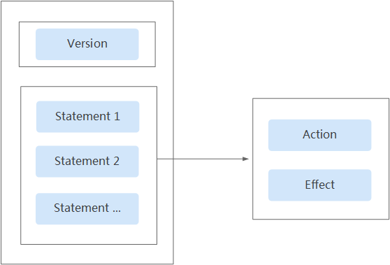
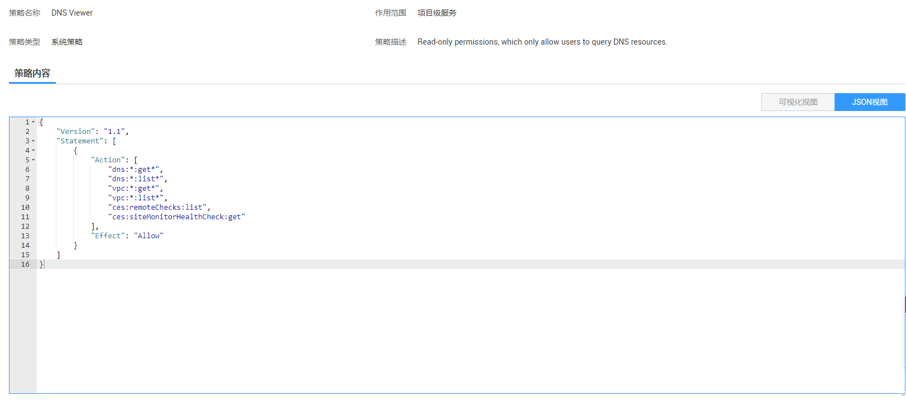
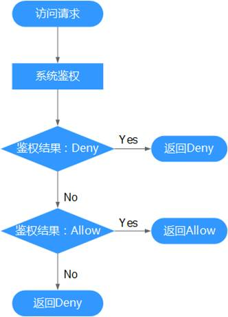

# 策略语法：细粒度策略<a name="dns_usermanual_0052"></a>

## 策略结构<a name="section17729144992111"></a>

策略结构包括：Version（策略版本号）和Statement（策略权限语句），其中Statement可以有多个，表示不同的授权项。

**图 1**  策略结构<a name="fig1696412499218"></a>  


## 策略语法<a name="section12737114911211"></a>

在IAM左侧导航窗格中，单击“策略”，单击策略名称，可以查看策略的详细内容，以“DNS Viewer”为例，说明细粒度策略的语法。

**图 2**  DNS Viewer策略<a name="fig1065619462276"></a>  


```
{
    "Version": "1.1",
    "Statement": [
        {
            "Action": [
                "dns:*:get*",
                "dns:*:list*",
                "vpc:*:get*",
                "vpc:*:list*",
                "ces:remoteChecks:list",
                "ces:siteMonitorHealthCheck:get"
            ],
            "Effect": "Allow"
        }
    ]
}
```

-   作用范围：策略的生效范围，该策略需要在除全局区域外的其他区域中授权。
-   Version：Version：策略的版本号，RBAC策略版本为“1.0”，细粒度策略版本为“1.1”。
-   Statement：策略的授权语句，包含Action（授权项）和Effect（作用），Action和Effect结合构成用户具备的权限。
    -   Action（授权项）：操作权限，格式为：服务名:资源类型:操作，支持单个或多个操作权限，支持通配符号\*，通配符号\*表示所有。

        示例：

        "dns:\*:get\*"：表示对dns所有资源类型的查询权限，其中dns为服务名，\*为资源类型，get\*为操作。

    -   Effect（作用）：定义Action中的操作权限是否允许执行。Allow：允许；Deny：拒绝。

        系统预置策略仅包含允许的授权语句，自定义策略中可以同时包含允许和拒绝的授权语句，同一个Action的Effect如果既有Allow又有Deny时，遵循Deny优先的原则。


## 多个授权项策略<a name="section187841949122111"></a>

一个自定义策略中可以包含多个授权项，且除了可以包含本服务的授权项外，还可以包含其他服务的授权项，可以包含的其他服务必须跟本服务同属性，即都是项目级服务或都是全局级服务。多个授权语句策略描述如下：

```
{
    "Version": "1.1",
    "Statement": [
        {
            "Effect": "Allow",
            "Action": [
                "vpc:vpcs:list"
            ]
        },
        {
            "Effect": "Allow",
            "Action": [
                "dns:zone:list",
                "dns:recordset:list"
            ]
        },
        {
            "Effect": "Allow",
            "Action": [
                "ecs:availabilityZones:list"
            ]
        }
    ]
}
```

## 拒绝策略<a name="section1179674942116"></a>

拒绝策略需要同时配合其他策略使用，否则没有实际作用。用户被授予的策略中，一个授权项的作用如果同时存在Alow和Deny，则遵循Deny优先。

如果您给用户授予DNS Admin的系统策略，但不希望用户拥有DNS Admin中定义的DNS资源的删除权限，您可以创建一条拒绝删除DNS资源的自定义策略，然后同时将DNS Admin和拒绝策略授予用户，根据Deny优先原则，则用户可以对DNS执行除了删除外的所有操作。

拒绝策略示例如下：

```
{ 
      "Version": "1.1", 
      "Statement": [ 
            { 
		  "Effect": "Deny", 
                  "Action": [ 
                        "dns:*:delete*" 
                  ] 
            } 
      ] 
}
```

## 检查规则<a name="section148081149202116"></a>

用户在发起访问请求时，系统根据用户被授予的访问策略中的action进行鉴权判断。检查规则如下：

**图 3**  系统鉴权逻辑图<a name="fig8965184982114"></a>  


1.  用户发起访问请求。
2.  系统在用户被授予的策略中寻找请求对应的action，优先寻找Deny指令。如果找到一个适用的Deny指令，系统将返回Deny决定。
3.  如果没有找到Deny指令，系统将寻找适用于请求的任何Allow指令。如果找到一个Allow指令，系统将返回Allow决定。
4.  如果找不到Allow指令，最终决定为Deny，鉴权结束。

