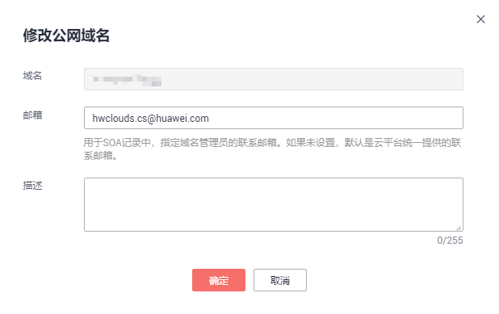
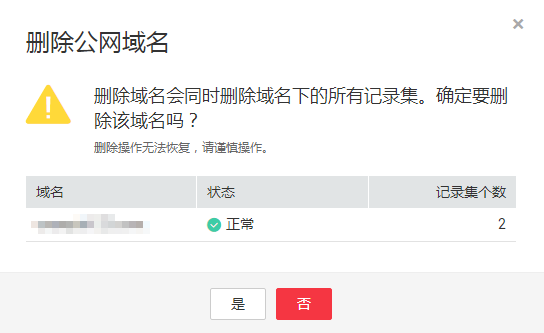
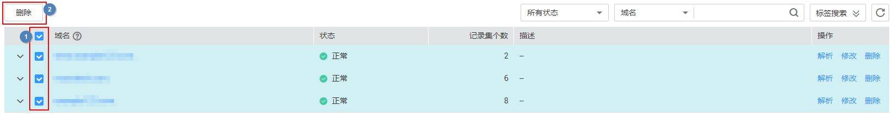
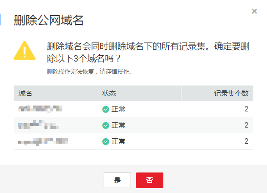

# 管理公网域名

## 操作场景

您可以修改、暂停/启用以及删除已经添加到云解析服务的公网域名，同时还可以查看公网域名的详细信息。

## 修改公网域名

在使用公网域名的过程中，如果发现公网域名的配置信息不符合您的业务需求，可以重新设置域名的管理员邮箱地址、域名的描述信息。

> **说明：** 
>更多关于域名管理员邮箱的信息，请参见[SOA记录中的Email格式为什么变化了？](https://support.huaweicloud.com/dns_faq/dns_faq_009.html)。

1.  登录管理控制台。
2.  将鼠标悬浮于页面左侧的“”，在服务列表中，选择“网络  \> 云解析服务”。

    进入“云解析”页面。

3.  在左侧树状导航栏，选择“域名解析 \> 公网解析”。

    进入“公网域名”页面。

1.  选择待修改的公网域名，单击“操作”列下的“修改”。

    进入“修改公网域名”页面。

    **图 1**  修改公网域名  
    

2.  根据实际需要，修改“邮箱”或“描述”信息。
3.  单击“确定”，保存修改后的公网域名。

## 删除公网域名

当用户不再使用云解析服务解析域名时，可以删除公网域名。删除公网域名后，该域名将无法再被解析。

> **须知：** 
>执行删除公网域名操作前，请确认已备份该公网域名下所有用户创建的记录集。

1.  登录管理控制台。
2.  将鼠标悬浮于页面左侧的“”，在服务列表中，选择“网络  \> 云解析服务”。

    进入“云解析”页面。

3.  在左侧树状导航栏，选择“域名解析 \> 公网解析”。

    进入“公网域名”页面。

1.  选择待删除的公网域名，单击“操作”列下的“更多 \> 删除”。

    进入“删除公网域名”页面。

    **图 2**  删除公网域名  
    

2.  单击“是”，确认删除该公网域名。

## 批量删除公网域名

当用户想要一次性删除多个公网域名时，可以使用批量删除功能。删除公网域名后，域名将无法再被解析。

> **须知：** 
>执行删除公网域名操作前，请确认已备份公网域名下所有用户创建的记录集。

1.  登录管理控制台。
2.  将鼠标悬浮于页面左侧的“”，在服务列表中，选择“网络  \> 云解析服务”。

    进入“云解析”页面。

3.  在左侧树状导航栏，选择“域名解析 \> 公网解析”。

    进入“公网域名”页面。

1.  勾选待删除的公网域名，单击“删除”。

    **图 3**  批量删除公网域名  
    

2.  在“删除公网域名”页面，单击“是”，确认删除公网域名。

    **图 4**  确认删除公网域名  
    

## 暂停/启用公网域名

当用户想要停止某个公网域名的所有记录集解析时，可以通过暂停公网域名实现。若要恢复该域名的解析，可以通过启用公网域名实现。

1.  登录管理控制台。
2.  将鼠标悬浮于页面左侧的“”，在服务列表中，选择“网络  \> 云解析服务”。

    进入“云解析”页面。

3.  在左侧树状导航栏，选择“域名解析 \> 公网解析”。

    进入“公网域名”页面。

4.  选择待暂停/启用的公网域名，单击“操作”列下的“更多 \> 暂停”/“更多 \> 启用”。

    进入“暂停公网域名”/“启用公网域名”页面。

5.  单击“确定”，暂停/启用公网域名。

## 查看公网域名详情

您可以在公网域名列表页面查询域名的详细信息，包括域名ID、域名创建或最近一次修改时间、TTL、标签等。

1.  登录管理控制台。
2.  将鼠标悬浮于页面左侧的“”，在服务列表中，选择“网络  \> 云解析服务”。

    进入“云解析”页面。

1.  在“总览”页签，选择“我的资源”下的“公网解析”，查看公网域名列表。
2.  在公网域名列表页面，单击域名前面的“”查看公网域名详情。

    **图 5**  公网域名详情  
    

