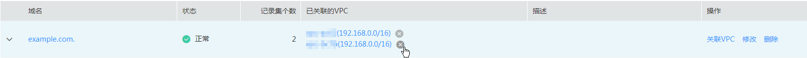

# 管理内网域名

## 查看内网域名详情

1.  登录管理控制台。
2.  选择“网络 \> 云解析服务”。

    进入云解析服务页面。

3.  在“总览”页签，选择“我的资源”下的“内网域名”。
4.  单击管理控制台左上角的，选择区域和项目。
5.  在内网域名列表页面，查看内网域名详情。

## 增加内网域名

如果有新增内网域名需要使用DNS服务托管时，需使用增加内网域名功能。

1.  登录管理控制台。
2.  选择“网络 \> 云解析服务”。

    进入云解析服务页面。

3.  在左侧树状导航栏，选择“域名解析 \> 内网域名”。

    进入“内网域名”页面。

4.  单击管理控制台左上角的，选择区域和项目。
5.  单击“创建内网域名”，开始创建内网域名。

    **图 1**  创建内网域名  
    

6.  根据界面提示配置参数，参数说明如[表1](#zh-cn_topic_0057777026_zh-cn_topic_0035467699_table2052132816642)所示。

    **表 1**  创建内网域名参数说明

    
    <table><thead align="left"><tr id="zh-cn_topic_0057777026_zh-cn_topic_0035467699_row5957484916642"><th class="cellrowborder" valign="top" width="18.11%" id="mcps1.2.4.1.1">
参数

    </th>
    <th class="cellrowborder" valign="top" width="50.629999999999995%" id="mcps1.2.4.1.2">
参数说明

    </th>
    <th class="cellrowborder" valign="top" width="31.259999999999998%" id="mcps1.2.4.1.3">
取值样例

    </th>
    </tr>
    </thead>
    <tbody><tr id="zh-cn_topic_0057777026_zh-cn_topic_0035467699_row2871871016642"><td class="cellrowborder" valign="top" width="18.11%" headers="mcps1.2.4.1.1 ">
域名

    </td>
    <td class="cellrowborder" valign="top" width="50.629999999999995%" headers="mcps1.2.4.1.2 ">
域名。

    
可以自定义，支持创建顶级域，但需符合域名命名规范。

    </td>
    <td class="cellrowborder" valign="top" width="31.259999999999998%" headers="mcps1.2.4.1.3 ">
example.com

    </td>
    </tr>
    <tr id="zh-cn_topic_0057777026_row16069279235858"><td class="cellrowborder" valign="top" width="18.11%" headers="mcps1.2.4.1.1 ">
VPC

    </td>
    <td class="cellrowborder" valign="top" width="50.629999999999995%" headers="mcps1.2.4.1.2 ">
内网域名要关联的VPC。

    </td>
    <td class="cellrowborder" valign="top" width="31.259999999999998%" headers="mcps1.2.4.1.3 ">
-

    </td>
    </tr>
    <tr id="zh-cn_topic_0057777026_zh-cn_topic_0035467699_row3925088716642"><td class="cellrowborder" valign="top" width="18.11%" headers="mcps1.2.4.1.1 ">
邮箱

    </td>
    <td class="cellrowborder" valign="top" width="50.629999999999995%" headers="mcps1.2.4.1.2 ">
可选参数。

    
管理该内网域名的管理员邮箱。建议用户使用保留邮箱“HOSTMASTER@<em id="zh-cn_topic_0057777026_i31584450204027">域名</em>”作为此管理员邮箱。

    
更多关于Email的信息，请参见<a href="http://support.huaweicloud.com/dns_faq/dns_faq_009.html" target="_blank" rel="noopener noreferrer">SOA记录中的Email格式为什么变化了？</a>。

    </td>
    <td class="cellrowborder" valign="top" width="31.259999999999998%" headers="mcps1.2.4.1.3 ">
HOSTMASTER@example.com

    </td>
    </tr>
    <tr id="zh-cn_topic_0057777026_row648142632420"><td class="cellrowborder" valign="top" width="18.11%" headers="mcps1.2.4.1.1 ">
标签

    </td>
    <td class="cellrowborder" valign="top" width="50.629999999999995%" headers="mcps1.2.4.1.2 ">
可选参数。

    
域名的标示，包括键和值，每个域名可以创建10个标签。

    
键和值的命名规则请参见<a href="#zh-cn_topic_0057773658__zh-cn_topic_0057777026_table1393932617253">表2</a>。

    </td>
    <td class="cellrowborder" valign="top" width="31.259999999999998%" headers="mcps1.2.4.1.3 ">
example_key1

    
example_value1

    </td>
    </tr>
    <tr id="zh-cn_topic_0057777026_row197267115553"><td class="cellrowborder" valign="top" width="18.11%" headers="mcps1.2.4.1.1 ">
描述

    </td>
    <td class="cellrowborder" valign="top" width="50.629999999999995%" headers="mcps1.2.4.1.2 ">
可选参数。

    
域名的描述信息。

    
长度不超过255个字符。

    </td>
    <td class="cellrowborder" valign="top" width="31.259999999999998%" headers="mcps1.2.4.1.3 ">
This is a zone example.

    </td>
    </tr>
    </tbody>
    </table>

    **表 2**  标签命名规则

    
    <table><thead align="left"><tr id="zh-cn_topic_0057777026_zh-cn_topic_0035467699_row72901535141713"><th class="cellrowborder" valign="top" width="18.181818181818183%" id="mcps1.2.4.1.1">
参数

    </th>
    <th class="cellrowborder" valign="top" width="50.505050505050505%" id="mcps1.2.4.1.2">
规则

    </th>
    <th class="cellrowborder" valign="top" width="31.313131313131315%" id="mcps1.2.4.1.3">
举例

    </th>
    </tr>
    </thead>
    <tbody><tr id="zh-cn_topic_0057777026_zh-cn_topic_0035467699_row52906354176"><td class="cellrowborder" valign="top" width="18.181818181818183%" headers="mcps1.2.4.1.1 ">
键

    </td>
    <td class="cellrowborder" valign="top" width="50.505050505050505%" headers="mcps1.2.4.1.2 "><ul id="zh-cn_topic_0057777026_zh-cn_topic_0035467699_ul46253231183"><li>不能为空。</li><li>对于同一资源键值唯一。</li><li>长度不超过36个字符。</li><li>取值为不包含“=”,“*”,“&lt;”,“&gt;”,“\”,“,”,“|”,“/”的所有Unicode字符，且首尾字符不能为空格。</li></ul>
    </td>
    <td class="cellrowborder" valign="top" width="31.313131313131315%" headers="mcps1.2.4.1.3 ">
example_key1

    </td>
    </tr>
    <tr id="zh-cn_topic_0057777026_zh-cn_topic_0035467699_row132900355172"><td class="cellrowborder" valign="top" width="18.181818181818183%" headers="mcps1.2.4.1.1 ">
值

    </td>
    <td class="cellrowborder" valign="top" width="50.505050505050505%" headers="mcps1.2.4.1.2 "><ul id="zh-cn_topic_0057777026_zh-cn_topic_0035467699_ul19648123161815"><li>不能为空。</li><li>长度不超过43个字符。</li><li>取值为不包含“=”,“*”,“&lt;”,“&gt;”,“\”,“,”,“|”,“/”的所有Unicode字符，且首尾字符不能为空格。</li></ul>
    </td>
    <td class="cellrowborder" valign="top" width="31.313131313131315%" headers="mcps1.2.4.1.3 ">
example_value1

    </td>
    </tr>
    </tbody>
    </table>

7.  单击“确定”。

    创建完成后，您可以在“内网域名”页面查看新创建的域名信息。

    > **说明：**   
    >单击“名称”列的域名名称，可以看到系统已经为您创建了SOA类型和NS类型的记录集。其中，  
    >-   SOA类型的记录集标识了对此域名具有最终解释权的主权威服务器。  
    >-   NS类型的记录集标识了此域名的权威服务器。  

## 修改内网域名

在使用内网域名的过程中，如果发现内网域名的配置信息不符合您的业务需求，可以通过修改内网域名功能，重新配置邮箱、描述信息。

1.  登录管理控制台。
2.  选择“网络 \> 云解析服务”。

    进入云解析服务页面。

3.  在左侧树状导航栏，选择“域名解析 \> 内网域名”。

    进入“内网域名”页面。

4.  单击管理控制台左上角的，选择区域和项目。
5.  选择待修改的内网域名，单击“操作”列下的“修改”。

    系统进入“修改内网域名”页面。

6.  根据实际需要，修改邮箱或描述信息。
7.  单击“确定”，保存修改后的内网域名。

## 关联VPC

当用户创建的内网域名需要新关联VPC时，可以在管理控制台云解析服务页面进行关联操作。

1.  登录管理控制台。
2.  选择“网络 \> 云解析服务”。

    进入云解析服务页面。

3.  在左侧树状导航栏，选择“域名解析 \> 内网域名”。

    进入“内网域名”页面。

4.  单击管理控制台左上角的，选择区域和项目。
5.  选择待关联VPC的内网域名，单击“操作”列下的“关联VPC”。

    **图 2**  关联VPC  
    

6.  根据界面提示配置参数，参数说明如[表3](#table2843771002454)所示。

    **表 3**  关联VPC

    
    <table><thead align="left"><tr id="row3835768902454"><th class="cellrowborder" valign="top" width="24.310000000000002%" id="mcps1.2.4.1.1">
参数

    </th>
    <th class="cellrowborder" valign="top" width="42.36%" id="mcps1.2.4.1.2">
参数说明

    </th>
    <th class="cellrowborder" valign="top" width="33.33%" id="mcps1.2.4.1.3">
取值样例

    </th>
    </tr>
    </thead>
    <tbody><tr id="row4962413602454"><td class="cellrowborder" valign="top" width="24.310000000000002%" headers="mcps1.2.4.1.1 ">
域名

    </td>
    <td class="cellrowborder" valign="top" width="42.36%" headers="mcps1.2.4.1.2 ">
内网域名。

    </td>
    <td class="cellrowborder" valign="top" width="33.33%" headers="mcps1.2.4.1.3 ">
example.com

    </td>
    </tr>
    <tr id="row878042502454"><td class="cellrowborder" valign="top" width="24.310000000000002%" headers="mcps1.2.4.1.1 ">
VPC

    </td>
    <td class="cellrowborder" valign="top" width="42.36%" headers="mcps1.2.4.1.2 ">
内网域名要关联的VPC

    </td>
    <td class="cellrowborder" valign="top" width="33.33%" headers="mcps1.2.4.1.3 ">
-

    </td>
    </tr>
    </tbody>
    </table>

7.  单击“确定”。

## 解关联VPC

当用户创建的内网域名关联多个VPC时，可以解关联某个不需要的VPC。用户可以在管理控制台云解析服务页面进行解关联操作。

> **说明：**   
>如果内网域名当前仅关联一个VPC，则无法执行解关联操作，可以直接删除该内网域名。  

1.  登录管理控制台。
2.  选择“网络 \> 云解析服务”。

    进入云解析服务页面。

3.  在左侧树状导航栏，选择“域名解析 \> 内网域名”。

    进入“内网域名”页面。

4.  单击管理控制台左上角的，选择区域和项目。
5.  选择待解关联VPC的内网域名，单击“已关联的VPC”列下的开始解关联VPC。

    **图 3**  内网域名  
    

6.  在“解关联VPC”对话框，单击“确定”，完成解关联VPC。

## 删除内网域名

当用户无需使用云解析服务托管该内网域名时，可以使用删除内网域名功能。删除内网域名后，该内网域名包含的域名将无法再被解析。

> **注意：**   
>执行删除内网域名操作前，请确认已备份该内网域名下所有用户创建的记录集。  

1.  登录管理控制台。
2.  选择“网络 \> 云解析服务”。

    进入云解析服务页面。

3.  在左侧树状导航栏，选择“域名解析 \> 内网域名”。

    进入“内网域名”页面。

4.  单击管理控制台左上角的，选择区域和项目。
5.  选择待删除的内网域名，单击“操作”列下的“删除”。
6.  单击“确定”，确认删除该内网域名。

