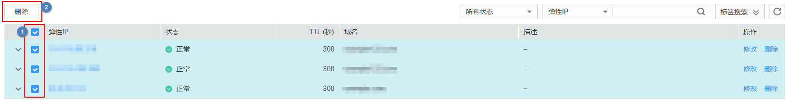
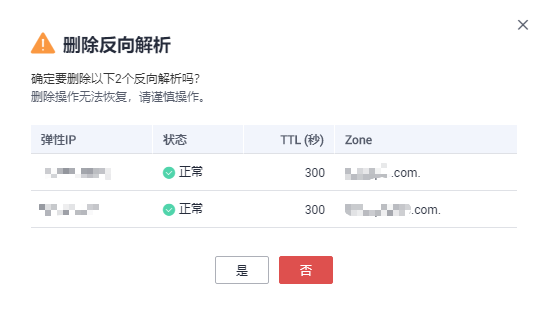
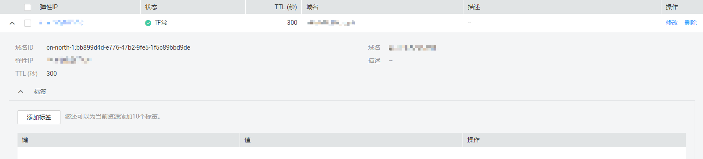

# 管理反向解析

## 操作场景

您可以修改或者删除已经创建的反向解析，同时还可以查看反向解析的详细信息。

## 修改反向解析

若弹性IP对应的反向解析记录的域名、TTL或者描述信息发生变化时，您可以按照本操作修改反向解析记录。

1.  登录管理控制台。
2.  将鼠标悬浮于页面左侧的“”，在服务列表中，选择“网络  \> 云解析服务”。

    进入“云解析”页面。

3.  在左侧树状导航栏，选择“域名解析 \> 反向解析”。

    进入“反向解析”页面。

4.  单击管理控制台左上角的，选择区域和项目。
5.  选择待修改的反向解析，单击“操作”列下的“修改”。

    进入“修改反向解析”页面。

6.  根据实际需要，修改弹性IP对应的域名、TTL或描述。
7.  单击“确定”，保存修改后的反向解析。

## 删除反向解析

当用户无需使用该反向解析时，可以按照本操作删除反向解析记录。删除反向解析后，该弹性IP的反向解析域名将会变更为华为云平台提供的默认域名。

1.  登录管理控制台。
2.  将鼠标悬浮于页面左侧的“”，在服务列表中，选择“网络  \> 云解析服务”。

    进入“云解析”页面。

3.  在左侧树状导航栏，选择“域名解析 \> 反向解析”。

    进入“反向解析”页面。

1.  单击管理控制台左上角的，选择区域和项目。
2.  选择待删除的反向解析，单击“操作”列下的“删除”。
3.  单击“确定”，完成删除操作。

## 批量删除反向解析

当用户想要一次性删除多个反向解析时，可以使用批量删除功能。删除反向解析后，弹性IP的反向解析域名将会变更为华为云平台提供的默认域名。

1.  登录管理控制台。
2.  将鼠标悬浮于页面左侧的“”，在服务列表中，选择“网络  \> 云解析服务”。

    进入“云解析”页面。

3.  在左侧树状导航栏，选择“域名解析 \> 反向解析”。

    进入“反向解析”页面。

1.  单击管理控制台左上角的，选择区域和项目。
2.  勾选待删除的反向解析，单击“删除”。

    **图 1**  批量删除反向解析  
    

3.  在“删除反向解析”页面，单击“是”，确认删除反向解析。

    **图 2**  确认删除反向解析  
    

## 查看反向解析详情

反向解析创建完成后，您可以在“反向解析”页面查看新创建的反向解析详细信息，包含域名ID、TTL、弹性IP、标签等。

1.  登录管理控制台。
2.  将鼠标悬浮于页面左侧的“”，在服务列表中，选择“网络  \> 云解析服务”。

    进入“云解析”页面。

1.  在“总览”页签，选择“我的资源”下的“反向解析”，查看反向解析列表。
2.  单击管理控制台左上角的，选择区域和项目。
3.  在反向解析列表页面，查看反向解析详情。

    **图 3**  反向解析记录详情  
    

