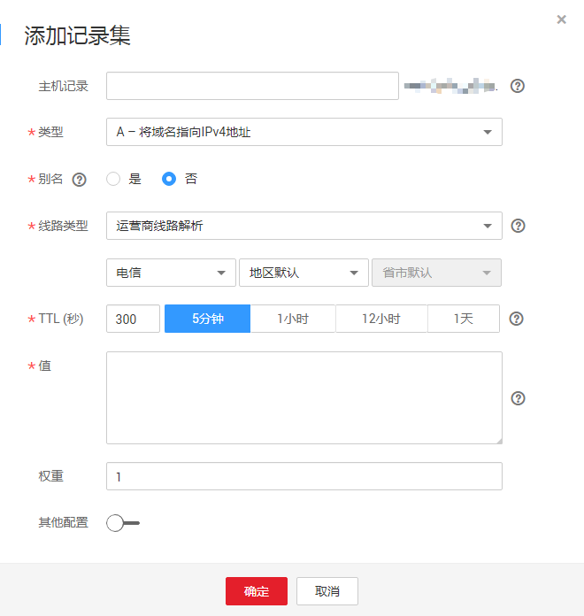

# 管理记录集

## 查看记录集详情

1.  登录管理控制台。
2.  选择“网络 \> 云解析服务”。

    进入云解析服务页面。

3.  在“总览”页签，选择“我的资源”下的“公网域名”或者“内网域名”。

    进入域名列表页。

4.  （可选）如果选择“内网域名”，请单击管理控制台左上角的，选择区域和项目。
5.  在域名列表页面，单击域名名称。

    系统进入该域名的记录集页面。

6.  在记录集页面，查看记录集详情。

    > **说明：**   
    >您可以在记录集列表中，单击“域名”和“类型”列的，对记录集进行排序。  

## 新增记录集

云解析服务当前支持多种类型的记录集，不同类型的记录集适用于不同的使用场景，用户需根据需求添加对应类型的记录集。

1.  登录管理控制台。
2.  选择“网络 \> 云解析服务”。

    进入云解析服务页面。

3.  在左侧树状导航栏，选择“域名解析 \> 公网域名”或者“域名解析 \> 内网域名”。

    进入域名列表页面。

4.  （可选）如果选择“内网域名”，请单击管理控制台左上角的，选择区域和项目。
5.  在待添加记录集的域名所在行，单击“名称”列的域名名称。
6.  单击“添加记录集”。

    系统进入“添加记录集”页面。

    **图 1**  添加记录集  
    

7.  根据界面提示填写参数配置。
    -   如果添加A类型的记录集，请参见[表1](#table219785892310)填写参数配置。

        **表 1**  添加A类型记录集参数说明

        
        <table><thead align="left"><tr id="row01931258112316"><th class="cellrowborder" valign="top" width="20.549999999999997%" id="mcps1.2.4.1.1">
参数

        </th>
        <th class="cellrowborder" valign="top" width="46.12%" id="mcps1.2.4.1.2">
参数说明

        </th>
        <th class="cellrowborder" valign="top" width="33.33%" id="mcps1.2.4.1.3">
取值样例

        </th>
        </tr>
        </thead>
        <tbody><tr id="row191931585230"><td class="cellrowborder" valign="top" width="20.549999999999997%" headers="mcps1.2.4.1.1 ">
主机记录

        </td>
        <td class="cellrowborder" valign="top" width="46.12%" headers="mcps1.2.4.1.2 ">
域名（后缀无需用户手动填写）。

        
如果输入框未填值，则参数值默认为该Zone的名称。

        </td>
        <td class="cellrowborder" valign="top" width="33.33%" headers="mcps1.2.4.1.3 ">
www

        </td>
        </tr>
        <tr id="row1195175852312"><td class="cellrowborder" valign="top" width="20.549999999999997%" headers="mcps1.2.4.1.1 ">
类型

        </td>
        <td class="cellrowborder" valign="top" width="46.12%" headers="mcps1.2.4.1.2 ">
记录集的类型，此处为A类型。

        </td>
        <td class="cellrowborder" valign="top" width="33.33%" headers="mcps1.2.4.1.3 ">
A – 将域名指向IPv4地址

        </td>
        </tr>
        <tr id="row9195205842311"><td class="cellrowborder" valign="top" width="20.549999999999997%" headers="mcps1.2.4.1.1 ">
线路类型

        </td>
        <td class="cellrowborder" valign="top" width="46.12%" headers="mcps1.2.4.1.2 ">
用于DNS服务器在解析域名时，根据访问者的来源，返回对应的服务器IP地址，详细说明请参见<a href="https://support.huaweicloud.com/productdesc-dns/zh-cn_topic_0089177011.html" target="_blank" rel="noopener noreferrer">解析线路</a>。

        
添加解析线路类型时，切记先添加默认线路类型，以保证网站可访问。

        </td>
        <td class="cellrowborder" valign="top" width="33.33%" headers="mcps1.2.4.1.3 ">
全网默认

        </td>
        </tr>
        <tr id="row7195185892312"><td class="cellrowborder" valign="top" width="20.549999999999997%" headers="mcps1.2.4.1.1 ">
TTL(秒)

        </td>
        <td class="cellrowborder" valign="top" width="46.12%" headers="mcps1.2.4.1.2 ">
记录集的有效缓存时间，以秒为单位。

        </td>
        <td class="cellrowborder" valign="top" width="33.33%" headers="mcps1.2.4.1.3 ">
默认为“5min”，即300s。

        </td>
        </tr>
        <tr id="row17195105813235"><td class="cellrowborder" valign="top" width="20.549999999999997%" headers="mcps1.2.4.1.1 ">
值

        </td>
        <td class="cellrowborder" valign="top" width="46.12%" headers="mcps1.2.4.1.2 ">
域名对应的IPv4地址。

        
多个IPv4地址以换行符分隔。

        </td>
        <td class="cellrowborder" valign="top" width="33.33%" headers="mcps1.2.4.1.3 ">
192.168.12.2

        
192.168.12.3

        </td>
        </tr>
        <tr id="row19985141952618"><td class="cellrowborder" valign="top" width="20.549999999999997%" headers="mcps1.2.4.1.1 ">
权重

        </td>
        <td class="cellrowborder" valign="top" width="46.12%" headers="mcps1.2.4.1.2 ">
解析记录的权重，可选参数，默认值为1。

        
仅支持为公网域名的记录集配置此参数。

        
取值范围：0~100。

        
当域名有多条某一类型的解析记录时，根据权重数值选择解析记录，权重数值越高，优先级越高。

        </td>
        <td class="cellrowborder" valign="top" width="33.33%" headers="mcps1.2.4.1.3 ">
1

        </td>
        </tr>
        <tr id="row17670131420546"><td class="cellrowborder" valign="top" width="20.549999999999997%" headers="mcps1.2.4.1.1 ">
健康检查

        </td>
        <td class="cellrowborder" valign="top" width="46.12%" headers="mcps1.2.4.1.2 ">
健康检查的名称，可选参数。

        
如果已经创建了健康检查，可以通过下拉列表框选择对应的健康检查。

        </td>
        <td class="cellrowborder" valign="top" width="33.33%" headers="mcps1.2.4.1.3 ">
-

        </td>
        </tr>
        <tr id="row1319511584234"><td class="cellrowborder" valign="top" width="20.549999999999997%" headers="mcps1.2.4.1.1 ">
标签

        </td>
        <td class="cellrowborder" valign="top" width="46.12%" headers="mcps1.2.4.1.2 ">
可选参数，当“其他配置”开关打开时显示。记录集的标示，包括键和值，每个记录集可以创建10个标签。

        
键和值的命名规则请参见<a href="#zh-cn_topic_0035467703__table191971158112315">表2</a>。

        </td>
        <td class="cellrowborder" valign="top" width="33.33%" headers="mcps1.2.4.1.3 ">
example_key1

        
example_value1

        </td>
        </tr>
        <tr id="row8195185872311"><td class="cellrowborder" valign="top" width="20.549999999999997%" headers="mcps1.2.4.1.1 ">
描述

        </td>
        <td class="cellrowborder" valign="top" width="46.12%" headers="mcps1.2.4.1.2 ">
可选配置，对域名的描述，当“其他配置”开关打开时显示。

        </td>
        <td class="cellrowborder" valign="top" width="33.33%" headers="mcps1.2.4.1.3 ">
-

        </td>
        </tr>
        </tbody>
        </table>

        **表 2**  标签命名规则

        
        <table><thead align="left"><tr id="zh-cn_topic_0035467699_row72901535141713"><th class="cellrowborder" valign="top" width="18.181818181818183%" id="mcps1.2.4.1.1">
参数

        </th>
        <th class="cellrowborder" valign="top" width="50.505050505050505%" id="mcps1.2.4.1.2">
规则

        </th>
        <th class="cellrowborder" valign="top" width="31.313131313131315%" id="mcps1.2.4.1.3">
举例

        </th>
        </tr>
        </thead>
        <tbody><tr id="zh-cn_topic_0035467699_row52906354176"><td class="cellrowborder" valign="top" width="18.181818181818183%" headers="mcps1.2.4.1.1 ">
键

        </td>
        <td class="cellrowborder" valign="top" width="50.505050505050505%" headers="mcps1.2.4.1.2 "><ul id="zh-cn_topic_0035467699_ul46253231183"><li>不能为空。</li><li>对于同一资源键值唯一。</li><li>长度不超过36个字符。</li><li>取值为不包含“=”,“*”,“&lt;”,“&gt;”,“\”,“,”,“|”,“/”的所有Unicode字符，且首尾字符不能为空格。</li></ul>
        </td>
        <td class="cellrowborder" valign="top" width="31.313131313131315%" headers="mcps1.2.4.1.3 ">
example_key1

        </td>
        </tr>
        <tr id="zh-cn_topic_0035467699_row132900355172"><td class="cellrowborder" valign="top" width="18.181818181818183%" headers="mcps1.2.4.1.1 ">
值

        </td>
        <td class="cellrowborder" valign="top" width="50.505050505050505%" headers="mcps1.2.4.1.2 "><ul id="zh-cn_topic_0035467699_ul19648123161815"><li>不能为空。</li><li>长度不超过43个字符。</li><li>取值为不包含“=”,“*”,“&lt;”,“&gt;”,“\”,“,”,“|”,“/”的所有Unicode字符，且首尾字符不能为空格。</li></ul>
        </td>
        <td class="cellrowborder" valign="top" width="31.313131313131315%" headers="mcps1.2.4.1.3 ">
example_value1

        </td>
        </tr>
        </tbody>
        </table>

    -   如果添加AAAA类型的记录集，请参见[表3](#table3171006112739)填写参数配置。

        **表 3**  添加AAAA类型记录集参数说明

        
        <table><thead align="left"><tr id="row3069844212739"><th class="cellrowborder" valign="top" width="20.549999999999997%" id="mcps1.2.4.1.1">
参数

        </th>
        <th class="cellrowborder" valign="top" width="46.12%" id="mcps1.2.4.1.2">
参数说明

        </th>
        <th class="cellrowborder" valign="top" width="33.33%" id="mcps1.2.4.1.3">
取值样例

        </th>
        </tr>
        </thead>
        <tbody><tr id="row2712386512739"><td class="cellrowborder" valign="top" width="20.549999999999997%" headers="mcps1.2.4.1.1 ">
主机记录

        </td>
        <td class="cellrowborder" valign="top" width="46.12%" headers="mcps1.2.4.1.2 ">
域名（后缀无需用户手动填写）。

        
如果输入框未填值，则参数值默认为该域名的名称。

        </td>
        <td class="cellrowborder" valign="top" width="33.33%" headers="mcps1.2.4.1.3 ">
www

        </td>
        </tr>
        <tr id="row3782375412739"><td class="cellrowborder" valign="top" width="20.549999999999997%" headers="mcps1.2.4.1.1 ">
类型

        </td>
        <td class="cellrowborder" valign="top" width="46.12%" headers="mcps1.2.4.1.2 ">
记录集的类型，此处为AAAA类型。

        </td>
        <td class="cellrowborder" valign="top" width="33.33%" headers="mcps1.2.4.1.3 ">
AAAA – 将域名指向IPv6地址

        </td>
        </tr>
        <tr id="row3156703320747"><td class="cellrowborder" valign="top" width="20.549999999999997%" headers="mcps1.2.4.1.1 ">
线路类型

        </td>
        <td class="cellrowborder" valign="top" width="46.12%" headers="mcps1.2.4.1.2 ">
用于DNS服务器在解析域名时，根据访问者的来源，返回对应的服务器IP地址，详细说明请参见<a href="https://support.huaweicloud.com/productdesc-dns/zh-cn_topic_0089177011.html" target="_blank" rel="noopener noreferrer">解析线路</a>。

        
添加解析线路类型时，切记先添加默认线路类型，以保证网站可访问。

        </td>
        <td class="cellrowborder" valign="top" width="33.33%" headers="mcps1.2.4.1.3 ">
全网默认

        </td>
        </tr>
        <tr id="row5115242612739"><td class="cellrowborder" valign="top" width="20.549999999999997%" headers="mcps1.2.4.1.1 ">
TTL(秒)

        </td>
        <td class="cellrowborder" valign="top" width="46.12%" headers="mcps1.2.4.1.2 ">
记录集的有效缓存时间，以秒为单位。

        </td>
        <td class="cellrowborder" valign="top" width="33.33%" headers="mcps1.2.4.1.3 ">
默认为“5min”，即300s。

        </td>
        </tr>
        <tr id="row3916732112739"><td class="cellrowborder" valign="top" width="20.549999999999997%" headers="mcps1.2.4.1.1 ">
值

        </td>
        <td class="cellrowborder" valign="top" width="46.12%" headers="mcps1.2.4.1.2 ">
域名对应的IPv6地址。

        
多个IPv6地址以换行符分隔。

        </td>
        <td class="cellrowborder" valign="top" width="33.33%" headers="mcps1.2.4.1.3 ">
ff03:0db8:85a3:0:0:8a2e:0370:7334

        </td>
        </tr>
        <tr id="row1510111843017"><td class="cellrowborder" valign="top" width="20.549999999999997%" headers="mcps1.2.4.1.1 ">
权重

        </td>
        <td class="cellrowborder" valign="top" width="46.12%" headers="mcps1.2.4.1.2 ">
解析记录的权重，可选参数，默认值为1。

        
仅支持为公网域名的记录集配置此参数。

        
取值范围：0~100。

        
当域名有多条某一类型的解析记录时，根据权重数值选择解析记录，权重数值越高，优先级越高。

        </td>
        <td class="cellrowborder" valign="top" width="33.33%" headers="mcps1.2.4.1.3 ">
1

        </td>
        </tr>
        <tr id="row9295163318544"><td class="cellrowborder" valign="top" width="20.549999999999997%" headers="mcps1.2.4.1.1 ">
健康检查

        </td>
        <td class="cellrowborder" valign="top" width="46.12%" headers="mcps1.2.4.1.2 ">
健康检查的名称，可选参数。

        
如果已经创建了健康检查，可以通过下拉列表框选择对应的健康检查。

        </td>
        <td class="cellrowborder" valign="top" width="33.33%" headers="mcps1.2.4.1.3 ">
-

        </td>
        </tr>
        <tr id="row158111406234"><td class="cellrowborder" valign="top" width="20.549999999999997%" headers="mcps1.2.4.1.1 ">
标签

        </td>
        <td class="cellrowborder" valign="top" width="46.12%" headers="mcps1.2.4.1.2 ">
可选参数，当“其他配置”开关打开时显示。记录集的标示，包括键和值，每个记录集可以创建10个标签。

        
键和值的命名规则请参见<a href="#zh-cn_topic_0035467703__table191971158112315">表2</a>。

        </td>
        <td class="cellrowborder" valign="top" width="33.33%" headers="mcps1.2.4.1.3 ">
example_key1

        
example_value1

        </td>
        </tr>
        <tr id="row5602640133247"><td class="cellrowborder" valign="top" width="20.549999999999997%" headers="mcps1.2.4.1.1 ">
描述

        </td>
        <td class="cellrowborder" valign="top" width="46.12%" headers="mcps1.2.4.1.2 ">
可选配置，对域名的描述，当“其他配置”开关打开时显示。

        
长度不超过255个字符。

        </td>
        <td class="cellrowborder" valign="top" width="33.33%" headers="mcps1.2.4.1.3 ">
The description of the hostname.

        </td>
        </tr>
        </tbody>
        </table>

    -   如果添加NS类型的记录集，请参见[表4](#table51864159122254)填写参数配置。

        > **说明：**   
        >仅支持为公网域名添加NS类型的记录集。  

        **表 4**  添加NS类型记录集参数说明

        
        <table><thead align="left"><tr id="zh-cn_topic_0035467703_row3069844212739"><th class="cellrowborder" valign="top" width="20.549999999999997%" id="mcps1.2.4.1.1">
参数

        </th>
        <th class="cellrowborder" valign="top" width="46.12%" id="mcps1.2.4.1.2">
参数说明

        </th>
        <th class="cellrowborder" valign="top" width="33.33%" id="mcps1.2.4.1.3">
取值样例

        </th>
        </tr>
        </thead>
        <tbody><tr id="zh-cn_topic_0035467703_row2712386512739"><td class="cellrowborder" valign="top" width="20.549999999999997%" headers="mcps1.2.4.1.1 ">
主机记录

        </td>
        <td class="cellrowborder" valign="top" width="46.12%" headers="mcps1.2.4.1.2 ">
域名（后缀无需用户手动填写）。

        </td>
        <td class="cellrowborder" valign="top" width="33.33%" headers="mcps1.2.4.1.3 ">
abc

        </td>
        </tr>
        <tr id="zh-cn_topic_0035467703_row3782375412739"><td class="cellrowborder" valign="top" width="20.549999999999997%" headers="mcps1.2.4.1.1 ">
类型

        </td>
        <td class="cellrowborder" valign="top" width="46.12%" headers="mcps1.2.4.1.2 ">
记录集的类型，此处为NS类型。

        </td>
        <td class="cellrowborder" valign="top" width="33.33%" headers="mcps1.2.4.1.3 ">
NS – 将子域名授权给其他NS服务器解析

        </td>
        </tr>
        <tr id="row5089078420816"><td class="cellrowborder" valign="top" width="20.549999999999997%" headers="mcps1.2.4.1.1 ">
线路类型

        </td>
        <td class="cellrowborder" valign="top" width="46.12%" headers="mcps1.2.4.1.2 ">
用于DNS服务器在解析域名时，根据访问者的来源，返回对应的服务器IP地址，详细说明请参见<a href="https://support.huaweicloud.com/productdesc-dns/zh-cn_topic_0089177011.html" target="_blank" rel="noopener noreferrer">解析线路</a>。

        
添加解析线路类型时，切记先添加默认线路类型，以保证网站可访问。

        </td>
        <td class="cellrowborder" valign="top" width="33.33%" headers="mcps1.2.4.1.3 ">
全网默认

        </td>
        </tr>
        <tr id="zh-cn_topic_0035467703_row5115242612739"><td class="cellrowborder" valign="top" width="20.549999999999997%" headers="mcps1.2.4.1.1 ">
TTL(秒)

        </td>
        <td class="cellrowborder" valign="top" width="46.12%" headers="mcps1.2.4.1.2 ">
记录集的有效缓存时间，以秒为单位。

        </td>
        <td class="cellrowborder" valign="top" width="33.33%" headers="mcps1.2.4.1.3 ">
默认为“5min”，即300s。

        </td>
        </tr>
        <tr id="zh-cn_topic_0035467703_row3916732112739"><td class="cellrowborder" valign="top" width="20.549999999999997%" headers="mcps1.2.4.1.1 ">
值

        </td>
        <td class="cellrowborder" valign="top" width="46.12%" headers="mcps1.2.4.1.2 ">
一个或者多个DNS服务器域名。

        
多个域名之间以换行符隔开。

        </td>
        <td class="cellrowborder" valign="top" width="33.33%" headers="mcps1.2.4.1.3 ">
ns1.example.net

        
ns2.example.net

        </td>
        </tr>
        <tr id="row5382424113015"><td class="cellrowborder" valign="top" width="20.549999999999997%" headers="mcps1.2.4.1.1 ">
权重

        </td>
        <td class="cellrowborder" valign="top" width="46.12%" headers="mcps1.2.4.1.2 ">
解析记录的权重，可选参数，默认值为1。

        
仅支持为公网域名的记录集配置此参数。

        
取值范围：0~100。

        
当域名有多条某一类型的解析记录时，根据权重数值选择解析记录，权重数值越高，优先级越高。

        </td>
        <td class="cellrowborder" valign="top" width="33.33%" headers="mcps1.2.4.1.3 ">
1

        </td>
        </tr>
        <tr id="row3862153135416"><td class="cellrowborder" valign="top" width="20.549999999999997%" headers="mcps1.2.4.1.1 ">
健康检查

        </td>
        <td class="cellrowborder" valign="top" width="46.12%" headers="mcps1.2.4.1.2 ">
健康检查的名称，可选参数。

        
如果已经创建了健康检查，可以通过下拉列表框选择对应的健康检查。

        </td>
        <td class="cellrowborder" valign="top" width="33.33%" headers="mcps1.2.4.1.3 ">
-

        </td>
        </tr>
        <tr id="row097221322518"><td class="cellrowborder" valign="top" width="20.549999999999997%" headers="mcps1.2.4.1.1 ">
标签

        </td>
        <td class="cellrowborder" valign="top" width="46.12%" headers="mcps1.2.4.1.2 ">
可选参数，当“其他配置”开关打开时显示。记录集的标示，包括键和值，每个记录集可以创建10个标签。

        
键和值的命名规则请参见<a href="#zh-cn_topic_0035467703__table191971158112315">表2</a>。

        </td>
        <td class="cellrowborder" valign="top" width="33.33%" headers="mcps1.2.4.1.3 ">
example_key1

        
example_value1

        </td>
        </tr>
        <tr id="row21315254133345"><td class="cellrowborder" valign="top" width="20.549999999999997%" headers="mcps1.2.4.1.1 ">
描述

        </td>
        <td class="cellrowborder" valign="top" width="46.12%" headers="mcps1.2.4.1.2 ">
可选配置，对域名的描述，当“其他配置”开关打开时显示。

        
长度不超过255个字符。

        </td>
        <td class="cellrowborder" valign="top" width="33.33%" headers="mcps1.2.4.1.3 ">
The description of the hostname.

        </td>
        </tr>
        </tbody>
        </table>

    -   如果添加CNAME类型的记录集，请参见[表5](#zh-cn_topic_0035467703_table51864159122254)填写参数配置。

        **表 5**  添加CNAME类型记录集参数说明

        
        <table><thead align="left"><tr id="zh-cn_topic_0035467703_zh-cn_topic_0035467703_row3069844212739"><th class="cellrowborder" valign="top" width="20.549999999999997%" id="mcps1.2.4.1.1">
参数

        </th>
        <th class="cellrowborder" valign="top" width="44.99%" id="mcps1.2.4.1.2">
参数说明

        </th>
        <th class="cellrowborder" valign="top" width="34.46%" id="mcps1.2.4.1.3">
取值样例

        </th>
        </tr>
        </thead>
        <tbody><tr id="zh-cn_topic_0035467703_zh-cn_topic_0035467703_row2712386512739"><td class="cellrowborder" valign="top" width="20.549999999999997%" headers="mcps1.2.4.1.1 ">
主机记录

        </td>
        <td class="cellrowborder" valign="top" width="44.99%" headers="mcps1.2.4.1.2 ">
别名（后缀无需用户手动填写）。

        </td>
        <td class="cellrowborder" valign="top" width="34.46%" headers="mcps1.2.4.1.3 ">
alias

        </td>
        </tr>
        <tr id="zh-cn_topic_0035467703_zh-cn_topic_0035467703_row3782375412739"><td class="cellrowborder" valign="top" width="20.549999999999997%" headers="mcps1.2.4.1.1 ">
类型

        </td>
        <td class="cellrowborder" valign="top" width="44.99%" headers="mcps1.2.4.1.2 ">
记录集的类型，此处为CNAME类型。

        </td>
        <td class="cellrowborder" valign="top" width="34.46%" headers="mcps1.2.4.1.3 ">
CNAME – 将域名指向另外一个域名

        </td>
        </tr>
        <tr id="row1236199720835"><td class="cellrowborder" valign="top" width="20.549999999999997%" headers="mcps1.2.4.1.1 ">

        
线路类型

        </td>
        <td class="cellrowborder" valign="top" width="44.99%" headers="mcps1.2.4.1.2 ">
用于DNS服务器在解析域名时，根据访问者的来源，返回对应的服务器IP地址，详细说明请参见<a href="https://support.huaweicloud.com/productdesc-dns/zh-cn_topic_0089177011.html" target="_blank" rel="noopener noreferrer">解析线路</a>。

        
添加解析线路类型时，切记先添加默认线路类型，以保证网站可访问。

        </td>
        <td class="cellrowborder" valign="top" width="34.46%" headers="mcps1.2.4.1.3 ">
全网默认

        </td>
        </tr>
        <tr id="zh-cn_topic_0035467703_zh-cn_topic_0035467703_row5115242612739"><td class="cellrowborder" valign="top" width="20.549999999999997%" headers="mcps1.2.4.1.1 ">
TTL(秒)

        </td>
        <td class="cellrowborder" valign="top" width="44.99%" headers="mcps1.2.4.1.2 ">
记录集的有效缓存时间，以秒为单位。

        </td>
        <td class="cellrowborder" valign="top" width="34.46%" headers="mcps1.2.4.1.3 ">
默认为“5min”，即300s。

        </td>
        </tr>
        <tr id="zh-cn_topic_0035467703_zh-cn_topic_0035467703_row3916732112739"><td class="cellrowborder" valign="top" width="20.549999999999997%" headers="mcps1.2.4.1.1 ">
值

        </td>
        <td class="cellrowborder" valign="top" width="44.99%" headers="mcps1.2.4.1.2 ">
需指向的域名。

        </td>
        <td class="cellrowborder" valign="top" width="34.46%" headers="mcps1.2.4.1.3 ">
webserver01.example.com

        </td>
        </tr>
        <tr id="row1171304010305"><td class="cellrowborder" valign="top" width="20.549999999999997%" headers="mcps1.2.4.1.1 ">
权重

        </td>
        <td class="cellrowborder" valign="top" width="44.99%" headers="mcps1.2.4.1.2 ">
解析记录的权重，可选参数，默认值为1。

        
仅支持为公网域名的记录集配置此参数。

        
取值范围：0~100。

        
当域名有多条某一类型的解析记录时，根据权重数值选择解析记录，权重数值越高，优先级越高。

        </td>
        <td class="cellrowborder" valign="top" width="34.46%" headers="mcps1.2.4.1.3 ">
1

        </td>
        </tr>
        <tr id="row19105141210553"><td class="cellrowborder" valign="top" width="20.549999999999997%" headers="mcps1.2.4.1.1 ">
健康检查

        </td>
        <td class="cellrowborder" valign="top" width="44.99%" headers="mcps1.2.4.1.2 ">
健康检查的名称，可选参数。

        
如果已经创建了健康检查，可以通过下拉列表框选择对应的健康检查。

        </td>
        <td class="cellrowborder" valign="top" width="34.46%" headers="mcps1.2.4.1.3 ">
-

        </td>
        </tr>
        <tr id="row14781155652511"><td class="cellrowborder" valign="top" width="20.549999999999997%" headers="mcps1.2.4.1.1 ">
标签

        </td>
        <td class="cellrowborder" valign="top" width="44.99%" headers="mcps1.2.4.1.2 ">
可选参数，当“其他配置”开关打开时显示。记录集的标示，包括键和值，每个记录集可以创建10个标签。

        
键和值的命名规则请参见<a href="#zh-cn_topic_0035467703__table191971158112315">表2</a>。

        </td>
        <td class="cellrowborder" valign="top" width="34.46%" headers="mcps1.2.4.1.3 ">
example_key1

        
example_value1

        </td>
        </tr>
        <tr id="row17850451133421"><td class="cellrowborder" valign="top" width="20.549999999999997%" headers="mcps1.2.4.1.1 ">
描述

        </td>
        <td class="cellrowborder" valign="top" width="44.99%" headers="mcps1.2.4.1.2 ">
可选配置，对域名的描述，当“其他配置”开关打开时显示。

        
长度不超过255个字符。

        </td>
        <td class="cellrowborder" valign="top" width="34.46%" headers="mcps1.2.4.1.3 ">
The description of the alias name.

        </td>
        </tr>
        </tbody>
        </table>

    -   如果添加MX类型的记录集，请参见[表6](#zh-cn_topic_0035467703_table3171006112739)填写参数配置。

        **表 6**  添加MX类型记录集参数说明

        
        <table><thead align="left"><tr id="row40985647123146"><th class="cellrowborder" valign="top" width="19.05%" id="mcps1.2.4.1.1">
参数

        </th>
        <th class="cellrowborder" valign="top" width="47.620000000000005%" id="mcps1.2.4.1.2">
参数说明

        </th>
        <th class="cellrowborder" valign="top" width="33.33%" id="mcps1.2.4.1.3">
取值样例

        </th>
        </tr>
        </thead>
        <tbody><tr id="row933533123146"><td class="cellrowborder" valign="top" width="19.05%" headers="mcps1.2.4.1.1 ">
主机记录

        </td>
        <td class="cellrowborder" valign="top" width="47.620000000000005%" headers="mcps1.2.4.1.2 ">
域名（后缀无需用户手动填写）。

        
如果输入框未填值，则参数值默认为该域名的名称。

        </td>
        <td class="cellrowborder" valign="top" width="33.33%" headers="mcps1.2.4.1.3 ">
一般为空，不输入值。

        </td>
        </tr>
        <tr id="row26983954123146"><td class="cellrowborder" valign="top" width="19.05%" headers="mcps1.2.4.1.1 ">
类型

        </td>
        <td class="cellrowborder" valign="top" width="47.620000000000005%" headers="mcps1.2.4.1.2 ">
记录集的类型，此处为MX类型。

        </td>
        <td class="cellrowborder" valign="top" width="33.33%" headers="mcps1.2.4.1.3 ">
MX – 将域名指向邮件服务器地址

        </td>
        </tr>
        <tr id="row3823189820853"><td class="cellrowborder" valign="top" width="19.05%" headers="mcps1.2.4.1.1 ">

        
线路类型

        </td>
        <td class="cellrowborder" valign="top" width="47.620000000000005%" headers="mcps1.2.4.1.2 ">
用于DNS服务器在解析域名时，根据访问者的来源，返回对应的服务器IP地址，详细说明请参见<a href="https://support.huaweicloud.com/productdesc-dns/zh-cn_topic_0089177011.html" target="_blank" rel="noopener noreferrer">解析线路</a>。

        
添加解析线路类型时，切记先添加默认线路类型，以保证网站可访问。

        </td>
        <td class="cellrowborder" valign="top" width="33.33%" headers="mcps1.2.4.1.3 ">
全网默认

        </td>
        </tr>
        <tr id="row52690765123146"><td class="cellrowborder" valign="top" width="19.05%" headers="mcps1.2.4.1.1 ">
TTL(秒)

        </td>
        <td class="cellrowborder" valign="top" width="47.620000000000005%" headers="mcps1.2.4.1.2 ">
记录集的有效缓存时间，以秒为单位。

        </td>
        <td class="cellrowborder" valign="top" width="33.33%" headers="mcps1.2.4.1.3 ">
默认为“5min”，即300s。

        </td>
        </tr>
        <tr id="row17058403123146"><td class="cellrowborder" valign="top" width="19.05%" headers="mcps1.2.4.1.1 ">
值

        </td>
        <td class="cellrowborder" valign="top" width="47.620000000000005%" headers="mcps1.2.4.1.2 ">
邮箱服务器信息。

        
格式:[priority] [mail server host name]

        
priority用来指定邮件服务器接收邮件优先顺序，数值越小优先级越高。

        
MX记录值请填写邮件服务商提供给您的域名地址。

        </td>
        <td class="cellrowborder" valign="top" width="33.33%" headers="mcps1.2.4.1.3 ">
10 mailserver.example.com

        </td>
        </tr>
        <tr id="row1032385319303"><td class="cellrowborder" valign="top" width="19.05%" headers="mcps1.2.4.1.1 ">
权重

        </td>
        <td class="cellrowborder" valign="top" width="47.620000000000005%" headers="mcps1.2.4.1.2 ">
解析记录的权重，可选参数，默认值为1。

        
仅支持为公网域名的记录集配置此参数。

        
取值范围：0~100。

        
当域名有多条某一类型的解析记录时，根据权重数值选择解析记录，权重数值越高，优先级越高。

        </td>
        <td class="cellrowborder" valign="top" width="33.33%" headers="mcps1.2.4.1.3 ">
1

        </td>
        </tr>
        <tr id="row169681431175512"><td class="cellrowborder" valign="top" width="19.05%" headers="mcps1.2.4.1.1 ">
健康检查

        </td>
        <td class="cellrowborder" valign="top" width="47.620000000000005%" headers="mcps1.2.4.1.2 ">
健康检查的名称，可选参数。

        
如果已经创建了健康检查，可以通过下拉列表框选择对应的健康检查。

        </td>
        <td class="cellrowborder" valign="top" width="33.33%" headers="mcps1.2.4.1.3 ">
-

        </td>
        </tr>
        <tr id="row17185193111276"><td class="cellrowborder" valign="top" width="19.05%" headers="mcps1.2.4.1.1 ">
标签

        </td>
        <td class="cellrowborder" valign="top" width="47.620000000000005%" headers="mcps1.2.4.1.2 ">
可选参数，当“其他配置”开关打开时显示。记录集的标示，包括键和值，每个记录集可以创建10个标签。

        
键和值的命名规则请参见<a href="#zh-cn_topic_0035467703__table191971158112315">表2</a>。

        </td>
        <td class="cellrowborder" valign="top" width="33.33%" headers="mcps1.2.4.1.3 ">
example_key1

        
example_value1

        </td>
        </tr>
        <tr id="row31966209133453"><td class="cellrowborder" valign="top" width="19.05%" headers="mcps1.2.4.1.1 ">
描述

        </td>
        <td class="cellrowborder" valign="top" width="47.620000000000005%" headers="mcps1.2.4.1.2 ">
可选配置，对域名的描述，当“其他配置”开关打开时显示。

        
长度不超过255个字符。

        </td>
        <td class="cellrowborder" valign="top" width="33.33%" headers="mcps1.2.4.1.3 ">
The description of the hostname.

        </td>
        </tr>
        </tbody>
        </table>

    -   如果添加TXT类型的记录集，请参见[表7](#table5740910174810)填写参数配置。

        **表 7**  添加TXT类型记录集参数说明

        
        <table><thead align="left"><tr id="row118734174810"><th class="cellrowborder" valign="top" width="18.86%" id="mcps1.2.4.1.1">
参数

        </th>
        <th class="cellrowborder" valign="top" width="47.81%" id="mcps1.2.4.1.2">
参数说明

        </th>
        <th class="cellrowborder" valign="top" width="33.33%" id="mcps1.2.4.1.3">
取值样例

        </th>
        </tr>
        </thead>
        <tbody><tr id="row33282000174810"><td class="cellrowborder" valign="top" width="18.86%" headers="mcps1.2.4.1.1 ">
主机记录

        </td>
        <td class="cellrowborder" valign="top" width="47.81%" headers="mcps1.2.4.1.2 ">
域名（后缀无需用户手动填写）。

        
如果输入框未填值，则参数值默认为该域名的名称。

        </td>
        <td class="cellrowborder" valign="top" width="33.33%" headers="mcps1.2.4.1.3 ">
abc

        </td>
        </tr>
        <tr id="row5056388174810"><td class="cellrowborder" valign="top" width="18.86%" headers="mcps1.2.4.1.1 ">
类型

        </td>
        <td class="cellrowborder" valign="top" width="47.81%" headers="mcps1.2.4.1.2 ">
记录集的类型，此处为TXT类型。

        </td>
        <td class="cellrowborder" valign="top" width="33.33%" headers="mcps1.2.4.1.3 ">
TXT – 设置文本记录

        </td>
        </tr>
        <tr id="row6296735220910"><td class="cellrowborder" valign="top" width="18.86%" headers="mcps1.2.4.1.1 ">
线路类型

        </td>
        <td class="cellrowborder" valign="top" width="47.81%" headers="mcps1.2.4.1.2 ">
用于DNS服务器在解析域名时，根据访问者的来源，返回对应的服务器IP地址，详细说明请参见<a href="https://support.huaweicloud.com/productdesc-dns/zh-cn_topic_0089177011.html" target="_blank" rel="noopener noreferrer">解析线路</a>。

        
添加解析线路类型时，切记先添加默认线路类型，以保证网站可访问。

        </td>
        <td class="cellrowborder" valign="top" width="33.33%" headers="mcps1.2.4.1.3 ">
全网默认

        </td>
        </tr>
        <tr id="row58449804174810"><td class="cellrowborder" valign="top" width="18.86%" headers="mcps1.2.4.1.1 ">
TTL(秒)

        </td>
        <td class="cellrowborder" valign="top" width="47.81%" headers="mcps1.2.4.1.2 ">
记录集的有效缓存时间，以秒为单位。

        </td>
        <td class="cellrowborder" valign="top" width="33.33%" headers="mcps1.2.4.1.3 ">
默认为“5min”，即300s。

        </td>
        </tr>
        <tr id="row19149080174810"><td class="cellrowborder" valign="top" width="18.86%" headers="mcps1.2.4.1.1 ">
值

        </td>
        <td class="cellrowborder" valign="top" width="47.81%" headers="mcps1.2.4.1.2 ">
填写用户所需的任意文本内容。

        <ul id="ul32037609181232"><li>支持单个或多个文本记录，多个文本记录之间以换行符分隔。</li><li>单个文本记录可以包括多个文本字符串，每个文本字符串以双引号包裹，不同的文本字符串之间以单个空格隔开。</li><li>每个双引号包裹的文本字符串长度不超过255个字符。</li><li>单个文本记录不超过4096个字符。</li><li>不可为空。</li><li>不支持反斜杠字符“\”。</li><li>仅支持英文字符。</li></ul>
        </td>
        <td class="cellrowborder" valign="top" width="33.33%" headers="mcps1.2.4.1.3 ">
"aaa"

        
"bbb" "ccc" "ddd"

        
其中，"bbb" "ccc" "ddd"为一个文本记录，"bbb"为一个文本字符串。

        </td>
        </tr>
        <tr id="row1617114482556"><td class="cellrowborder" valign="top" width="18.86%" headers="mcps1.2.4.1.1 ">
健康检查

        </td>
        <td class="cellrowborder" valign="top" width="47.81%" headers="mcps1.2.4.1.2 ">
健康检查的名称，可选参数。

        
如果已经创建了健康检查，可以通过下拉列表框选择对应的健康检查。

        </td>
        <td class="cellrowborder" valign="top" width="33.33%" headers="mcps1.2.4.1.3 ">
-

        </td>
        </tr>
        <tr id="row19382843114"><td class="cellrowborder" valign="top" width="18.86%" headers="mcps1.2.4.1.1 ">
权重

        </td>
        <td class="cellrowborder" valign="top" width="47.81%" headers="mcps1.2.4.1.2 ">
解析记录的权重，可选参数，默认值为1。

        
仅支持为公网域名的记录集配置此参数。

        
取值范围：0~100。

        
当域名有多条某一类型的解析记录时，根据权重数值选择解析记录，权重数值越高，优先级越高。

        </td>
        <td class="cellrowborder" valign="top" width="33.33%" headers="mcps1.2.4.1.3 ">
1

        </td>
        </tr>
        <tr id="row168631717132812"><td class="cellrowborder" valign="top" width="18.86%" headers="mcps1.2.4.1.1 ">
标签

        </td>
        <td class="cellrowborder" valign="top" width="47.81%" headers="mcps1.2.4.1.2 ">
可选参数，当“其他配置”开关打开时显示。记录集的标示，包括键和值，每个记录集可以创建10个标签。

        
键和值的命名规则请参见<a href="#zh-cn_topic_0035467703__table191971158112315">表2</a>。

        </td>
        <td class="cellrowborder" valign="top" width="33.33%" headers="mcps1.2.4.1.3 ">
example_key1

        
example_value1

        </td>
        </tr>
        <tr id="row54183889133522"><td class="cellrowborder" valign="top" width="18.86%" headers="mcps1.2.4.1.1 ">
描述

        </td>
        <td class="cellrowborder" valign="top" width="47.81%" headers="mcps1.2.4.1.2 ">
可选配置，对域名的描述，当“其他配置”开关打开时显示。

        
长度不超过255个字符。

        </td>
        <td class="cellrowborder" valign="top" width="33.33%" headers="mcps1.2.4.1.3 ">
The description of the hostname.

        </td>
        </tr>
        </tbody>
        </table>

    -   如果添加SRV类型的记录集，请参见[表8](#table28439303171815)填写参数配置。

        **表 8**  添加SRV类型记录集参数说明

        
        <table><thead align="left"><tr id="row7964149171815"><th class="cellrowborder" valign="top" width="18.86%" id="mcps1.2.4.1.1">
参数

        </th>
        <th class="cellrowborder" valign="top" width="47.81%" id="mcps1.2.4.1.2">
参数说明

        </th>
        <th class="cellrowborder" valign="top" width="33.33%" id="mcps1.2.4.1.3">
取值样例

        </th>
        </tr>
        </thead>
        <tbody><tr id="row7736918171815"><td class="cellrowborder" valign="top" width="18.86%" headers="mcps1.2.4.1.1 ">
主机记录

        </td>
        <td class="cellrowborder" valign="top" width="47.81%" headers="mcps1.2.4.1.2 ">
填写主机通过哪种网络协议（如tcp、udp）提供了哪种通用网络服务（如ftp、ssh、sip）。

        
格式为：_<em id="i61518104214227">服务的名字</em>._<em id="i48790082214232">协议的类型</em>

        </td>
        <td class="cellrowborder" valign="top" width="33.33%" headers="mcps1.2.4.1.3 ">
_ftp._tcp

        
表示通过TCP协议提供FTP服务。

        </td>
        </tr>
        <tr id="row3202766171815"><td class="cellrowborder" valign="top" width="18.86%" headers="mcps1.2.4.1.1 ">
类型

        </td>
        <td class="cellrowborder" valign="top" width="47.81%" headers="mcps1.2.4.1.2 ">
记录集的类型，此处为SRV类型。

        </td>
        <td class="cellrowborder" valign="top" width="33.33%" headers="mcps1.2.4.1.3 ">
SRV – 记录提供特定服务的服务器

        </td>
        </tr>
        <tr id="row4890062320927"><td class="cellrowborder" valign="top" width="18.86%" headers="mcps1.2.4.1.1 ">
线路类型

        </td>
        <td class="cellrowborder" valign="top" width="47.81%" headers="mcps1.2.4.1.2 ">
用于DNS服务器在解析域名时，根据访问者的来源，返回对应的服务器IP地址，详细说明请参见<a href="https://support.huaweicloud.com/productdesc-dns/zh-cn_topic_0089177011.html" target="_blank" rel="noopener noreferrer">解析线路</a>。

        
添加解析线路类型时，切记先添加默认线路类型，以保证网站可访问。

        </td>
        <td class="cellrowborder" valign="top" width="33.33%" headers="mcps1.2.4.1.3 ">
全网默认

        </td>
        </tr>
        <tr id="row59149642171815"><td class="cellrowborder" valign="top" width="18.86%" headers="mcps1.2.4.1.1 ">
TTL(秒)

        </td>
        <td class="cellrowborder" valign="top" width="47.81%" headers="mcps1.2.4.1.2 ">
记录集的有效缓存时间，以秒为单位。

        </td>
        <td class="cellrowborder" valign="top" width="33.33%" headers="mcps1.2.4.1.3 ">
默认为“5min”，即300s。

        </td>
        </tr>
        <tr id="row3093139171815"><td class="cellrowborder" valign="top" width="18.86%" headers="mcps1.2.4.1.1 ">
值

        </td>
        <td class="cellrowborder" valign="top" width="47.81%" headers="mcps1.2.4.1.2 ">
格式为：优先级 权重 端口号 目标地址

        
其中：

        <ul id="ul61715031214652"><li>优先级、权重、端口号均为数字，取值范围0～65535。</li><li>系统优先比较优先级，优先级相同时，再比较权重。</li><li>优先级：值越小，优先级越高。</li><li>权重：值越大，权重越大。</li><li>目标地址：目的主机的域名。
请确保该主机可以解析。

        </li></ul>
        </td>
        <td class="cellrowborder" valign="top" width="33.33%" headers="mcps1.2.4.1.3 ">
2 1 2355 example_server.test.com

        </td>
        </tr>
        <tr id="row9579174510564"><td class="cellrowborder" valign="top" width="18.86%" headers="mcps1.2.4.1.1 ">
健康检查

        </td>
        <td class="cellrowborder" valign="top" width="47.81%" headers="mcps1.2.4.1.2 ">
健康检查的名称，可选参数。

        
如果已经创建了健康检查，可以通过下拉列表框选择对应的健康检查。

        </td>
        <td class="cellrowborder" valign="top" width="33.33%" headers="mcps1.2.4.1.3 ">
-

        </td>
        </tr>
        <tr id="row982022017310"><td class="cellrowborder" valign="top" width="18.86%" headers="mcps1.2.4.1.1 ">
权重

        </td>
        <td class="cellrowborder" valign="top" width="47.81%" headers="mcps1.2.4.1.2 ">
解析记录的权重，可选参数，默认值为1。

        
仅支持为公网域名的记录集配置此参数。

        
取值范围：0~100。

        
当域名有多条某一类型的解析记录时，根据权重数值选择解析记录，权重数值越高，优先级越高。

        </td>
        <td class="cellrowborder" valign="top" width="33.33%" headers="mcps1.2.4.1.3 ">
1

        </td>
        </tr>
        <tr id="row126157642916"><td class="cellrowborder" valign="top" width="18.86%" headers="mcps1.2.4.1.1 ">
标签

        </td>
        <td class="cellrowborder" valign="top" width="47.81%" headers="mcps1.2.4.1.2 ">
可选参数，当“其他配置”开关打开时显示。记录集的标示，包括键和值，每个记录集可以创建10个标签。

        
键和值的命名规则请参见<a href="#zh-cn_topic_0035467703__table191971158112315">表2</a>。

        </td>
        <td class="cellrowborder" valign="top" width="33.33%" headers="mcps1.2.4.1.3 ">
example_key1

        
example_value1

        </td>
        </tr>
        <tr id="row41001399171815"><td class="cellrowborder" valign="top" width="18.86%" headers="mcps1.2.4.1.1 ">
描述

        </td>
        <td class="cellrowborder" valign="top" width="47.81%" headers="mcps1.2.4.1.2 ">
可选配置，对SRV记录集的描述，当“其他配置”开关打开时显示。

        </td>
        <td class="cellrowborder" valign="top" width="33.33%" headers="mcps1.2.4.1.3 ">
The description of SRV Server.

        </td>
        </tr>
        </tbody>
        </table>

    -   如果添加CAA类型的记录集，请参见[表9](#table676063732817)填写参数配置。

        > **说明：**   
        >仅支持为公网域名添加CAA类型的记录集。  

        **表 9**  添加CAA类型记录集参数说明

        
        <table><thead align="left"><tr id="row5778037182810"><th class="cellrowborder" valign="top" width="18.86%" id="mcps1.2.4.1.1">
参数

        </th>
        <th class="cellrowborder" valign="top" width="47.81%" id="mcps1.2.4.1.2">
参数说明

        </th>
        <th class="cellrowborder" valign="top" width="33.33%" id="mcps1.2.4.1.3">
取值样例

        </th>
        </tr>
        </thead>
        <tbody><tr id="row207951137172810"><td class="cellrowborder" valign="top" width="18.86%" headers="mcps1.2.4.1.1 ">
主机记录

        </td>
        <td class="cellrowborder" valign="top" width="47.81%" headers="mcps1.2.4.1.2 ">
域名（后缀无需用户手动填写）。

        
如果输入框未填值，则参数值默认为该域名的名称。

        </td>
        <td class="cellrowborder" valign="top" width="33.33%" headers="mcps1.2.4.1.3 ">
一般为空，不输入值。

        </td>
        </tr>
        <tr id="row13819837192816"><td class="cellrowborder" valign="top" width="18.86%" headers="mcps1.2.4.1.1 ">
类型

        </td>
        <td class="cellrowborder" valign="top" width="47.81%" headers="mcps1.2.4.1.2 ">
记录集的类型，此处为CAA类型。

        </td>
        <td class="cellrowborder" valign="top" width="33.33%" headers="mcps1.2.4.1.3 ">
CAA – CA证书颁发机构授权校验

        </td>
        </tr>
        <tr id="row183993742813"><td class="cellrowborder" valign="top" width="18.86%" headers="mcps1.2.4.1.1 ">
线路类型

        </td>
        <td class="cellrowborder" valign="top" width="47.81%" headers="mcps1.2.4.1.2 ">
用于DNS服务器在解析域名时，根据访问者的来源，返回对应的服务器IP地址，详细说明请参见<a href="https://support.huaweicloud.com/productdesc-dns/zh-cn_topic_0089177011.html" target="_blank" rel="noopener noreferrer">解析线路</a>。

        
添加解析线路类型时，切记先添加默认线路类型，以保证网站可访问。

        </td>
        <td class="cellrowborder" valign="top" width="33.33%" headers="mcps1.2.4.1.3 ">
全网默认

        </td>
        </tr>
        <tr id="row3866173712813"><td class="cellrowborder" valign="top" width="18.86%" headers="mcps1.2.4.1.1 ">
TTL(秒)

        </td>
        <td class="cellrowborder" valign="top" width="47.81%" headers="mcps1.2.4.1.2 ">
记录集的有效缓存时间，以秒为单位。

        </td>
        <td class="cellrowborder" valign="top" width="33.33%" headers="mcps1.2.4.1.3 ">
默认为“5min”，即300s。

        </td>
        </tr>
        <tr id="row9887737162813"><td class="cellrowborder" valign="top" width="18.86%" headers="mcps1.2.4.1.1 ">
值

        </td>
        <td class="cellrowborder" valign="top" width="47.81%" headers="mcps1.2.4.1.2 ">
格式：[flag] [tag] [value]，由一个标志字节的[flag]和一个[tag]-[value]（标签-值）对组成。

        
配置规则：

        <ul id="ul4929101919515"><li>flag：认证机构限制标志，定义为0~255无符号整型。常用取值为0。</li><li>tag：仅支持大小写字母和数字0~9，长度1~15，常用取值：<ul id="ul359754482613"><li>issue：授权任何类型的域名证书</li><li>issuewild：授权通配符域名证书</li><li>iodef：指定违规申请证书通知策略</li></ul>
        </li></ul>
        <ul id="ul445910264513"><li>value：域名或用于违规通知的电子邮箱或Web地址。其值取决于[tag]的值，必须加双引号。取值范围：字符串（仅包含字母、数字、空格、-#*?&amp;_~=:;.@+^/!%），最长255字符。</li></ul>
        </td>
        <td class="cellrowborder" valign="top" width="33.33%" headers="mcps1.2.4.1.3 ">
domain.com. CAA 0 issue "ca.abc.com"

        
domain.com. CAA 0 issuewild "ca.def.com"

        
domain.com. CAA 0 iodef "mailto:admin@domain.com"

        
domain.com. CAA 0 iodef "http:// domain.com/log/"

        </td>
        </tr>
        <tr id="row45906116578"><td class="cellrowborder" valign="top" width="18.86%" headers="mcps1.2.4.1.1 ">
健康检查

        </td>
        <td class="cellrowborder" valign="top" width="47.81%" headers="mcps1.2.4.1.2 ">
健康检查的名称，可选参数。

        
如果已经创建了健康检查，可以通过下拉列表框选择对应的健康检查。

        </td>
        <td class="cellrowborder" valign="top" width="33.33%" headers="mcps1.2.4.1.3 ">
-

        </td>
        </tr>
        <tr id="row343133417319"><td class="cellrowborder" valign="top" width="18.86%" headers="mcps1.2.4.1.1 ">
权重

        </td>
        <td class="cellrowborder" valign="top" width="47.81%" headers="mcps1.2.4.1.2 ">
解析记录的权重，可选参数，默认值为1。

        
仅支持为公网域名的记录集配置此参数。

        
取值范围：0~100。

        
当域名有多条某一类型的解析记录时，根据权重数值选择解析记录，权重数值越高，优先级越高。

        </td>
        <td class="cellrowborder" valign="top" width="33.33%" headers="mcps1.2.4.1.3 ">
1

        </td>
        </tr>
        <tr id="row1844134819292"><td class="cellrowborder" valign="top" width="18.86%" headers="mcps1.2.4.1.1 ">
标签

        </td>
        <td class="cellrowborder" valign="top" width="47.81%" headers="mcps1.2.4.1.2 ">
可选参数，当“其他配置”开关打开时显示。记录集的标示，包括键和值，每个记录集可以创建10个标签。

        
键和值的命名规则请参见<a href="#zh-cn_topic_0035467703__table191971158112315">表2</a>。

        </td>
        <td class="cellrowborder" valign="top" width="33.33%" headers="mcps1.2.4.1.3 ">
example_key1

        
example_value1

        </td>
        </tr>
        <tr id="row179379378281"><td class="cellrowborder" valign="top" width="18.86%" headers="mcps1.2.4.1.1 ">
描述

        </td>
        <td class="cellrowborder" valign="top" width="47.81%" headers="mcps1.2.4.1.2 ">
可选配置，对域名的描述，当“其他配置”开关打开时显示。

        
长度不超过255个字符。

        </td>
        <td class="cellrowborder" valign="top" width="33.33%" headers="mcps1.2.4.1.3 ">
The description of the hostname.

        </td>
        </tr>
        </tbody>
        </table>

    -   如果添加PTR类型的记录集，请参见[表10](#table6260239895544)填写参数配置。

        > **说明：**   
        >本操作仅支持为顶级域是in-addr.arpa的内网域名添加PTR记录。对于公网域名，添加PTR记录的方法请参见[管理反向解析](管理反向解析.md)。  

        **表 10**  添加PTR类型记录集参数说明

        
        <table><thead align="left"><tr id="row897191795544"><th class="cellrowborder" valign="top" width="18.86%" id="mcps1.2.4.1.1">
参数

        </th>
        <th class="cellrowborder" valign="top" width="47.81%" id="mcps1.2.4.1.2">
参数说明

        </th>
        <th class="cellrowborder" valign="top" width="33.33%" id="mcps1.2.4.1.3">
取值样例

        </th>
        </tr>
        </thead>
        <tbody><tr id="row5818398995544"><td class="cellrowborder" valign="top" width="18.86%" headers="mcps1.2.4.1.1 ">
主机记录

        </td>
        <td class="cellrowborder" valign="top" width="47.81%" headers="mcps1.2.4.1.2 ">
填写反向解析记录的名称。

        </td>
        <td class="cellrowborder" valign="top" width="33.33%" headers="mcps1.2.4.1.3 ">
10.1.168

        
例如，用户IP地址为192.168.1.10，则反向解析域名的完整格式为10.1.168.192.in-addr.arpa。

        <ul id="ul772510438411"><li>若创建的域名为192.in-addr.arpa，则主机记录为10.1.168</li><li>若创建的域名为1.168.192.in-addr.arpa，则主机记录为10</li></ul>
        </td>
        </tr>
        <tr id="row5967416095544"><td class="cellrowborder" valign="top" width="18.86%" headers="mcps1.2.4.1.1 ">
类型

        </td>
        <td class="cellrowborder" valign="top" width="47.81%" headers="mcps1.2.4.1.2 ">
记录集的类型，此处为PTR类型。

        </td>
        <td class="cellrowborder" valign="top" width="33.33%" headers="mcps1.2.4.1.3 ">
PTR – 将IP地址指向域名

        </td>
        </tr>
        <tr id="row4805667420946"><td class="cellrowborder" valign="top" width="18.86%" headers="mcps1.2.4.1.1 ">
线路类型

        </td>
        <td class="cellrowborder" valign="top" width="47.81%" headers="mcps1.2.4.1.2 ">
用于DNS服务器在解析域名时，根据访问者的来源，返回对应的服务器IP地址，详细说明请参见<a href="https://support.huaweicloud.com/productdesc-dns/zh-cn_topic_0089177011.html" target="_blank" rel="noopener noreferrer">解析线路</a>。

        
添加解析线路类型时，切记先添加默认线路类型，以保证网站可访问。

        </td>
        <td class="cellrowborder" valign="top" width="33.33%" headers="mcps1.2.4.1.3 ">
全网默认

        </td>
        </tr>
        <tr id="row2576416995544"><td class="cellrowborder" valign="top" width="18.86%" headers="mcps1.2.4.1.1 ">
TTL(秒)

        </td>
        <td class="cellrowborder" valign="top" width="47.81%" headers="mcps1.2.4.1.2 ">
记录集的有效缓存时间，以秒为单位。

        </td>
        <td class="cellrowborder" valign="top" width="33.33%" headers="mcps1.2.4.1.3 ">
默认为“5min”，即300s。

        </td>
        </tr>
        <tr id="row3669394995544"><td class="cellrowborder" valign="top" width="18.86%" headers="mcps1.2.4.1.1 ">
值

        </td>
        <td class="cellrowborder" valign="top" width="47.81%" headers="mcps1.2.4.1.2 ">
格式为：解析结果域名

        
最多仅可输入1个域名。

        </td>
        <td class="cellrowborder" valign="top" width="33.33%" headers="mcps1.2.4.1.3 ">
host.example.com.

        </td>
        </tr>
        <tr id="row257814332309"><td class="cellrowborder" valign="top" width="18.86%" headers="mcps1.2.4.1.1 ">
标签

        </td>
        <td class="cellrowborder" valign="top" width="47.81%" headers="mcps1.2.4.1.2 ">
可选参数，当“其他配置”开关打开时显示。记录集的标示，包括键和值，每个记录集可以创建10个标签。

        
键和值的命名规则请参见<a href="#zh-cn_topic_0035467703__table191971158112315">表2</a>。

        </td>
        <td class="cellrowborder" valign="top" width="33.33%" headers="mcps1.2.4.1.3 ">
example_key1

        
example_value1

        </td>
        </tr>
        <tr id="row3233016395544"><td class="cellrowborder" valign="top" width="18.86%" headers="mcps1.2.4.1.1 ">
描述

        </td>
        <td class="cellrowborder" valign="top" width="47.81%" headers="mcps1.2.4.1.2 ">
可选配置，对PTR记录集的描述，当“其他配置”开关打开时显示。

        </td>
        <td class="cellrowborder" valign="top" width="33.33%" headers="mcps1.2.4.1.3 ">
The description of PTR record.

        </td>
        </tr>
        </tbody>
        </table>

## 修改记录集

在使用记录集的过程中，如果发现记录集的配置信息不符合您的业务需求，可以通过修改记录集功能，重新配置TTL、值、描述等参数。

1.  登录管理控制台。
2.  选择“网络 \> 云解析服务”。

    进入云解析服务页面。

3.  在“总览”页签，选择“我的资源”下的“公网域名”或者“内网域名”。

    进入域名列表页。

4.  （可选）如果选择“内网域名”，请单击管理控制台左上角的，选择区域和项目。
5.  在域名列表页面，单击域名名称。

    系统进入该域名的记录集页面。

6.  选择待修改的记录集，单击“操作”列下的“修改”。

    系统进入“修改记录集”页面。

7.  根据实际需要，修改记录集的配置参数。

    系统支持修改记录集的TTL、值和描述。

8.  单击“确定”，保存修改后的记录集。

## 暂停/启用记录集

该功能仅支持公网域名的记录集使用。

用户可以将某个解析记录暂停，暂停后，该解析记录不再参与解析，但用户可以在解析列表中看到该解析记录。

1.  登录管理控制台。
2.  选择“网络 \> 云解析服务”。

    进入云解析服务页面。

3.  在“总览”页签，选择“我的资源”下的“公网域名”。

    进入域名列表页。

4.  在域名列表页面，单击域名名称。

    系统进入该域名的记录集页面。

5.  选择待暂停/启用的记录集，单击“操作”列下的“暂停”/“启用”。

    系统进入“修改记录集”/“启用记录集”页面。

6.  单击“确定”，暂停/启用当前解析记录。

## 删除记录集

当用户无需使用该记录集时，可以使用删除记录集功能。删除记录集后，对应类型的记录集功能会失效。例如，如果删除A类型记录集，该域名将无法被解析为一个IPv4地址。如果删除CNAME类型记录集，该别名将无法映射到之前指定的域名上。

1.  登录管理控制台。
2.  选择“网络 \> 云解析服务”。

    进入云解析服务页面。

3.  在“总览”页签，选择“我的资源”下的“公网域名”或者“内网域名”。

    进入域名列表页。

4.  （可选）如果选择“内网域名”，请单击管理控制台左上角的，选择区域和项目。
5.  在域名列表页面，单击域名名称。

    系统进入该域名的记录集页面。

6.  选择待删除的记录集，单击“操作”列下的“删除”。
7.  单击“确定”，确认删除该记录集。

