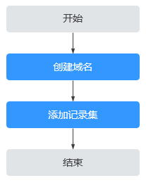

# 解析记录简介

云解析服务的解析由各种类型的记录集（Record Set）实现，记录集是指一组资源记录的集合。这些资源记录属于同一域名，用于定义该域名支持的解析类型以及解析值。

本章节介绍如何添加并管理记录集，如[表1](#table977612405507)所示。

**表 1**  记录集管理说明

<table><thead align="left"><tr id="row87771409504"><th class="cellrowborder" valign="top" width="18.13181318131813%" id="mcps1.2.4.1.1">
操作

</th>
<th class="cellrowborder" valign="top" width="30.193019301930192%" id="mcps1.2.4.1.2">
适用场景

</th>
<th class="cellrowborder" valign="top" width="51.67516751675167%" id="mcps1.2.4.1.3">
使用限制

</th>
</tr>
</thead>
<tbody><tr id="row3777840175020"><td class="cellrowborder" valign="top" width="18.13181318131813%" headers="mcps1.2.4.1.1 ">
<a href="添加记录集.md">添加记录集</a>

</td>
<td class="cellrowborder" valign="top" width="30.193019301930192%" headers="mcps1.2.4.1.2 ">
介绍云解析服务支持的记录集类型及其配置规则、如何为域名添加记录集。

云解析服务支持添加的记录集类型如<a href="记录集类型及配置规则.md#table936244914119">表1</a>所示。

</td>
<td class="cellrowborder" valign="top" width="51.67516751675167%" headers="mcps1.2.4.1.3 "><ul id="ul446519315616"><li>域名添加至云解析服务后，系统默认创建SOA类型和NS类型的记录集。</li><li>每个账户支持添加500个记录集。</li></ul>
</td>
</tr>
<tr id="row626642913510"><td class="cellrowborder" valign="top" width="18.13181318131813%" headers="mcps1.2.4.1.1 ">
<a href="管理记录集.md">管理记录集</a>

</td>
<td class="cellrowborder" valign="top" width="30.193019301930192%" headers="mcps1.2.4.1.2 ">
介绍如何修改、删除以及查看记录集。

</td>
<td class="cellrowborder" valign="top" width="51.67516751675167%" headers="mcps1.2.4.1.3 "><ul id="ul1356620454552"><li>记录集添加成功后不支持修改“线路类型”。</li><li>支持修改系统自动生成的NS记录集的TTL、值、描述等参数。</li><li>不支持修改解析系统默认创建的SOA类型的记录集。</li><li>不支持删除以及暂停解析系统默认创建的SOA类型和NS类型的记录集。</li></ul>
</td>
</tr>
<tr id="row203238852"><td class="cellrowborder" valign="top" width="18.13181318131813%" headers="mcps1.2.4.1.1 ">
<a href="批量添加记录集.md">批量添加记录集</a>

</td>
<td class="cellrowborder" valign="top" width="30.193019301930192%" headers="mcps1.2.4.1.2 ">
介绍如何为多个域名批量添加记录集。

</td>
<td class="cellrowborder" valign="top" width="51.67516751675167%" headers="mcps1.2.4.1.3 "><ul id="ul134127354816"><li>仅支持为公网域名批量添加记录集。</li><li>在进行批量添加记录集之前，需要完成<a href="创建公网域名.md">创建公网域名</a>，否则批量操作无效。</li><li>在批量添加记录集时：<ul id="dns_usermanual_0504_ul5255111916313"><li>支持同时为10000个域名添加记录集。</li><li>包括主域名和子域名在内，每个域名最多支持添加10条解析记录。</li><li>每个域名的“主机记录”设置相同。</li><li>线路类型只支持“全网默认”，不支持智能线路解析。</li><li>TTL只支持设置为300秒。</li></ul>
</li></ul>
</td>
</tr>
<tr id="row4964114017510"><td class="cellrowborder" valign="top" width="18.13181318131813%" headers="mcps1.2.4.1.1 ">
<a href="批量删除记录集.md">批量删除记录集</a>

</td>
<td class="cellrowborder" valign="top" width="30.193019301930192%" headers="mcps1.2.4.1.2 ">
介绍如何为多个域名批量删除指定“主机记录”的记录集。

</td>
<td class="cellrowborder" valign="top" width="51.67516751675167%" headers="mcps1.2.4.1.3 "><ul id="ul1863314719912"><li>仅支持为公网域名批量删除记录集。</li><li>不支持批量删除系统自动生成的NS类型和SOA类型的记录集。</li><li>如果某个域名不存在指定的“主机记录”，则针对该“主机记录”的批量操作无效。</li><li>在批量删除记录集时：<ul id="dns_usermanual_0505_ul5255111916313"><li>支持同时为10000个域名删除记录集。</li><li>最多支持设置5个指定“主机记录”。</li></ul>
</li></ul>
</td>
</tr>
<tr id="row1577754016507"><td class="cellrowborder" valign="top" width="18.13181318131813%" headers="mcps1.2.4.1.1 ">
<a href="设置域名泛解析.md">设置域名泛解析</a>

</td>
<td class="cellrowborder" valign="top" width="30.193019301930192%" headers="mcps1.2.4.1.2 ">
介绍如何为域名添加匹配所有子域名的解析记录。

</td>
<td class="cellrowborder" valign="top" width="51.67516751675167%" headers="mcps1.2.4.1.3 ">
不支持创建NS类型和SOA类型的泛解析记录。

</td>
</tr>
<tr id="row187779402501"><td class="cellrowborder" valign="top" width="18.13181318131813%" headers="mcps1.2.4.1.1 ">
<a href="设置别名解析.md">设置别名解析</a>

</td>
<td class="cellrowborder" valign="top" width="30.193019301930192%" headers="mcps1.2.4.1.2 ">
介绍如何将如下云服务资源实例与记录集相关联：

<ul id="ul281243711143"><li>云速建站</li><li>Web应用服务器</li></ul>
</td>
<td class="cellrowborder" valign="top" width="51.67516751675167%" headers="mcps1.2.4.1.3 ">
不支持将云服务资源实例与NS类型和CNAME类型的记录集相关联。

</td>
</tr>
<tr id="row02901172137"><td class="cellrowborder" valign="top" width="18.13181318131813%" headers="mcps1.2.4.1.1 ">
<a href="批量导入域名解析记录.md">批量导入域名解析记录</a>

</td>
<td class="cellrowborder" valign="top" width="30.193019301930192%" headers="mcps1.2.4.1.2 ">
介绍如何批量导入域名的解析记录。

</td>
<td class="cellrowborder" valign="top" width="51.67516751675167%" headers="mcps1.2.4.1.3 "><ul id="ul137066249247"><li>批量导入的上传文件格式支持xlsx，大小不超过2MB。</li><li>每次最多可以导入500条解析记录，超出的部分将不会导入。</li></ul>
</td>
</tr>
<tr id="row219931013136"><td class="cellrowborder" valign="top" width="18.13181318131813%" headers="mcps1.2.4.1.1 ">
<a href="批量导出域名解析记录.md">批量导出域名解析记录</a>

</td>
<td class="cellrowborder" valign="top" width="30.193019301930192%" headers="mcps1.2.4.1.2 ">
介绍如何批量导出域名的解析记录。

</td>
<td class="cellrowborder" valign="top" width="51.67516751675167%" headers="mcps1.2.4.1.3 ">
无

</td>
</tr>
<tr id="row16569111291316"><td class="cellrowborder" valign="top" width="18.13181318131813%" headers="mcps1.2.4.1.1 ">
<a href="迁移域名到华为云进行解析.md">迁移域名到华为云进行域名解析</a>

</td>
<td class="cellrowborder" valign="top" width="30.193019301930192%" headers="mcps1.2.4.1.2 ">
介绍如何将某个在Internet中正常解析的域名迁移到华为云的云解析服务进行解析。

</td>
<td class="cellrowborder" valign="top" width="51.67516751675167%" headers="mcps1.2.4.1.3 "><ul id="ul08415412418"><li>迁移前，需要到域名原服务商获取域名所有的解析记录。</li><li>迁移后，需要到域名注册商处修改域名的“DNS服务器地址”为华为云DNS。</li></ul>
</td>
</tr>
<tr id="row43584115199"><td class="cellrowborder" valign="top" width="18.13181318131813%" headers="mcps1.2.4.1.1 ">
<a href="搜索记录集.md">搜索记录集</a>

</td>
<td class="cellrowborder" valign="top" width="30.193019301930192%" headers="mcps1.2.4.1.2 ">
DNS管理控制台提供的搜索功能快速搜索解析记录集。

</td>
<td class="cellrowborder" valign="top" width="51.67516751675167%" headers="mcps1.2.4.1.3 "><ul id="ul206153114016"><li>搜索类型：精确搜索、模糊搜索。</li><li>搜索属性：域名、值（记录集取值）、ID（记录集ID）、健康检查ID、状态、类型、标签。<ul id="ul187373464211"><li>支持精确搜索的属性：域名、值（记录集取值）、ID（记录集ID）、健康检查ID（仅公网域名记录集支持）、状态、类型、标签。精确搜索时必须输入完整的属性值。</li><li>支持模糊搜索的属性：域名、值（记录集取值）。</li></ul>
</li></ul>
</td>
</tr>
</tbody>
</table>

云解析服务中，不同类型记录集的添加步骤相同，如[图1](#fig748135752616)所示。

**图 1**  记录集配置流程  

> **说明：** 
>[图1](#fig748135752616)中的“创建域名”既可以是公网域名，也可以是内网域名，详细内容请参见：
>-   [创建公网域名](创建公网域名.md)
>-   [创建内网域名](创建内网域名.md)

