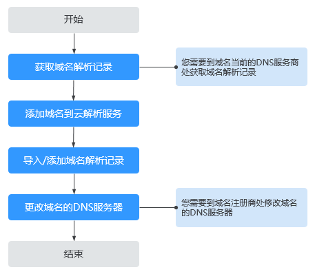

# 迁移域名到华为云进行解析

## 操作场景

若要将某个已经在其他域名注册商处注册完成，且在Internet中正常解析的域名迁移到华为云的云解析服务进行解析，可以参考本操作进行。

## 操作流程

迁移域名的操作如[图1](#fig84361613191316)所示。

**图 1**  迁移域名流程  

## 获取域名解析记录

将域名从其他域名服务商迁移到华为云的云解析服务进行解析，需要在云解析服务中重现域名当前的解析配置。因此，您需要联系域名原服务商，获取域名当前的解析记录配置。以下操作步骤仅供参考，详细操作请参见域名DNS服务商当前帮助文档。

1.  登录域名当前DNS服务商的管理控制台。
2.  在服务列表中，选择DNS对应服务名称，例如“云解析DNS”。
3.  在域名列表中，找到待迁移域名并查看当前解析记录。
4.  记录域名当前所有的解析记录。

    若当前DNS服务商支持批量导出域名解析记录功能，可以使用该功能一次性导出域名所有的解析记录。

## 添加域名到云解析服务

在云解析服务中，将待迁移域名添加至云解析服务。

添加域名的详细操作请参考[创建公网域名](创建公网域名.md)。

## 添加域名解析记录

您需要在华为云平台为域名添加在原服务商处的所有解析记录。域名原有的解析记录可以在原服务商处查询并导出。

导出域名解析记录后，您可以批量导入域名解析记录，详细操作请参见[批量导入域名解析记录](批量导入域名解析记录.md)。

您可以在已经连接Internet的PC终端的DOS窗口使用如下三种命令测试域名解析是否生效，命令格式如下：

-   ping 目标域名
-   nslookup \[-qt=类型\] 目标域名 权威DNS地址
-   dig 类型 目标域名 @权威DNS地址

> **说明：**   
>-   nslookup和dig命令中的“类型”可以输入解析记录类型（比如A，CNAME，TXT，MX等），用来查询指定类型的域名解析是否生效，如果不输入则默认查询A类型域名解析。  
>-   如果PC终端的操作系统没有自带dig命令，需要手动安装后才能使用。  
>-   上述命令均可以用于测试公网域名解析和内网域名解析是否生效。  

## 更改域名的DNS服务器地址

1.  在域名服务商处修改域名解析服务器地址。

    以下为常见域名服务商修改域名解析服务器的方法，具体以域名服务商官网操作指导为准：

    -   [怎样修改万网域名的DNS服务器地址？](https://support.huaweicloud.com/dns_faq/dns_faq_024.html)
    -   [怎样修改腾讯域名的DNS服务器地址？](https://support.huaweicloud.com/dns_faq/dns_faq_025.html)
    -   [怎样修改西部数码域名的DNS服务器地址？](https://support.huaweicloud.com/dns_faq/dns_faq_026.html)
    -   [怎样修改易名中国域名的DNS服务器地址？](https://support.huaweicloud.com/dns_faq/dns_faq_027.html)
    -   [怎样修改新网域名的DNS服务器地址？](https://support.huaweicloud.com/dns_faq/dns_faq_028.html)
    -   [怎样修改GoDaddy域名的DNS服务器地址？](https://support.huaweicloud.com/dns_faq/dns_faq_029.html)

2.  等待修改生效。

    通常，修改的DNS地址可以很快同步到顶级域服务器在互联网中生效。但是，域名服务商的NS记录的TTL值通常设置为48小时，这样假如某些地区Local DNS缓存了域名的NS记录，则最长需要48小时才能刷新成新的NS记录。

    具体域名的DNS生效时间请以域名服务商处的说明为准。在等待修改生效的期间内，请勿删除域名在原域名服务商处的解析记录，这样即使域名的新DNS没有生效，仍然可以通过访问原DNS进行解析。

