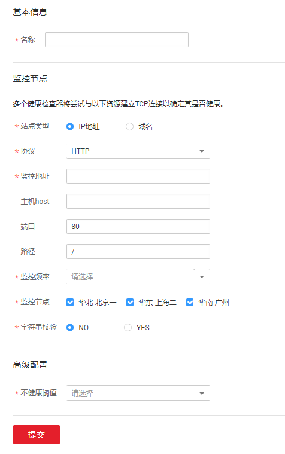

# 配置健康检查

## 操作场景

当用户想要通过云解析服务探测远端服务器的可用性、连通性等运行状态，可以本操作进行配置。

若用户想要在服务器不可用时收到通知提醒，则还需要在云监控服务上进行配置，详细操作请参考[《云监控服务用户指南》](https://support.huaweicloud.com/ces/index.html)。

> **说明：**   
>当您通过IAM用户访问云解析服务时，若要使用健康检查功能，需要为该用户在IAM中设置访问云监控服务部署区域的权限。详细操作请参考[《统一身份认证服务用户指南》](https://support.huaweicloud.com/iam/index.html)。  

## 创建健康检查

1.  登录管理控制台。
2.  选择“网络 \> 云解析服务”。

    进入云解析服务页面。

3.  在左侧树状导航栏，选择“域名解析 \> 健康检查”。

    进入“健康检查”页面。

4.  单击“创建健康检查”，开始创建健康检查。

    **图 1**  创建健康检查  
    

5.  配置健康检查的参数，如[表1](#table1840885584111)所示。

    **表 1**  配置参数

    
    <table><thead align="left"><tr id="row640865554119"><th class="cellrowborder" valign="top" width="27%" id="mcps1.2.4.1.1">
参数

    </th>
    <th class="cellrowborder" valign="top" width="50%" id="mcps1.2.4.1.2">
参数说明

    </th>
    <th class="cellrowborder" valign="top" width="23%" id="mcps1.2.4.1.3">
取值样例

    </th>
    </tr>
    </thead>
    <tbody><tr id="row540912557417"><td class="cellrowborder" valign="top" width="27%" headers="mcps1.2.4.1.1 ">
名称

    </td>
    <td class="cellrowborder" valign="top" width="50%" headers="mcps1.2.4.1.2 ">
配置站点监控的名称。

    </td>
    <td class="cellrowborder" valign="top" width="23%" headers="mcps1.2.4.1.3 ">
stationMonitor-tuq0

    </td>
    </tr>
    <tr id="row1540918557415"><td class="cellrowborder" valign="top" width="27%" headers="mcps1.2.4.1.1 ">
站点类型

    </td>
    <td class="cellrowborder" valign="top" width="50%" headers="mcps1.2.4.1.2 ">
配置对IP地址还是域名进行监控。

    </td>
    <td class="cellrowborder" valign="top" width="23%" headers="mcps1.2.4.1.3 ">
IP地址

    </td>
    </tr>
    <tr id="row12409115574116"><td class="cellrowborder" valign="top" width="27%" headers="mcps1.2.4.1.1 ">
协议

    </td>
    <td class="cellrowborder" valign="top" width="50%" headers="mcps1.2.4.1.2 ">
支持对如下协议进行监控：HTTP、HTTPS、TCP。

    </td>
    <td class="cellrowborder" valign="top" width="23%" headers="mcps1.2.4.1.3 ">
HTTP

    </td>
    </tr>
    <tr id="row104091055154111"><td class="cellrowborder" valign="top" width="27%" headers="mcps1.2.4.1.1 ">
监控地址

    </td>
    <td class="cellrowborder" valign="top" width="50%" headers="mcps1.2.4.1.2 ">
要监控的地址。

    
 说明： 
<ul id="ul886286181615"><li>如需监控HTTPS协议站点，请注意填写协议头https://。</li><li>站点监控不支持以下私有IP段的IP：
10.0.0.0—10.255.255.255

    
172.16.0.0-172.31.255.255

    
192.168.0.0-192.168.255.255

    
127.0.0.0-127.255.255.255

    </li></ul>
    

    </td>
    <td class="cellrowborder" valign="top" width="23%" headers="mcps1.2.4.1.3 ">
www.example.com

    </td>
    </tr>
    <tr id="row1741045511417"><td class="cellrowborder" valign="top" width="27%" headers="mcps1.2.4.1.1 ">
主机host

    </td>
    <td class="cellrowborder" valign="top" width="50%" headers="mcps1.2.4.1.2 ">
可选参数，监控的域名前缀。

    </td>
    <td class="cellrowborder" valign="top" width="23%" headers="mcps1.2.4.1.3 ">
www

    </td>
    </tr>
    <tr id="row14101055124119"><td class="cellrowborder" valign="top" width="27%" headers="mcps1.2.4.1.1 ">
端口

    </td>
    <td class="cellrowborder" valign="top" width="50%" headers="mcps1.2.4.1.2 ">
可选参数，与“协议”、“监控地址”和“路径”一起构成最终的探测地址。默认值为80。

    </td>
    <td class="cellrowborder" valign="top" width="23%" headers="mcps1.2.4.1.3 ">
80

    </td>
    </tr>
    <tr id="row104102559418"><td class="cellrowborder" valign="top" width="27%" headers="mcps1.2.4.1.1 ">
路径

    </td>
    <td class="cellrowborder" valign="top" width="50%" headers="mcps1.2.4.1.2 ">
可选参数，当“协议”为TCP时，无需配置次参数。

    
探测路径，与“协议”、“监控地址”和“端口”一起构成最终的探测地址。

    
探测地址的格式如下：

    <ul id="ul6531191474317"><li>当“协议”为HTTP和HTTPS时，格式为"协议"+"监控地址"+":"+"端口"+"路径"</li><li>当“协议”为TCP时，格式为："监控地址"+":"+"端口"</li></ul>
    </td>
    <td class="cellrowborder" valign="top" width="23%" headers="mcps1.2.4.1.3 ">
-

    </td>
    </tr>
    <tr id="row1314979164319"><td class="cellrowborder" valign="top" width="27%" headers="mcps1.2.4.1.1 ">
监控频率

    </td>
    <td class="cellrowborder" valign="top" width="50%" headers="mcps1.2.4.1.2 ">
监控探测引擎执行一次探测任务的时间间隔。

    
 说明： 

监控频率可设置为1分钟、5分钟、20分钟。

    

    </td>
    <td class="cellrowborder" valign="top" width="23%" headers="mcps1.2.4.1.3 ">
5分钟

    </td>
    </tr>
    <tr id="row105711460435"><td class="cellrowborder" valign="top" width="27%" headers="mcps1.2.4.1.1 ">
监控节点

    </td>
    <td class="cellrowborder" valign="top" width="50%" headers="mcps1.2.4.1.2 ">
目前支持华北-北京一、华东-上海二、华南-广州三个探测地点。

    </td>
    <td class="cellrowborder" valign="top" width="23%" headers="mcps1.2.4.1.3 ">
华北-北京一

    </td>
    </tr>
    <tr id="row58795314318"><td class="cellrowborder" valign="top" width="27%" headers="mcps1.2.4.1.1 ">
字符串校验

    </td>
    <td class="cellrowborder" valign="top" width="50%" headers="mcps1.2.4.1.2 ">
配置是否进行字符串校验，开启设置为“YES”，关闭设置为“NO”。默认值为“NO”。

    
如果开启字符串校验，探测点会在探测请求响应消息体的前512K字节里查询是否包含“匹配字符串”，如果匹配成功则认为web服务响应正常，反之则认为响应异常。

    </td>
    <td class="cellrowborder" valign="top" width="23%" headers="mcps1.2.4.1.3 ">
NO

    </td>
    </tr>
    <tr id="row1741333475217"><td class="cellrowborder" valign="top" width="27%" headers="mcps1.2.4.1.1 ">
匹配字符串

    </td>
    <td class="cellrowborder" valign="top" width="50%" headers="mcps1.2.4.1.2 ">
当“字符串校验”设置为“YES”时，出现该参数。

    
设置用于字符串校验的字符串，大小写敏感。

    </td>
    <td class="cellrowborder" valign="top" width="23%" headers="mcps1.2.4.1.3 ">
-

    </td>
    </tr>
    <tr id="row1899423919435"><td class="cellrowborder" valign="top" width="27%" headers="mcps1.2.4.1.1 ">
不健康阈值

    </td>
    <td class="cellrowborder" valign="top" width="50%" headers="mcps1.2.4.1.2 ">
设置当出现多少次探测失败后上报告警。

    </td>
    <td class="cellrowborder" valign="top" width="23%" headers="mcps1.2.4.1.3 ">
连续一次

    </td>
    </tr>
    </tbody>
    </table>

6.  单击“提交”，完成健康检查的配置。

## 设置健康检查

若要使用健康检查功能对域名或IP地址进行监测，可以在配置公网域名解析记录时，设置健康检查选项。

1.  在“公网域名”页面的域名列表中，单击域名的名称。
2.  单击“添加记录集”。
3.  通过下拉列表框选择已经创建的健康检查策略，设置“健康检查”功能。

    可以通过单击“查看健康检查”进入“健康检查”页面创建新的健康检查策略或者查看健康检查的详细信息。

