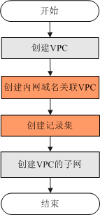

# 配置内网域名

## 操作场景

用户在VPC内使用云解析服务进行内网域名托管，需在管理控制台上配置DNS服务。

## 前提条件

已经创建VPC。

创建VPC的详细操作，请参见《虚拟私有云用户指南》。

## 内网域名配置流程

**图 1**  内网域名配置流程  

[图1](#f28bbf91c2c3e4b9c875c6375167fc7b1)中各项配置操作的执行位置如下：

-   “创建VPC”和“使用内网DNS创建VPC的子网”：由用户在管理控制台VPC服务页面完成相关配置。
-   “创建内网域名”和“创建记录集”：由用户在管理控制台云解析服务页面完成相关配置。

## 操作步骤

**创建内网域名**

1.  登录管理控制台。
2.  选择“网络 \> 云解析服务”。

    进入云解析服务页面。

3.  在左侧树状导航栏，选择“域名解析 \> 内网域名”。

    进入“内网域名”页面。

4.  单击管理控制台左上角的，选择区域和项目。
5.  单击“创建内网域名”，开始创建内网域名。

    **图 2**  创建内网域名  
    

6.  根据界面提示配置参数，参数说明如[表1](#zh-cn_topic_0035467699_table2052132816642)所示。

    **表 1**  创建内网域名参数说明

    
    <table><thead align="left"><tr id="zh-cn_topic_0035467699_row5957484916642"><th class="cellrowborder" valign="top" width="18.11%" id="mcps1.2.4.1.1">
参数

    </th>
    <th class="cellrowborder" valign="top" width="50.629999999999995%" id="mcps1.2.4.1.2">
参数说明

    </th>
    <th class="cellrowborder" valign="top" width="31.259999999999998%" id="mcps1.2.4.1.3">
取值样例

    </th>
    </tr>
    </thead>
    <tbody><tr id="zh-cn_topic_0035467699_row2871871016642"><td class="cellrowborder" valign="top" width="18.11%" headers="mcps1.2.4.1.1 ">
域名

    </td>
    <td class="cellrowborder" valign="top" width="50.629999999999995%" headers="mcps1.2.4.1.2 ">
域名。

    
可以自定义，支持创建顶级域，但需符合域名命名规范。

    </td>
    <td class="cellrowborder" valign="top" width="31.259999999999998%" headers="mcps1.2.4.1.3 ">
example.com

    </td>
    </tr>
    <tr id="row16069279235858"><td class="cellrowborder" valign="top" width="18.11%" headers="mcps1.2.4.1.1 ">
VPC

    </td>
    <td class="cellrowborder" valign="top" width="50.629999999999995%" headers="mcps1.2.4.1.2 ">
内网域名要关联的VPC。

    </td>
    <td class="cellrowborder" valign="top" width="31.259999999999998%" headers="mcps1.2.4.1.3 ">
-

    </td>
    </tr>
    <tr id="zh-cn_topic_0035467699_row3925088716642"><td class="cellrowborder" valign="top" width="18.11%" headers="mcps1.2.4.1.1 ">
邮箱

    </td>
    <td class="cellrowborder" valign="top" width="50.629999999999995%" headers="mcps1.2.4.1.2 ">
可选参数。

    
管理该内网域名的管理员邮箱。建议用户使用保留邮箱“HOSTMASTER@<em id="i31584450204027">域名</em>”作为此管理员邮箱。

    
更多关于Email的信息，请参见<a href="http://support.huaweicloud.com/dns_faq/dns_faq_009.html" target="_blank" rel="noopener noreferrer">SOA记录中的Email格式为什么变化了？</a>。

    </td>
    <td class="cellrowborder" valign="top" width="31.259999999999998%" headers="mcps1.2.4.1.3 ">
HOSTMASTER@example.com

    </td>
    </tr>
    <tr id="row648142632420"><td class="cellrowborder" valign="top" width="18.11%" headers="mcps1.2.4.1.1 ">
标签

    </td>
    <td class="cellrowborder" valign="top" width="50.629999999999995%" headers="mcps1.2.4.1.2 ">
可选参数。

    
域名的标示，包括键和值，每个域名可以创建10个标签。

    
键和值的命名规则请参见<a href="#zh-cn_topic_0057777026__table1393932617253">表2</a>。

    </td>
    <td class="cellrowborder" valign="top" width="31.259999999999998%" headers="mcps1.2.4.1.3 ">
example_key1

    
example_value1

    </td>
    </tr>
    <tr id="row197267115553"><td class="cellrowborder" valign="top" width="18.11%" headers="mcps1.2.4.1.1 ">
描述

    </td>
    <td class="cellrowborder" valign="top" width="50.629999999999995%" headers="mcps1.2.4.1.2 ">
可选参数。

    
域名的描述信息。

    
长度不超过255个字符。

    </td>
    <td class="cellrowborder" valign="top" width="31.259999999999998%" headers="mcps1.2.4.1.3 ">
This is a zone example.

    </td>
    </tr>
    </tbody>
    </table>

    **表 2**  标签命名规则

    
    <table><thead align="left"><tr id="zh-cn_topic_0035467699_row72901535141713"><th class="cellrowborder" valign="top" width="18.181818181818183%" id="mcps1.2.4.1.1">
参数

    </th>
    <th class="cellrowborder" valign="top" width="50.505050505050505%" id="mcps1.2.4.1.2">
规则

    </th>
    <th class="cellrowborder" valign="top" width="31.313131313131315%" id="mcps1.2.4.1.3">
举例

    </th>
    </tr>
    </thead>
    <tbody><tr id="zh-cn_topic_0035467699_row52906354176"><td class="cellrowborder" valign="top" width="18.181818181818183%" headers="mcps1.2.4.1.1 ">
键

    </td>
    <td class="cellrowborder" valign="top" width="50.505050505050505%" headers="mcps1.2.4.1.2 "><ul id="zh-cn_topic_0035467699_ul46253231183"><li>不能为空。</li><li>对于同一资源键值唯一。</li><li>长度不超过36个字符。</li><li>取值为不包含“=”,“*”,“&lt;”,“&gt;”,“\”,“,”,“|”,“/”的所有Unicode字符，且首尾字符不能为空格。</li></ul>
    </td>
    <td class="cellrowborder" valign="top" width="31.313131313131315%" headers="mcps1.2.4.1.3 ">
example_key1

    </td>
    </tr>
    <tr id="zh-cn_topic_0035467699_row132900355172"><td class="cellrowborder" valign="top" width="18.181818181818183%" headers="mcps1.2.4.1.1 ">
值

    </td>
    <td class="cellrowborder" valign="top" width="50.505050505050505%" headers="mcps1.2.4.1.2 "><ul id="zh-cn_topic_0035467699_ul19648123161815"><li>不能为空。</li><li>长度不超过43个字符。</li><li>取值为不包含“=”,“*”,“&lt;”,“&gt;”,“\”,“,”,“|”,“/”的所有Unicode字符，且首尾字符不能为空格。</li></ul>
    </td>
    <td class="cellrowborder" valign="top" width="31.313131313131315%" headers="mcps1.2.4.1.3 ">
example_value1

    </td>
    </tr>
    </tbody>
    </table>

7.  单击“确定”。

    创建完成后，您可以在“内网域名”页面查看新创建的域名信息。

    > **说明：**   
    >单击“名称”列的域名名称，可以看到系统已经为您创建了SOA类型和NS类型的记录集。其中，  
    >-   SOA类型的记录集标识了对此域名具有最终解释权的主权威服务器。  
    >-   NS类型的记录集标识了此域名的权威服务器。  

**添加A类型的记录集**

1.  在“内网域名”页面的域名列表中，单击新创建域名的名称。

    系统进入域名解析记录页面。

2.  单击“添加记录集”。

    系统进入“添加记录集”页面。

    **图 3**  添加记录集  
    

3.  根据界面提示填写参数配置，参数说明如[表3](#zh-cn_topic_0035467699_table6239446395216)所示。

    **表 3**  添加A类型记录集参数说明

    
    <table><thead align="left"><tr id="zh-cn_topic_0035467699_row1754572995216"><th class="cellrowborder" valign="top" width="20.549999999999997%" id="mcps1.2.4.1.1">
参数

    </th>
    <th class="cellrowborder" valign="top" width="46.12%" id="mcps1.2.4.1.2">
参数说明

    </th>
    <th class="cellrowborder" valign="top" width="33.33%" id="mcps1.2.4.1.3">
取值样例

    </th>
    </tr>
    </thead>
    <tbody><tr id="zh-cn_topic_0035467699_row3698863095216"><td class="cellrowborder" valign="top" width="20.549999999999997%" headers="mcps1.2.4.1.1 ">
主机记录

    </td>
    <td class="cellrowborder" valign="top" width="46.12%" headers="mcps1.2.4.1.2 ">
域名（后缀无需用户手动填写）。

    
如果输入框未填值，则参数值默认为该Zone的名称。

    </td>
    <td class="cellrowborder" valign="top" width="33.33%" headers="mcps1.2.4.1.3 ">
abc

    </td>
    </tr>
    <tr id="zh-cn_topic_0035467699_row933215795216"><td class="cellrowborder" valign="top" width="20.549999999999997%" headers="mcps1.2.4.1.1 ">
类型

    </td>
    <td class="cellrowborder" valign="top" width="46.12%" headers="mcps1.2.4.1.2 ">
记录集的类型，此处为A类型。

    </td>
    <td class="cellrowborder" valign="top" width="33.33%" headers="mcps1.2.4.1.3 ">
A – 将域名指向IPv4地址

    </td>
    </tr>
    <tr id="zh-cn_topic_0035467699_row2395117795431"><td class="cellrowborder" valign="top" width="20.549999999999997%" headers="mcps1.2.4.1.1 ">
TTL(秒)

    </td>
    <td class="cellrowborder" valign="top" width="46.12%" headers="mcps1.2.4.1.2 ">
记录集的有效缓存时间，以秒为单位。

    </td>
    <td class="cellrowborder" valign="top" width="33.33%" headers="mcps1.2.4.1.3 ">
默认为“5min”，即300s。

    </td>
    </tr>
    <tr id="zh-cn_topic_0035467699_row3388081495431"><td class="cellrowborder" valign="top" width="20.549999999999997%" headers="mcps1.2.4.1.1 ">
值

    </td>
    <td class="cellrowborder" valign="top" width="46.12%" headers="mcps1.2.4.1.2 ">
域名对应的IPv4地址。

    
多个IPv4地址以换行符分隔。

    </td>
    <td class="cellrowborder" valign="top" width="33.33%" headers="mcps1.2.4.1.3 ">
192.168.12.2

    
192.168.12.3

    </td>
    </tr>
    <tr id="row39942594272"><td class="cellrowborder" valign="top" width="20.549999999999997%" headers="mcps1.2.4.1.1 ">
标签

    </td>
    <td class="cellrowborder" valign="top" width="46.12%" headers="mcps1.2.4.1.2 ">
可选参数，当“其他配置”开关打开时显示。记录集的标示，包括键和值，每个记录集可以创建10个标签。

    
键和值的命名规则请参见<a href="#zh-cn_topic_0057777026__table1393932617253">表2</a>。

    </td>
    <td class="cellrowborder" valign="top" width="33.33%" headers="mcps1.2.4.1.3 ">
example_key1

    
example_value1

    </td>
    </tr>
    <tr id="row21944507132325"><td class="cellrowborder" valign="top" width="20.549999999999997%" headers="mcps1.2.4.1.1 ">
描述

    </td>
    <td class="cellrowborder" valign="top" width="46.12%" headers="mcps1.2.4.1.2 ">
可选配置，对域名的描述，当“其他配置”开关打开时显示。

    </td>
    <td class="cellrowborder" valign="top" width="33.33%" headers="mcps1.2.4.1.3 ">
-

    </td>
    </tr>
    </tbody>
    </table>

4.  单击“确定”，完成A类型记录集的添加。

**更改VPC子网的DNS**

为实现内网域名在VPC上的正常解析，用户需要在管理控制台VPC页面，把VPC子网的DNS改成云解析服务提供的内网DNS。

内网域名创建完成后，添加记录集页面显示了VPC子网使用的内网DNS。

云解析服务VPC子网使用的内网DNS的具体查询方法：

1.  登录管理控制台。
2.  选择“网络 \> 云解析服务”。

    进入云解析服务页面。

3.  在左侧树状导航栏，选择“域名解析 \> 内网域名”。

    进入“内网域名”页面。

4.  单击管理控制台左上角的，选择区域和项目。
5.  在“内网域名”页面域名列表中，单击“名称”列的域名名称进入域名解析记录页面。
6.  在内网域名列表上方会提示VPC子网使用的DNS。

