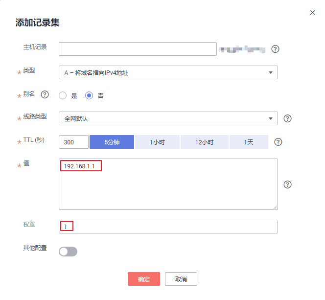

# 配置权重解析

## 操作场景

在大型网络应用中，通常会使用多台服务器提供同一个服务。为了平衡每台服务器上的访问压力，通常会选择采用负载均衡来实现，提高服务器响应效率。

云解析服务支持解析的负载均衡，也叫做带权重的记录轮询，通过为不同解析记录配置“权重”参数来实现。

当您的网站拥有多台服务器，每台服务器具有独立的IP地址。通过解析的负载均衡可以实现将不同用户的访问请求按比例分配到各个服务器上。

例如，某网站的域名为“example.com”，部署了3台服务器，对应的IP地址分别为：192.168.1.1、192.168.1.2、192.168.1.3。

-   在不配置“权重”参数的情况下，可以配置1条A类型记录集，将记录集值设置为3个IP地址。

    在这种配置中，不同的访问者会随机访问其中1个IP地址。详细信息，请参见[当记录值有多个IP地址时，域名是如何解析的？](https://support.huaweicloud.com/dns_faq/dns_faq_023.html)。

-   在配置“权重”参数的情况下，可以配置3条A类型记录集，记录集值分别设置为3个IP地址。

    在这种配置中，通过“权重”参数，可以设置这3条解析记录在解析响应消息中所占比重，实现将用户的访问按比例路由到各个服务器上。

权重解析对解析请求的负载均衡更为精确，本章节将介绍如何配置权重解析。

## 权重解析规划

网站有3台服务器，配置了3条A类型解析记录，分别指向各服务器的IP地址。设置不同的“权重”参数，可以控制向用户返回不同IP地址的比例。

**表 1**  数据规划

<table><thead align="left"><tr id="row13917132810191"><th class="cellrowborder" valign="top" width="10%" id="mcps1.2.8.1.1">
方案

</th>
<th class="cellrowborder" valign="top" width="10%" id="mcps1.2.8.1.2">
域名

</th>
<th class="cellrowborder" valign="top" width="10%" id="mcps1.2.8.1.3">
记录集类型

</th>
<th class="cellrowborder" valign="top" width="10%" id="mcps1.2.8.1.4">
线路类型

</th>
<th class="cellrowborder" valign="top" width="10%" id="mcps1.2.8.1.5">
值

</th>
<th class="cellrowborder" valign="top" width="10%" id="mcps1.2.8.1.6">
权重

</th>
<th class="cellrowborder" valign="top" width="40%" id="mcps1.2.8.1.7">
说明

</th>
</tr>
</thead>
<tbody><tr id="row1191711289195"><td class="cellrowborder" rowspan="3" valign="top" width="10%" headers="mcps1.2.8.1.1 ">
方案一

</td>
<td class="cellrowborder" rowspan="3" valign="top" width="10%" headers="mcps1.2.8.1.2 ">
example.com

</td>
<td class="cellrowborder" rowspan="3" valign="top" width="10%" headers="mcps1.2.8.1.3 ">
A

</td>
<td class="cellrowborder" rowspan="3" valign="top" width="10%" headers="mcps1.2.8.1.4 ">
全网默认

</td>
<td class="cellrowborder" valign="top" width="10%" headers="mcps1.2.8.1.5 ">
192.168.1.1

</td>
<td class="cellrowborder" valign="top" width="10%" headers="mcps1.2.8.1.6 ">
1

</td>
<td class="cellrowborder" rowspan="3" valign="top" width="40%" headers="mcps1.2.8.1.7 ">
用户的访问请求将按照“1:1:1”的比例，平均的分摊至3台服务器上。

</td>
</tr>
<tr id="row091812289193"><td class="cellrowborder" valign="top" headers="mcps1.2.8.1.1 ">
192.168.1.2

</td>
<td class="cellrowborder" valign="top" headers="mcps1.2.8.1.2 ">
1

</td>
</tr>
<tr id="row19180286193"><td class="cellrowborder" valign="top" headers="mcps1.2.8.1.1 ">
192.168.1.3

</td>
<td class="cellrowborder" valign="top" headers="mcps1.2.8.1.2 ">
1

</td>
</tr>
<tr id="row11918192811192"><td class="cellrowborder" rowspan="3" valign="top" width="10%" headers="mcps1.2.8.1.1 ">
方案二

</td>
<td class="cellrowborder" rowspan="3" valign="top" width="10%" headers="mcps1.2.8.1.2 ">
example.com

</td>
<td class="cellrowborder" rowspan="3" valign="top" width="10%" headers="mcps1.2.8.1.3 ">
A

</td>
<td class="cellrowborder" rowspan="3" valign="top" width="10%" headers="mcps1.2.8.1.4 ">
全网默认

</td>
<td class="cellrowborder" valign="top" width="10%" headers="mcps1.2.8.1.5 ">
192.168.1.1

</td>
<td class="cellrowborder" valign="top" width="10%" headers="mcps1.2.8.1.6 ">
2

</td>
<td class="cellrowborder" rowspan="3" valign="top" width="40%" headers="mcps1.2.8.1.7 ">
用户的访问请求将按照“2:3:1”的比例进行分摊。

例如，DNS收到6条访问请求，则两次返回“192.168.1.1”、三次返回“192.168.1.2”，一次返回“192.168.1.3”，返回IP地址的顺序随机。

</td>
</tr>
<tr id="row19181328191910"><td class="cellrowborder" valign="top" headers="mcps1.2.8.1.1 ">
192.168.1.2

</td>
<td class="cellrowborder" valign="top" headers="mcps1.2.8.1.2 ">
3

</td>
</tr>
<tr id="row9918328151918"><td class="cellrowborder" valign="top" headers="mcps1.2.8.1.1 ">
192.168.1.3

</td>
<td class="cellrowborder" valign="top" headers="mcps1.2.8.1.2 ">
1

</td>
</tr>
</tbody>
</table>

## 前提条件

网站的域名“example.com”已创建至云解析服务。

## 操作步骤

以为域名“example.com”设置3条全网默认的A类型记录集为例介绍权重解析的操作步骤，3条解析记录的权重比例设置为“1:1:1”。

1.  登录管理控制台。
2.  将鼠标悬浮于页面左侧的“”，在服务列表中，选择“网络  \> 云解析服务”。

    进入“云解析”页面。

3.  在左侧树状导航栏，选择“公网域名”。

    进入“公网域名”页面。

4.  在“公网域名”页面的域名列表中，单击域名example.com的名称。

    进入“解析记录”页面。

5.  单击“添加记录集”，进入“添加记录集”页面。

    **图 1**  添加权重解析  
    

6.  在“添加记录集”页面，根据界面提示为域名“example.com”设置A记录集参数。
    -   主机记录：设置为空，表示解析的域名为主域名“example.com”。
    -   类型：设置为A类型记录集。
    -   线路类型：设置为“全网默认”。
    -   值：设置为网站第一台服务器的IP地址“192.168.1.1”。
    -   权重：设置为“1”。

7.  单击“确定”，完成第1条解析记录的设置。
8.  重复执行[步骤5](#li147602027144118)\~[步骤7](#li15591751113516)，完成第2条和第3条解析记录的设置。

    参数取值与第1条解析记录类似，仅参数“值”需要替换为网站另外两台服务器的IP地址“192.168.1.2”和“192.168.1.3”。

    至此，完成权重解析的配置，用户的访问请求会平均分配至3台网站服务器上，实现负载均衡。

